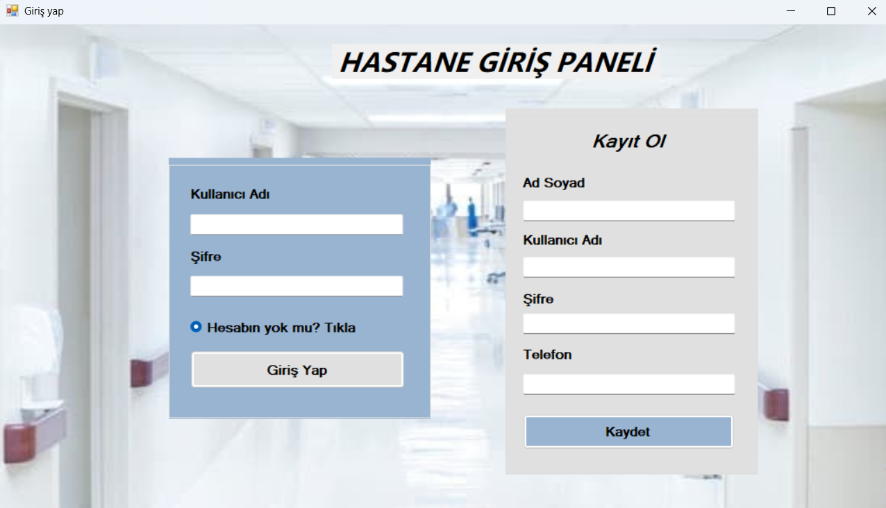
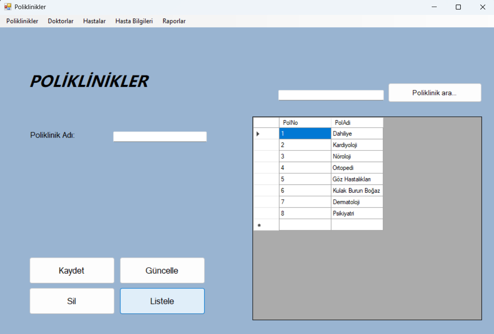
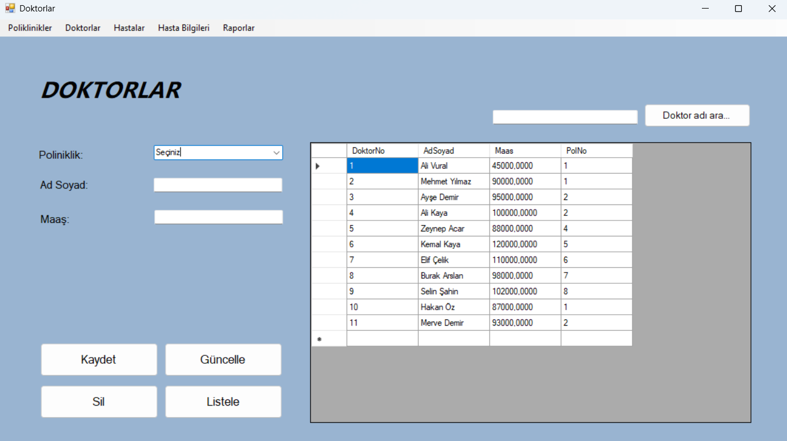
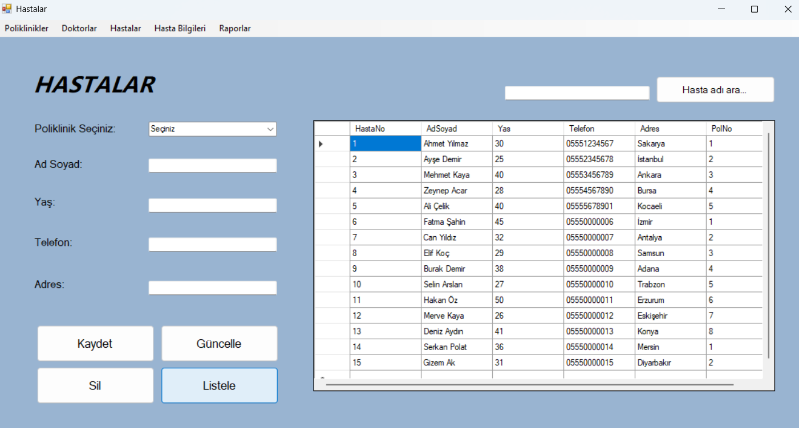
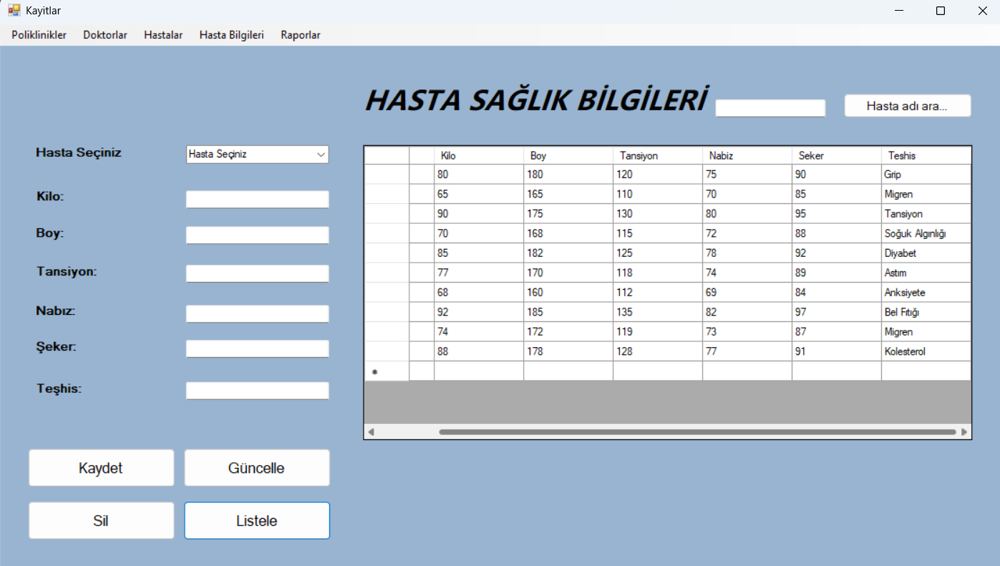
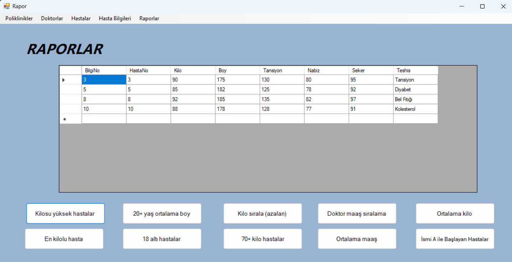

# 🏥 Hastane Yönetim Sistemi (ADO.NET & Stored Procedures)

Bu proje, Softito Akademi eğitimi kapsamında ADO.NET veri erişim teknolojisi ve MS SQL Server Stored Procedure'leri (Saklı Yordamlar) kullanılarak geliştirilmiş çok katmanlı yapıda bir **Hastane Yönetim Sistemi** Windows Forms uygulamasıdır.

## 🛠️ Kullanılan Teknolojiler

- **Programlama Dili:** C# (.NET Framework 4.7.2)
- **Veritabanı:** MS SQL Server (`softHastane` veritabanı)
- **Veri Erişim Teknolojisi:** ADO.NET (`SqlConnection`, `SqlCommand`, `SqlDataReader`, `SqlDataAdapter`)
- **Tasarım:** Windows Forms

## 🗄️ Veritabanı & Model Yapısı

Proje doğrudan SQL Server üzerinde `softHastane` veritabanına bağlanır. Veri işlemleri performans ve güvenlik amacıyla SQL Stored Procedure'leri üzerinden gerçekleştirilmektedir.

### 🔑 Kullanılan Stored Procedure'ler (Saklı Yordamlar)
- `PoliklinikListele`: Tüm aktif poliklinikleri listeler.
- `PoliklinikEkle`: Yeni poliklinik kaydı oluşturur (Parametre: `@PolAdi`).
- `PoliklinikGuncelle`: Poliklinik adını günceller (Parametreler: `@PolNo`, `@PolAdi`).
- `PoliklinikSil`: Poliklinik kaydını siler (Parametre: `@PolNo`).
- `PoliklinikAra`: Poliklinik adına göre arama yapar (Parametre: `@PolAdi`).

### 📑 Tablolar
- **Kullanici:** Giriş ve kayıt işlemlerini yönetir (`AdSoyad`, `KullaniciAdi`, `Sifre`, `Telefon` sütunları).
- **Poliklinikler:** Poliklinik bilgilerini tutar.
- **Doktorlar:** Doktorların ad-soyad, uzmanlık branşı bilgilerini barındırır.
- **Hastalar:** Hasta kabul kayıt bilgilerini tutar.
- **Randevular:** Randevu kayıt bilgilerini ve saatlerini yönetir.

## 🌟 Temel Özellikler

- **Kullanıcı Yetkilendirme:** Giriş Yap / Üye Ol (`Login_Register.cs`) ekranları ile sisteme güvenli giriş.
- **Parametreli Sorgular (SQL Injection Koruması):** ADO.NET parametreleri (`AddWithValue`) ile güvenli veri girişi.
- **Poliklinik Yönetimi:** Stored Procedure tabanlı CRUD ve arama işlemleri.
- **Modüler Menü Sistemi:** Doktorlar, hastalar, randevular ve raporlar arasında geçiş sağlayan dinamik menü.

## 📸 Ekran Görüntüleri

Aşağıda uygulamanın çeşitli modüllerine ait ekran görüntülerini inceleyebilirsiniz:

### 🔑 Giriş Ekranı

### 🏥 Poliklinik Yönetimi

### 👨‍⚕️ Doktor Yönetimi

### 👥 Hasta Kayıt & Arama

### 📅 Randevu Kayıtları

### 📊 Raporlar & Analizler

