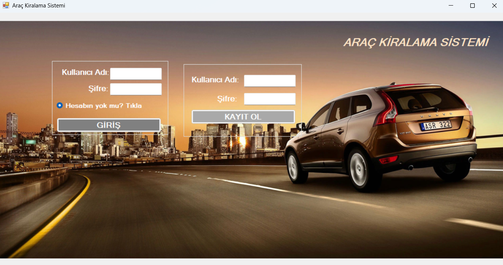
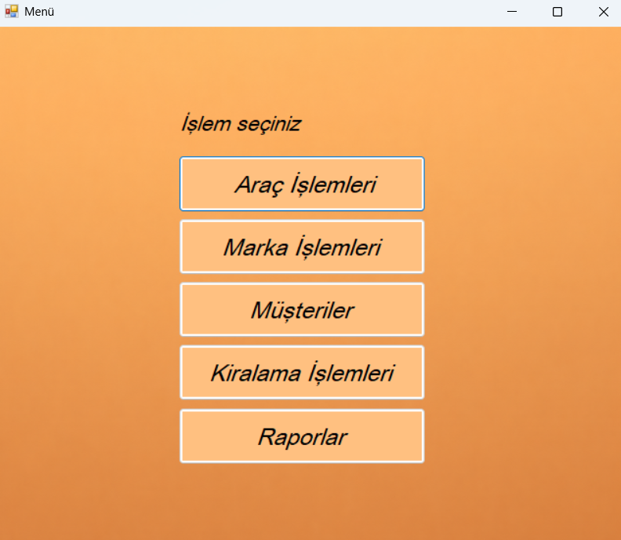
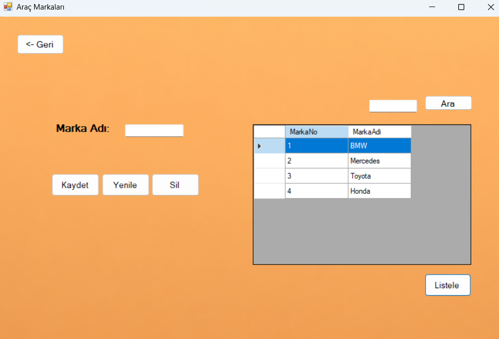
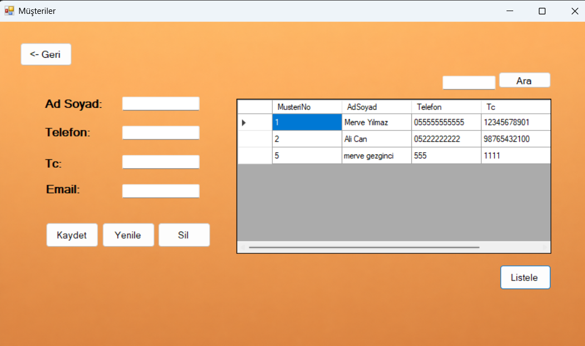
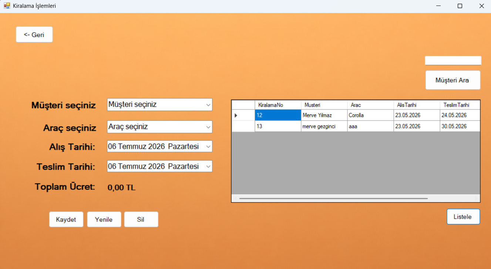
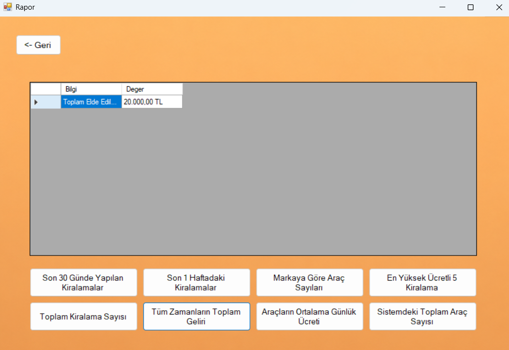
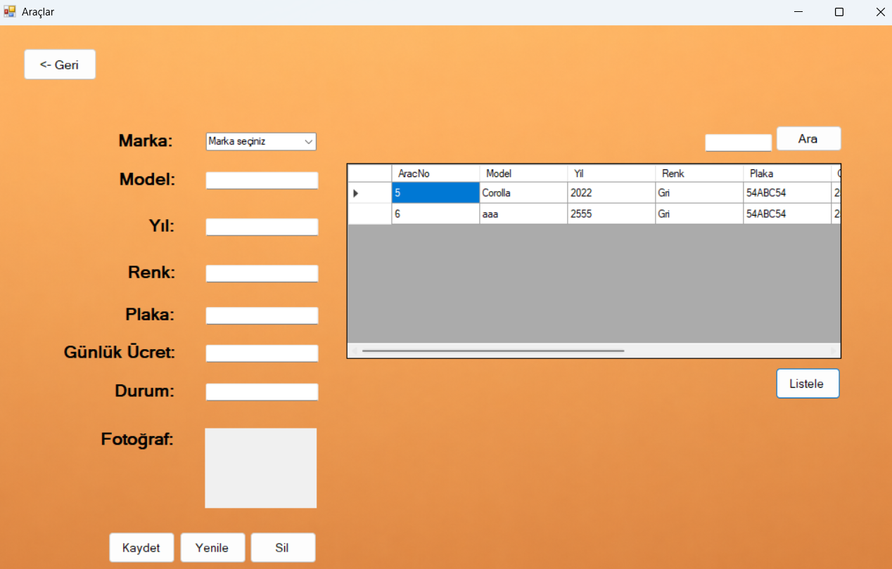

# 🚗 Araç Kiralama Yönetim Sistemi (EF Database First)

Bu proje, Softito Akademi eğitimi kapsamında Entity Framework Database First yaklaşımı ve LINQ (Language Integrated Query) sorguları kullanılarak geliştirilmiş bir **Araç Kiralama Yönetim Sistemi** Windows Forms uygulamasıdır.

## 🛠️ Kullanılan Teknolojiler

- **Programlama Dili:** C#
- **ORM Teknolojisi:** Entity Framework (Database First - `.edmx` modelleme)
- **Veritabanı:** MS SQL Server (`softAracKiralama` veritabanı)
- **Sorgulama Dili:** LINQ (Language Integrated Query)
- **Arayüz:** Windows Forms

## 🗄️ Veritabanı & Entity Yapısı

Veritabanı tasarımı SQL Server tarafında yapılmış ve ADO.NET Entity Data Model yardımıyla projeye aktarılmıştır. Projede kullanılan temel veri modelleri:

- **Araclar (`Araclars`):** Plaka, Marka, Model, Yıl, Renk, Günlük Ücret ve Kiralama Durumu bilgilerini tutar.
- **Markalar (`Markalars`):** Araç markalarını ve kategorilerini temsil eder.
- **Musteriler (`Musterilers`):** Ad-Soyad, TC Kimlik No, Telefon, Ehliyet Bilgileri ve E-posta adreslerini barındırır.
- **Kiralamalar (`Kiralamalars`):** Kiralama tarihi, teslim alma tarihi, toplam gün sayısı ve toplam tutar bilgilerini tutarak kiralama sözleşmelerini yönetir.
- **Kullanicilar (`Kullanicilars`):** Sistem yöneticilerinin giriş kimlik doğrulamalarını yönetir.

## 🌟 Temel Özellikler

- **Gelişmiş Arayüz Modülleri:** Araç Tanımlama (`Arac.cs`), Müşteri Kayıt (`Musteri.cs`), Marka Yönetimi (`Marka.cs`) ve Kiralama İşlemleri (`KiralamaIslemleri.cs`) ekranları.
- **Kiralama & Teslim Alma Döngüsü:** Kiralanan araçların otomatik olarak "Dolu/Pasif" duruma geçmesi, teslim alındığında "Müsait" durumuna çekilmesi.
- **LINQ Sorguları:** Filtreleme, arama ve veri listeleme işlemlerinde dinamik LINQ Select ve Where metotları.
- **İstatistik & Raporlama:** Sistem genelindeki araç sayısını, kiradaki araçları ve toplam hasılatı gösteren raporlama ekranı (`Rapor.cs`).

## 📸 Ekran Görüntüleri

