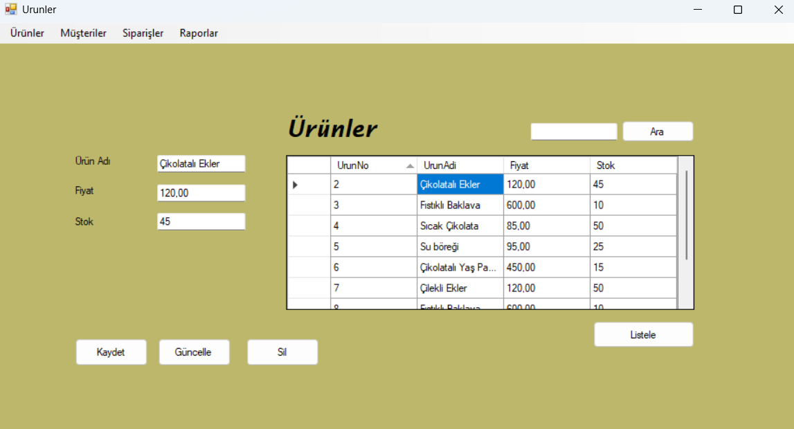

# 🍰 Pastane Sipariş ve Stok Takip Uygulaması (ADO.NET)

Bu proje, Softito Akademi eğitimi kapsamında ADO.NET veri erişim teknolojisi kullanılarak geliştirilmiş bir **Pastane Sipariş ve Stok Takip** Windows Forms uygulamasıdır.

## 🛠️ Kullanılan Teknolojiler

- **Programlama Dili:** C#
- **Veri Erişim Teknolojisi:** ADO.NET (`SqlConnection`, `SqlCommand`, `SqlDataReader`, `SqlDataAdapter`)
- **Veritabanı:** MS SQL Server (`softPastane` veritabanı)
- **Arayüz:** Windows Forms

## 🌟 Temel Özellikler

- **Dinamik Sipariş Giriş Arayüzü (`Siparisler.cs`):** Form üzerindeki `FlowLayoutPanel` yapısı kullanılarak veritabanındaki ürünlerin dinamik CheckBox ve adet seçimi için NumericUpDown kontrolleriyle otomatik listelenmesi. Sipariş verilirken toplam tutar ve adetin dinamik olarak hesaplanması.
- **Ürün & Menü Yönetimi (`Urunler.cs`):** Pastane menüsündeki ürünlerin (pasta, börek, içecekler vb.) eklenmesi, stok güncellenmesi ve fiyatlandırılması.
- **Müşteri Kayıt Sistemi (`Musteriler.cs`):** Müşteri telefon, adres ve sipariş geçmişinin takibi.
- **Satış Raporları (`Rapor.cs`):** Belirli tarih aralıklarına göre satılan ürün miktarlarının ve elde edilen cironun analiz edilmesi.

## 🗄️ Veritabanı Yapısı

Uygulama, SQL Server üzerindeki `softPastane` veritabanını kullanır:
- **Kullanici:** Sistem giriş yetkilerini barındırır.
- **Urunler:** Ürün bilgileri ve mevcut stok durumlarını tutar.
- **Musteri:** Sipariş veren müşteri bilgilerini içerir.
- **Siparis:** Alınan siparişlerin detaylarını, tarihini ve toplam fiyatını kaydeder.

## 📸 Ekran Görüntüleri

*Ekran görüntülerinizi bu klasör altındaki `images/` klasörüne ekleyip aşağıdaki linkleri güncelleyebilirsiniz:*

```markdown


```
