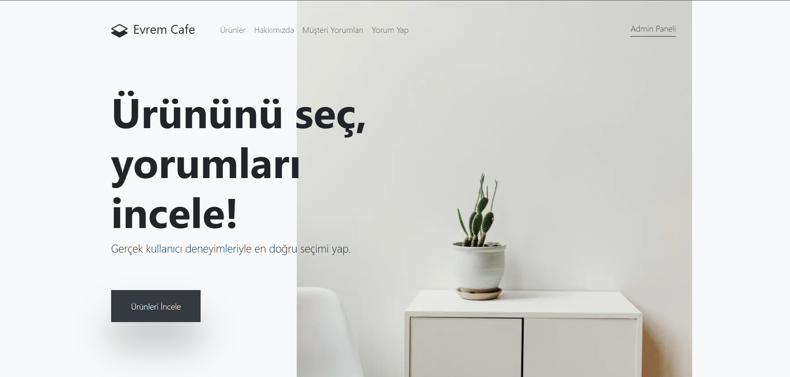
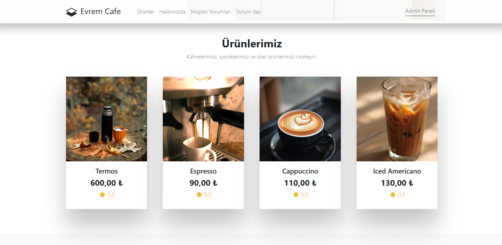
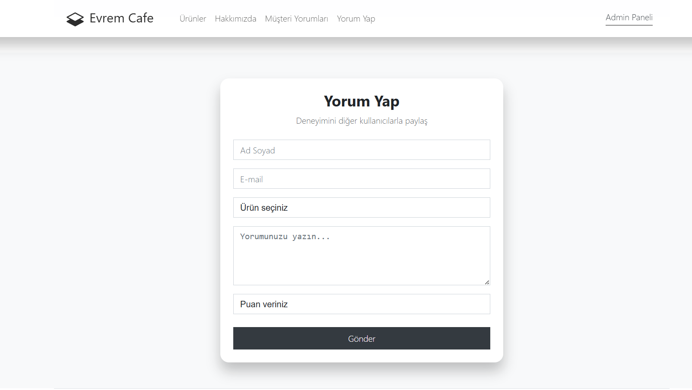
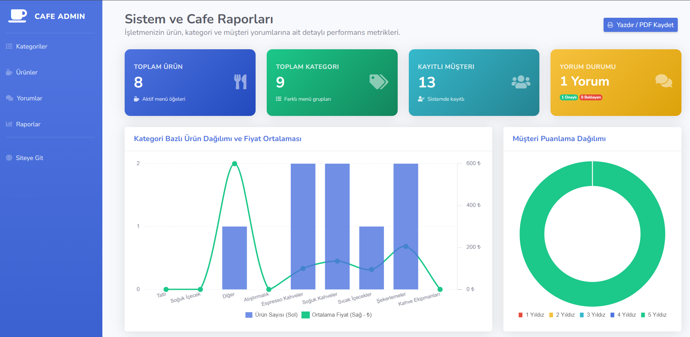
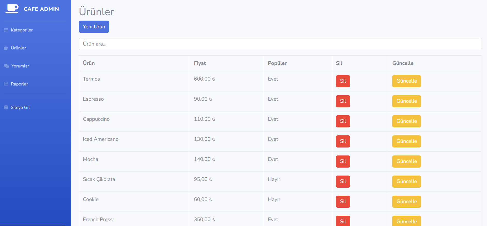
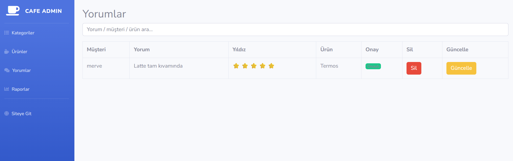

# ☕ Evrem Cafe - Kafe & Müşteri Yorum Portalı

Bu proje, **Softito Akademi Backend Developer Eğitimi** kapsamında, ASP.NET Core MVC mimarisi ve Entity Framework Core Code First yaklaşımı kullanılarak geliştirilmiş modern bir **Kafe Sipariş, Yönetim ve Müşteri Yorum Sistemi** web uygulamasıdır.

Proje; backend odaklı MVC mimarisi, ilişkisel veritabanı tasarımı ve veri raporlama süreçlerini pekiştirmek amacıyla tasarlanmıştır.

---

## 📸 Ekran Görüntüleri

Projenize ait ekran görüntülerinin dizilimini ve görsellerini aşağıda bulabilirsiniz. Bu ekran görüntülerini GitHub'a yüklerken projenin kök dizinindeki `images/` klasörüne aşağıdaki isimlerle kaydetmeniz önerilir:

### 🌐 Kullanıcı Portalı (Anasayfa & Yorum Sistemi)

<table width="100%">
  <tr>
    <td width="50%" align="center">
      <b>1. Anasayfa - Kahve Dünyası</b> 
      
    </td>
    <td width="50%" align="center">
      <b>2. Dinamik Ürün Menüsü</b> 
      
    </td>
  </tr>
  <tr>
    <td colspan="2" align="center">
      <b>3. Yorum & Puanlama Arayüzü</b> 
      
    </td>
  </tr>
</table>

### 🛡️ Admin Yönetim Paneli

<table width="100%">
  <tr>
    <td width="50%" align="center">
      <b>4. Sistem İstatistikleri & Gelişmiş Raporlar</b> 
      
    </td>
    <td width="50%" align="center">
      <b>5. Ürün Yönetimi (CRUD & Arama)</b> 
      
    </td>
  </tr>
  <tr>
    <td colspan="2" align="center">
      <b>6. Yorum Yönetimi & Onaylama Paneli</b> 
      
    </td>
  </tr>
</table>

---

## 🛠️ Kullanılan Teknolojiler & Araçlar

Projenin backend ve veritabanı mimarisinde aşağıdaki teknolojiler ve kütüphaneler kullanılmıştır:

- **Programlama Dili:** C# (.NET Core)
- **Framework:** ASP.NET Core MVC (Model-View-Controller mimarisi)
- **Veritabanı ORM:** Entity Framework Core (EF Core)
- **Veritabanı Motoru:** MS SQL Server (`cafedb` veritabanı)
- **Arayüz Teknolojileri:** Razor Syntax, HTML5, CSS3, Bootstrap 4
- **Grafik ve İkon Kütüphaneleri:** Chart.js v2.9.4, FontAwesome

---

## 🧠 Backend Geliştirici Olarak Neler Öğrendim?

Bu projenin geliştirilme sürecinde bir Backend Developer olarak aşağıdaki temel yetkinlikleri ve pratikleri kazandım:

### 1. EF Core ile Code First Yaklaşımı ve Veritabanı Yönetimi
- **İlişkisel Veritabanı Modelleme:** Kategoriler, Ürünler, Müşteriler ve Yorumlar arasındaki bire-çok (one-to-many) ilişkileri kod ortamında modelledim.
- **Migrations & Database Seeding:** Kod tabanındaki değişikliklerin `dotnet ef migrations` ile veritabanına sorunsuz yansıtılmasını ve ilk örnek verilerin (seeding) SQL Server üzerinde oluşturulmasını deneyimledim.
- **Veritabanı Sağlığı ve Bütünlüğü:** Nullable reference types kavramını uygulayarak veritabanı alanlarının güvenliğini sağladım.

### 2. ASP.NET Core MVC Mimarisi ve Veri Akışı
- **Controller & Action Yönetimi:** İş mantığını barındıran Controller sınıfları tasarlayarak HTTP isteklerini (GET/POST) karşılamayı ve yönlendirmeyi (Redirect) pratik ettim.
- **Strongly Typed ViewModels:** Dynamic ve `ViewBag` kullanımındaki `RuntimeBinderException` risklerini önlemek için güçlü tipli `ReportsViewModel` yapısını kurguladım. Controller ile View katmanı arasındaki veri taşıma sürecini güvenli hâle getirdim.
- **Razor Engine Entegrasyonu:** Sunucu tarafında üretilen verilerin Razor Syntax ile dinamik HTML bileşenlerine dönüştürülmesini sağladım.

### 3. Gelişmiş LINQ Sorguları ve Sunucu Tarafı Veri Analizi
- **Veri Gruplama & Agregasyon:** `GroupBy` kullanarak kullanıcı puanlarını derecelerine göre grupladım. `Average`, `Sum`, `Min`, `Max` ve `Count` metotları vasıtasıyla dinamik raporlama verileri ürettim.
- **İlişkisel Sorgular:** Eager Loading (`Include`) pratikleri ile ilişkili tabloları veritabanından minimum sorgu maliyetiyle çektim.

### 4. Raporlama ve Güvenli Admin Paneli Mantığı
- **İstatistik Grafik Alt Yapısı:** Chart.js kütüphanesi için sunucu tarafında veri hazırladım. Çift eksenli (Dual-Axis) ve doughnut grafik verilerini JSON formatında ön yüze aktardım.
- **Yorum Onaylama & İş Akışı (Approval Workflow):** Müşterilerden gelen yorumları doğrudan yayınlamak yerine admin onayına (`IsApproved` kontrolü) sunan iş akışını uygulayarak güvenli içerik yönetimi mantığını pekiştirdim.
- **Dışa Aktarma (Export) Mantığı:** Rapor verilerinin Türkçe karakter desteği (UTF-8 BOM) ile CSV dosyasına dönüştürülerek Excel uyumlu şekilde indirilmesini sağlayan yapıyı kurdum.
