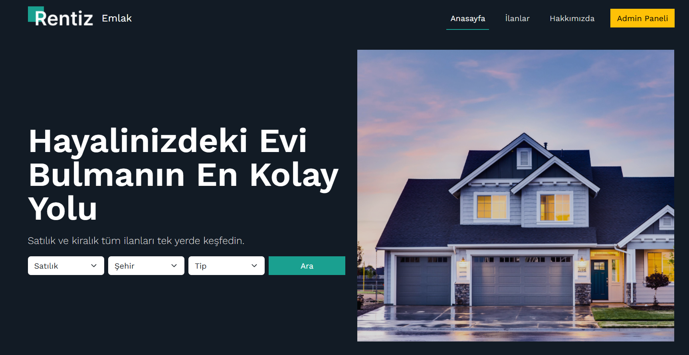
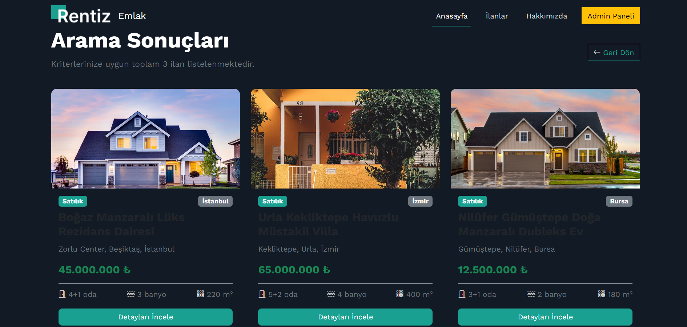
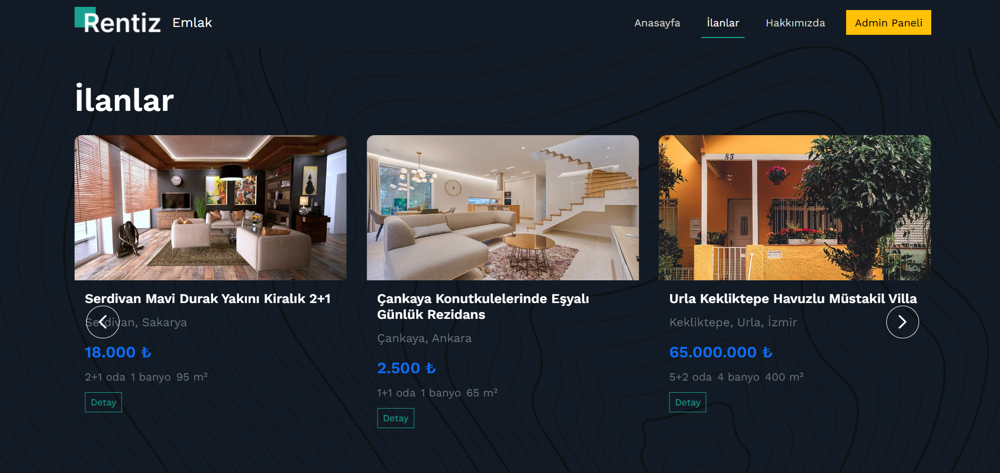
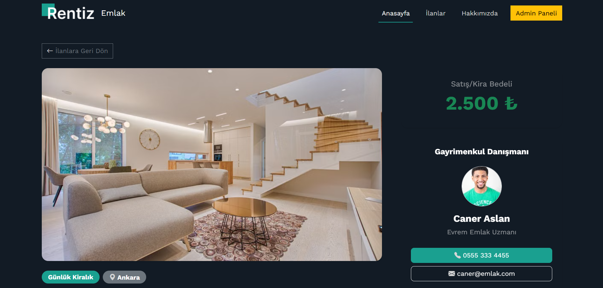
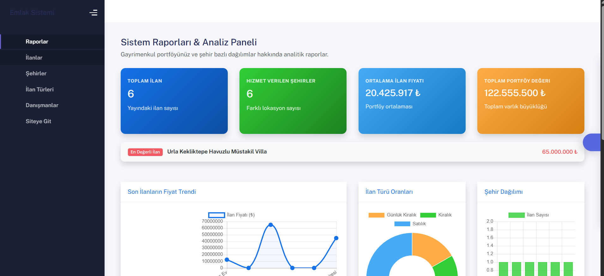
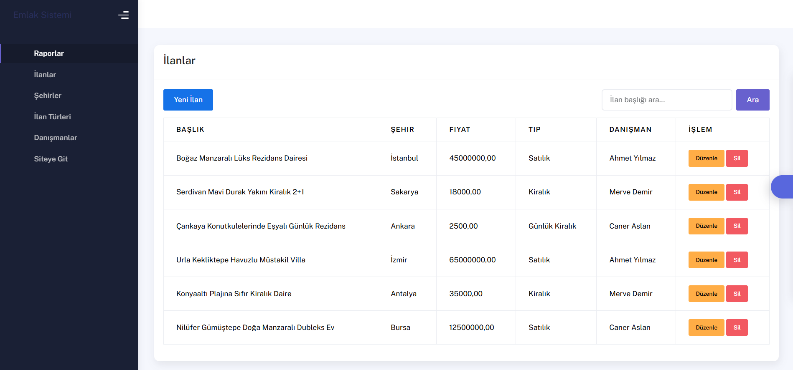
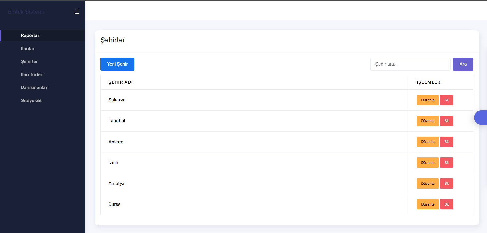
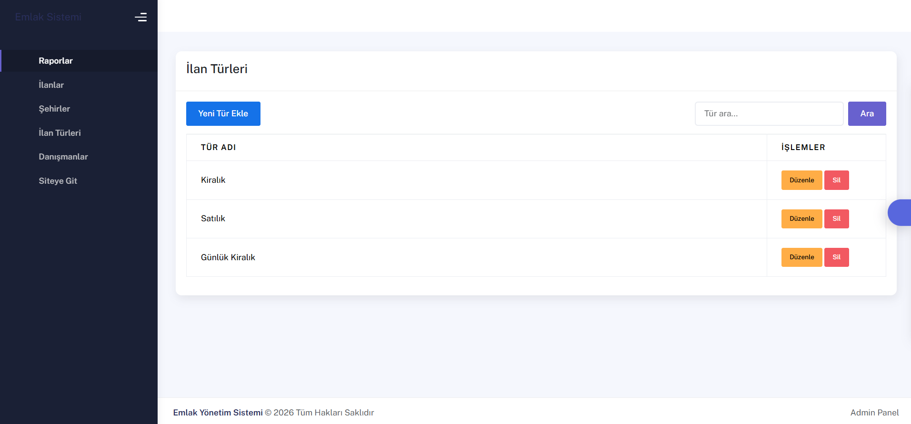
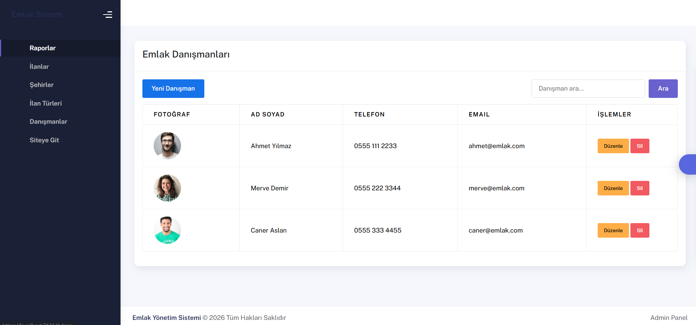

# 🏠 Rentiz Emlak - Gayrimenkul İlan & Raporlama Portalı

Bu proje, **Softito Akademi Backend Developer Eğitimi** kapsamında, Entity Framework Core Database First yaklaşımı ve ASP.NET Core MVC mimarisi kullanılarak geliştirilmiş modern bir **Kafe Sipariş, Yönetim ve Müşteri Yorum Sistemi** benzeri olan **Emlak İlan Yönetim ve Raporlama Sistemi** web uygulamasıdır.

Proje; backend mimarisi, ilişkisel veritabanı tasarımı (Database First), veri raporlama süreçleri ve dinamik arama filtrelerini pekiştirmek amacıyla geliştirilmiştir.

---

## 📸 Ekran Görüntüleri

Projenize ait ekran görüntülerinin dizilimini ve görsellerini aşağıda bulabilirsiniz. Bu ekran görüntülerini GitHub'a yüklerken projenin kök dizinindeki `images/` klasörüne aşağıdaki isimlerle kaydetmeniz önerilir:

### 🌐 Kullanıcı Portalı (Anasayfa, Arama & Detay)

<table width="100%">
  <tr>
    <td width="50%" align="center">
      <b>1. Anasayfa - Arama Motoru (Boş Durum)</b> 
      
    </td>
    <td width="50%" align="center">
      <b>2. İnteraktif Arama Sonuçları Izgarası (Grid)</b> 
      
    </td>
  </tr>
  <tr>
    <td width="50%" align="center">
      <b>3. İlan Sürgüsü (Fixed Swiper Slider & Yön Okları)</b> 
      
    </td>
    <td width="50%" align="center">
      <b>4. İlan Detay Sayfası & Danışman İletişim Kartı</b> 
      
    </td>
  </tr>
</table>

### 🛡️ Admin Yönetim Paneli & Raporlama

<table width="100%">
  <tr>
    <td colspan="2" align="center">
      <b>5. Sistem Raporları & Analiz Paneli (KPI & Chart.js Grafik Modülleri)</b> 
      
    </td>
  </tr>
  <tr>
    <td width="50%" align="center">
      <b>6. İlan Yönetim Paneli (CRUD & Başlık Arama)</b> 
      
    </td>
    <td width="50%" align="center">
      <b>7. Lokasyon / Şehir Yönetimi (CRUD & Arama)</b> 
      
    </td>
  </tr>
  <tr>
    <td width="50%" align="center">
      <b>8. İlan Türü Yönetimi (CRUD & Arama)</b> 
      
    </td>
    <td width="50%" align="center">
      <b>9. Emlak Danışmanları Yönetimi (CRUD & Arama)</b> 
      
    </td>
  </tr>
</table>

---

## 🛠️ Kullanılan Teknolojiler & Araçlar

Projenin backend, veritabanı ve panel entegrasyonunda aşağıdaki teknolojiler kullanılmıştır:

- **Programlama Dili:** C# (.NET Core)
- **Framework:** ASP.NET Core MVC (Model-View-Controller mimarisi)
- **Veritabanı ORM:** Entity Framework Core (EF Core)
- **Veritabanı Yaklaşımı:** Database First (Mevcut SQL Server şemasından Scaffolded Modeller)
- **Veritabanı Motoru:** MS SQL Server (`RealEstateDb` veritabanı)
- **Arayüz Teknolojileri:** Razor Syntax, HTML5, CSS3, Bootstrap 5
- **Grafik Kütüphanesi:** Chart.js v4.x
- **İkon Seti:** FontAwesome & Simple Line Icons

---

## 🧠 Backend Geliştirici Olarak Neler Öğrendim?

Bu projenin geliştirilme ve hata giderme süreçlerinde bir Backend Developer olarak aşağıdaki temel yetkinlikleri ve pratikleri kazandım:

### 1. EF Core ile Database First (Scaffold) Entegrasyonu
- **Veritabanından Kod Üretimi:** Veritabanı şemasını öncelikle SQL Server üzerinde kurgulayıp, `dotnet ef dbcontext scaffold` araçları vasıtasıyla C# sınıflarının ve ilişkisel haritalamaların (`Fluent API`) otomatik üretilmesini sağladım.
- **İlişkisel Bütünlük:** Şehirler (`Cities`), İlan Türleri (`PropertyTypes`), Emlak Danışmanları (`Realtors`) ve İlanlar (`Properties`) arasındaki bire-çok (one-to-many) ilişkileri veritabanı seviyesinde kurarak backend modellerine güvenli bir şekilde yansıttım.

### 2. İleri Düzey LINQ Sorguları ve Veri Raporlama
- **Sunucu Tarafı İstatistikler:** Dashboard ekranında dinamik grafikler çizebilmek için verileri SQL tarafında `GroupBy` ile grupladım. Şehirlere göre ilan adetlerini ve ilan türü dağılımlarını anlık hesaplayarak Chart.js kütüphanesine JSON formatında aktardım.
- **Performans Optimizasyonu:** `Include` kullanarak ilişkili tabloları (City, PropertyType, Realtor) tek bir SQL sorgusu (Eager Loading) ile belleğe çektim ve sorgu maliyetlerini minimumda tuttum.
- **KPI Metrikleri:** Toplam portföy değeri (`Sum`), ortalama ilan fiyatı (`Average`), en yüksek fiyatlı gayrimenkul (`Max`) gibi istatistikleri dinamik olarak hesapladım.

### 3. Arama ve Filtreleme Mantığı (Public & Admin CRUD)
- **Çoklu Filtre Kurgusu:** Kullanıcı portalında şehir (`cityId`), emlak amacı (`purpose`: Satılık/Kiralık) ve metin (`type`) bazlı üçlü kombinasyon içeren bir arama motoru geliştirdim.
- **CRUD Panel Aramaları:** Admin panelindeki her bir veri yönetim ekranına (Şehir, İlan, Tür, Danışman) controller seviyesinde çalışan, `IQueryable` yapısıyla SQL üzerinde filtrelenip sayfalanan güvenli arama (Search) formları entegre ettim.

### 4. Rota ve Varlık Yolu (Asset Pathing) Hata Ayıklama
- **Bağıl Yol Sorunlarının Giderilmesi:** Alt sayfalarda ve arama sayfalarında (`/Property/Details/2` veya `/Property/Search`) bozulan navbar ve CSS kütüphanesi yüklenme problemlerini, asset yollarına kök dizin işareti (`/`) ekleyerek çözdüm.
- **Varsayılan Rota (Default Route) Yapılandırması:** `Program.cs` üzerinde varsayılan başlangıç denetleyicisini (`Home/Index`) olarak ayarlayarak, sitenin ilk açılışta admin paneli yerine kullanıcı landing page arayüzü ile açılmasını sağladım.
