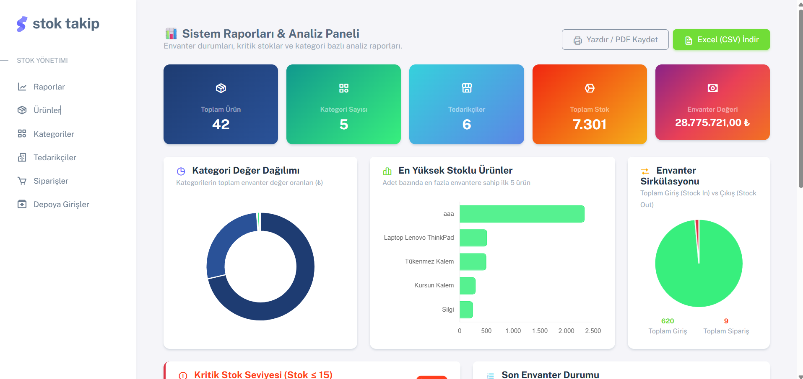
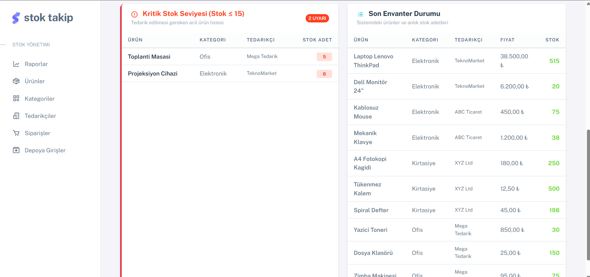
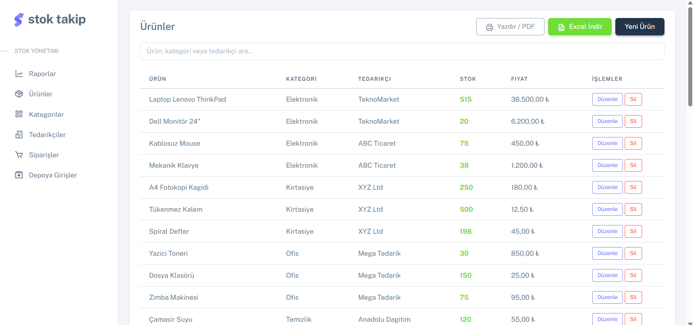
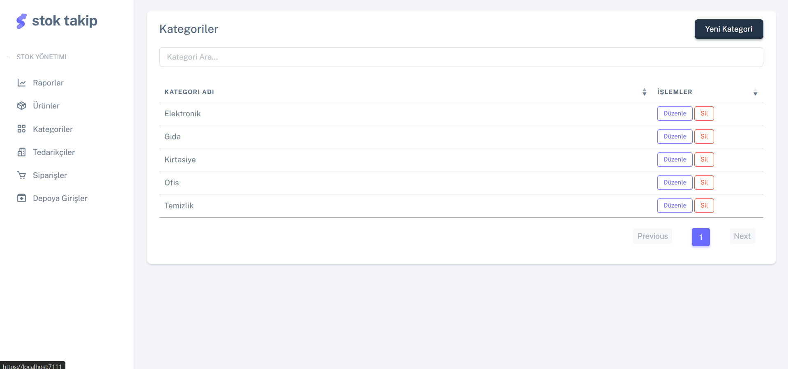
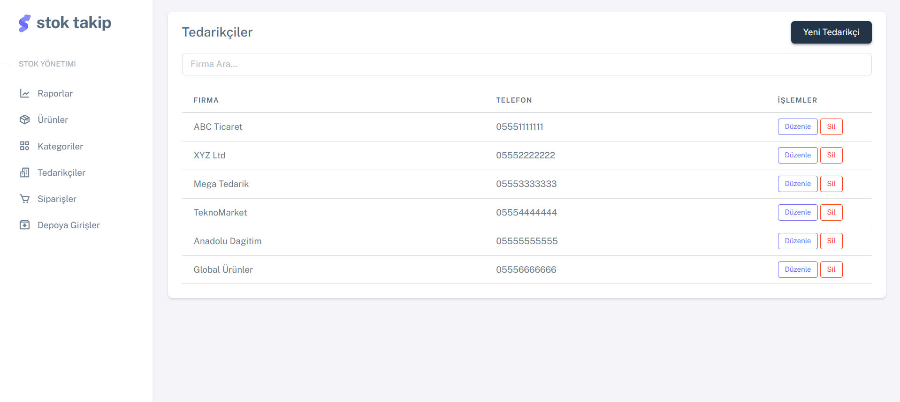
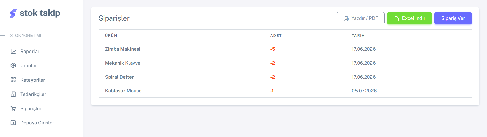
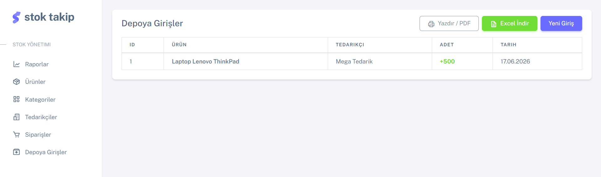

# 📦 Stok Takip - Envanter Raporlama & Yönetim Sistemi

Bu proje, **Softito Akademi Backend Developer Eğitimi** kapsamında, Entity Framework Core Code-First yaklaşımı ve ASP.NET Core MVC mimarisi kullanılarak geliştirilmiş, çok katmanlı yapıya sahip modern bir **Stok Takip ve Raporlama Sistemi** web uygulamasıdır.

Proje; backend mimarisi, Code-First veritabanı tasarımı, veri raporlama ve istemci taraflı rapor aktarım süreçlerini pekiştirmek amacıyla geliştirilmiştir.

---

## 📸 Ekran Görüntüleri

Projenize ait ekran görüntülerinin dizilimini ve görsellerini aşağıda bulabilirsiniz. Bu ekran görüntülerini GitHub'a yüklerken projenin kök dizinindeki `images/` klasörüne aşağıdaki isimlerle kaydetmeniz önerilir:

### 📊 Raporlar Paneli & Analitik Veriler

<table width="100%">
  <tr>
    <td width="50%" align="center">
      <b>1. Raporlar & Analiz Paneli (KPI & Chart.js)</b> 
      
    </td>
    <td width="50%" align="center">
      <b>2. Kritik Stok Uyarısı & Envanter Durumu</b> 
      
    </td>
  </tr>
</table>

### 🛡️ Envanter Yönetim & CRUD Ekranları

<table width="100%">
  <tr>
    <td width="33%" align="center">
      <b>3. Ürün Yönetimi (CRUD & CSV/PDF)</b> 
      
    </td>
    <td width="33%" align="center">
      <b>4. Kategori Yönetimi (CRUD)</b> 
      
    </td>
    <td width="34%" align="center">
      <b>5. Tedarikçi Yönetimi (CRUD)</b> 
      
    </td>
  </tr>
  <tr>
    <td width="50%" align="center">
      <b>6. Sipariş Geçmişi & Raporlama (CSV/PDF)</b> 
      
    </td>
    <td width="50%" align="center">
      <b>7. Depo Giriş Hareketleri (CSV/PDF)</b> 
      
    </td>
  </tr>
</table>

---

## 🛠️ Kullanılan Teknolojiler & Kütüphaneler

Projenin backend, veritabanı ve panel entegrasyonunda aşağıdaki teknolojiler kullanılmıştır:

- **Programlama Dili:** C# (.NET 9.0)
- **Framework:** ASP.NET Core MVC (Model-View-Controller mimarisi)
- **Veritabanı ORM:** Entity Framework Core (EF Core)
- **Veritabanı Yaklaşımı:** Code-First (Modellerden Veritabanı Üretimi & Migration)
- **Veritabanı Motoru:** MS SQL Server (`StokTakipDb` veritabanı)
- **Arayüz Teknolojileri:** Razor Syntax, HTML5, CSS3, Bootstrap 5 (Sneat Admin Teması)
- **Grafik Kütüphanesi:** Chart.js v4.x
- **İkon Seti:** Boxicons v2.x

---

## 🧠 Backend Geliştirici Olarak Neler Öğrendim?

Bu projenin geliştirilme ve entegrasyon süreçlerinde bir Backend Developer olarak aşağıdaki temel yetkinlikleri ve pratikleri kazandım:

### 1. EF Core ile Code-First Modelleme ve İlişki Yönetimi
- **Veritabanı Tasarımı:** C# sınıfları (Product, Category, Supplier, Order, StockEntry) üzerinden veri şemasını sıfırdan kurguladım ve `DbContext` üzerinde Fluent API kullanarak veri tabanı kısıtlamalarını (DeleteBehavior, ColumnType vb.) yapılandırdım.
- **Migration & Veri Tohumlama (Seeding):** `dotnet ef migrations` araçlarıyla veritabanı şema güncellemelerini yönetecek geçişleri hazırladım ve sistemin test verileriyle otomatik ayağa kalkmasını sağladım.

### 2. Çok Katmanlı Mimari (Multi-Layer Architecture) Entegrasyonu
- Uygulamayı sorumlulukların ayrılması (Separation of Concerns) ilkesine uygun şekilde 3 katmana ayırarak yönettim:
  - **`stok_codefirstmvcproje.model`:** Entity sınıflarını barındıran katman.
  - **`stok_codefirstmvcproje.data`:** DbContext ve veritabanı yapılandırmalarını içeren katman.
  - **`stok_codefirstmvcproje.UI`:** Presentation (Razor Views, Controllers) katmanı.

### 3. LINQ Birleştirme (Join) Sorguları & Agregasyon Yetkinlikleri
- **Gelişmiş Veri Birleştirme (Join):** Ürün detaylarını ve grafik verilerini hazırlamak amacıyla LINQ üzerinde `join` ve `DefaultIfEmpty` operatörlerini kullanarak `Inner Join` ve `Left Join` sorguları yazdım.
- **Performans Optimizasyonu:** Rapor verilerini sunucu tarafında gruplayarak (`GroupBy`) ve maliyet hesaplamalarını SQL üzerinde (`Sum(x => x.StockQty * x.UnitPrice)`) yürüterek sunucu-istemci arasındaki veri trafiğini minimum düzeyde tuttum.

### 4. Raporlama Entegrasyonları (Excel CSV & PDF Baskı Layout)
- **İstemci Taraflı Veri Aktarımı:** Sunucuya ek istek yükü getirmeden, tabloda listelenen verilerin Türkçe karakter uyumlu (UTF-8 BOM `\ufeff`) şekilde Excel (CSV) formatında inmesini sağlayan Javascript tabanlı ihracat motoru entegre ettim.
- **Baskı & PDF Yönetimi:** CSS `@@media print` kurallarını kullanarak, kullanıcının sayfayı "PDF olarak kaydetmesi" durumunda sol menülerin, filtrelerin ve butonların otomatik olarak gizlenmesini sağlayıp temiz A4 dikey fatura/rapor çıktısı alınmasını sağladım.
