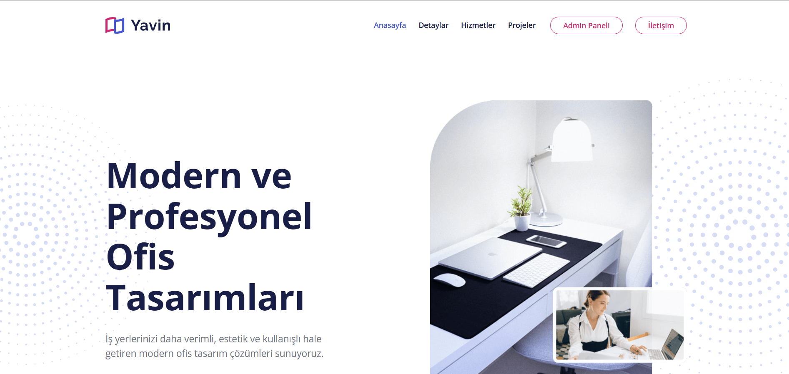

# 🏢 Yavin - Ofis Tasarım Yönetim Portalı

Bu proje, **Softito Akademi Backend Developer Eğitimi** kapsamında, **ASP.NET Core Razor Pages** mimarisi ve ham **ADO.NET (SQL Server)** veri erişim kütüphaneleri kullanılarak geliştirilmiş, kurumsal bir ofis dekorasyon ve tasarım portfolyosu yönetim sistemidir.

Proje kapsamında; Razor Pages mimarisi, ADO.NET veri komutları, SQL Server veritabanı yönetimi ve kurumsal şablonlara uyumlu yönetim paneli entegrasyonu pratik edilmiştir.

---

## 📸 Ekran Görüntüleri

Projenize ait ekran görüntülerinin dizilimini ve görsellerini aşağıda bulabilirsiniz. Bu ekran görüntülerini GitHub'a yüklerken projenin kök dizinindeki `images/` klasörüne aşağıdaki isimlerle kaydetmeniz önerilir:

### 🏠 Kamu & Portfolyo Arayüzü

<table width="100%">
  <tr>
    <td width="100%" align="center">
      <b>1. Kurumsal Açılış & Portfolyo Sayfası</b> 
      
    </td>
  </tr>
</table>

### 🛡️ Yönetici (Admin) Paneli & CRUD Ekranları

<table width="100%">
  <tr>
    <td width="50%" align="center">
      <b>2. Admin Panel Özeti (Dashboard)</b> 
      
    </td>
    <td width="50%" align="center">
      <b>3. Kategori Yönetim Paneli (CRUD)</b> 
      
    </td>
  </tr>
  <tr>
    <td width="50%" align="center">
      <b>4. Hizmet Yönetim Paneli (CRUD)</b> 
      
    </td>
    <td width="50%" align="center">
      <b>5. Proje Yönetim Paneli (CRUD)</b> 
      
    </td>
  </tr>
  <tr>
    <td width="100%" align="center">
      <b>6. Gelen Müşteri Talepleri (İletişim Talepleri Paneli)</b> 
      
    </td>
  </tr>
</table>

---

## 🛠️ Kullanılan Teknolojiler & Mimari Yapı

Projenin backend, veri erişim katmanı ve arayüz yapısında aşağıdaki teknolojiler tercih edilmiştir:

- **Programlama Dili & Framework:** C# (.NET 9.0) & ASP.NET Core Razor Pages
- **Veri Erişim Modeli:** Ham ADO.NET (Raw SQL Queries)
- **Veritabanı Sağlayıcısı:** Microsoft SQL Server (`SqlConnection`, `SqlCommand`, `SqlDataReader` kullanımı)
- **Veritabanı Adı:** `OfisDB`
- **Arayüz Teknolojileri:** Razor CSS Isolation, HTML5, CSS3, Bootstrap 5, FontAwesome 5 (Yavin Landing ve Yavin Admin Sidebar temaları)

---

## 🧠 Backend Geliştirici Olarak Neler Öğrendim?

Bu projenin geliştirilme ve entegrasyon süreçlerinde bir Backend Developer olarak aşağıdaki temel yetkinlikleri ve pratikleri kazandım:

### 1. Razor Pages Mimari Yaklaşımı ve PageModel Yapısı
- **Sayfa Tabanlı Mantıksal Ayrım (Page-Based Routing):** Controller sınıfları yerine sayfa bazlı veri bağlama (Model Binding) ve HTTP metotları (OnGet, OnPost) ile sayfa yaşam döngülerini yönettik.
- **Form Bindings & Veri Transferi:** `[BindProperty]` özellikleri ve `Request.Form` nesnelerini kullanarak formlardan güvenli veri okuma süreçlerini kurguladık.

### 2. Ham ADO.NET ile Veritabanı Programlama
- **Bağlantı ve Komut Yönetimi:** EF Core gibi ORM araçları olmadan, `SqlConnection` nesnesiyle veritabanına el sıkışıp `SqlCommand` nesnesi ve parametre bağlama (`AddWithValue`) yöntemleriyle güvenli SQL sorguları çalıştırdık.
- **Veri Okuma Performansı:** `SqlDataReader` ile veritabanından dönen satırları en az bellek tüketimiyle, nesne eşleştirme (Object Mapping) işlemlerini manuel olarak C# nesnelerine dönüştürerek yürüttük.
- **Transaction ve Güvenlik:** SQL Injection açıklarını önlemek amacıyla tamamen parametrik sorgular kullandık.

### 3. Çok Tablolu SQL İlişkileri ve Join Yönetimi
- **Left Join Entegrasyonu:** Projeler listelenirken projeye ait kategorinin adını getirebilmek için `Projects` ve `Categories` tablolarını `LEFT JOIN` kullanarak birleştirdik ve C# modelleri üzerinde eşleştirdik.
- **İlişkili Silme Kısıtlamaları (Foreign Key Constraints):** Veritabanı şemasında kategorisi silinen projelerin `CategoryId` alanının `NULL` set edilmesini sağlayarak (`ON DELETE SET NULL`) veri bütünlüğünü koruduk.

### 4. Çift Layout (Layout Isolation) Yönetimi
- Projede hem müşterilere yönelik landing page arayüzü (`_Layout.cshtml`) hem de yöneticilere yönelik gelişmiş bir yönetim paneli arayüzü (`_AdminLayout.cshtml`) kurgulayarak rollerin arayüzsel ayrımını başarıyla sağladık.
