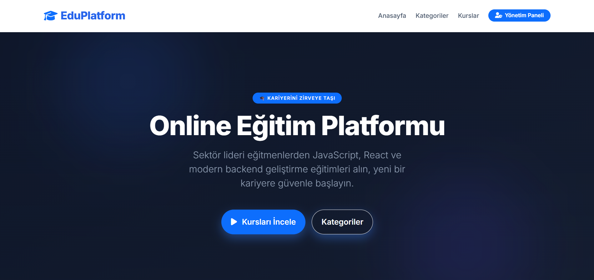
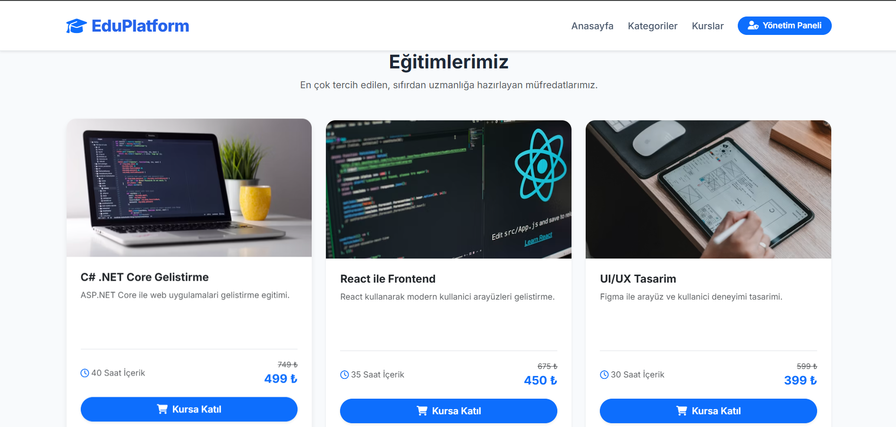
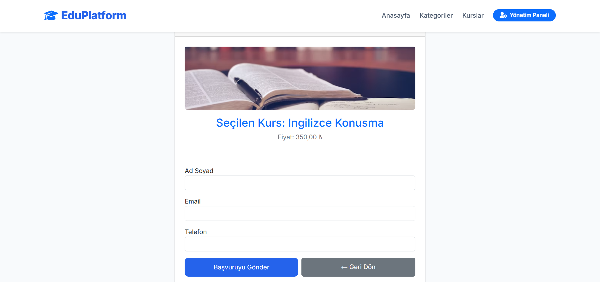
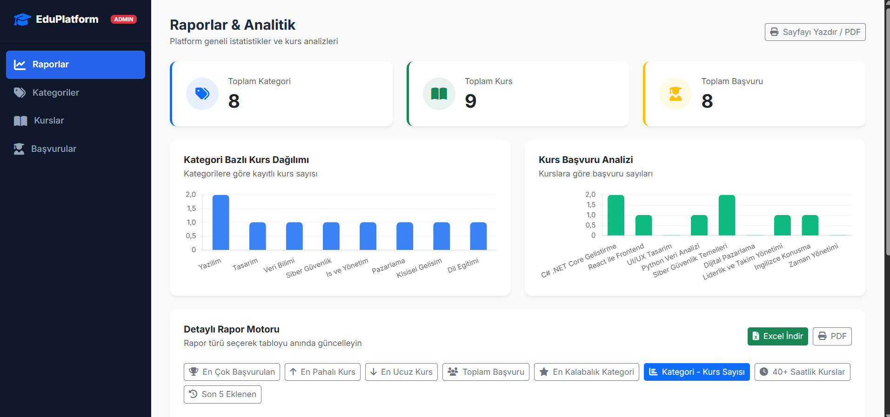
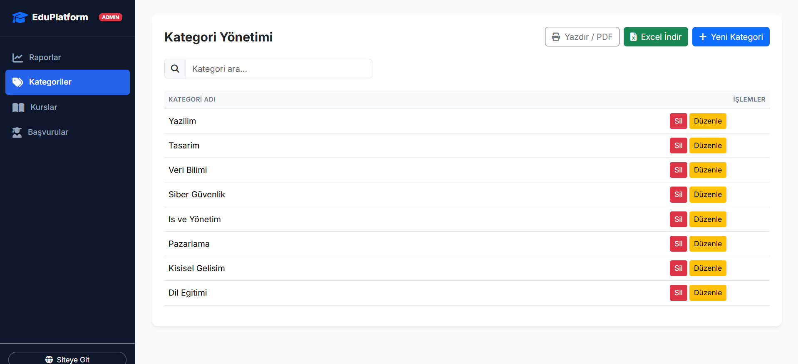
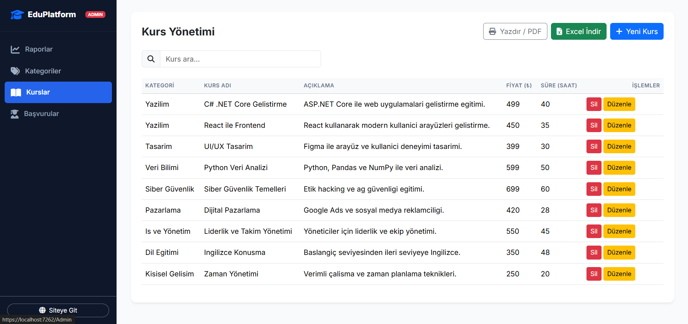
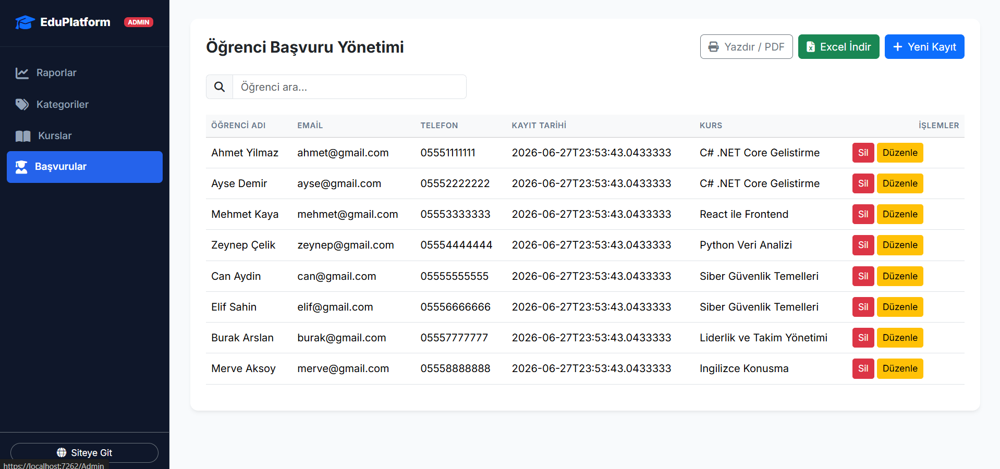

# 🎓 EduPlatform — JavaScript & Kurs Yönetim Portalı

Yazılım, tasarım, veri bilimi ve kişisel gelişim kurslarını tek çatı altında toplayan, **ASP.NET Core MVC** ve **JavaScript** (AJAX / jQuery) mimarisiyle geliştirilmiş tam yığın bir **eğitim & kurs yönetim portalı**.

---

## 🛠️ Kullanılan Teknolojiler & Kütüphaneler

- **Programlama Dili & Framework:** C# (.NET 9) / ASP.NET Core MVC
- **Veri Erişim:** Entity Framework Core (Code-First)
- **Veritabanı:** MS SQL Server (LocalDB)
- **Frontend:** HTML5, Vanilla CSS, Bootstrap 5, Google Fonts (Inter), FontAwesome
- **Dinamik UI:** jQuery, AJAX (sayfa yenilenmeden tablo güncelleme)
- **Raporlama:** Chart.js (Çubuk Grafikler), CSV/Excel İndirme, Tarayıcı Tabanlı PDF (window.print)

---

## 🌟 Öne Çıkan Özellikler

### 1. Tam AJAX Tabanlı CRUD Yönetimi
Tüm admin sayfalarında (Kategoriler, Kurslar, Başvurular) **sayfa yenilenmeden** çalışan jQuery AJAX motoru kullanılmıştır. Veri ekleme, güncelleme ve silme işlemleri anında tabloya yansır.

### 2. Dinamik Rapor Motoru (8 Farklı Rapor)
Admin panelinde rapor türünü seçince tablo AJAX ile anında güncellenir:
- En çok başvuru alan kurs
- En pahalı / en ucuz kurs
- Toplam başvuru sayısı
- En kalabalık kategori
- Kategori bazlı kurs sayıları
- 40+ saatlik kurslar
- Son 5 eklenen kurs

### 3. PDF & Excel Çıktısı
Her admin yönetim sayfasında istemci tarafında çalışan:
- **PDF:** `window.print()` + `@media print` stilleriyle temiz A4 çıktısı
- **Excel (CSV):** UTF-8 BOM işaretli, Türkçe karakter uyumlu CSV indirme

### 4. Anlık Arama
Kategori, kurs ve başvuru sayfalarında `keyup` tetikleyicili anlık arama; her karakter girişinde sunucuya AJAX isteği gönderir.

### 5. Chart.js Analitik Grafikleri
Admin raporlar sayfasında:
- **Mavi çubuk grafik:** Kategori bazlı kurs sayısı dağılımı
- **Yeşil çubuk grafik:** Kurslara göre başvuru sayısı analizi

---

## 🧠 Backend Geliştirici Olarak Neler Öğrendim?

- **EF Core Code-First & Migration:** Model sınıflarından veritabanı şeması oluşturma, veri ilişkilendirme (`Category → Course → Enrollment`) ve migration yönetimi.
- **jQuery & AJAX Mimarisi:** Geleneksel form submit'ten bağımsız, endpoint'e JSON isteği atan, dönen veriyle DOM'u güncelleyen tam AJAX CRUD akışını uygulamalı olarak öğrendim.
- **Controller Tasarımı:** `JsonResult` döndüren API benzeri action metotlar (`GetReport`, `CourseList`, `CategoryList`) ile MVC'de karma (hybrid) API + View mimarisi kurguladım.
- **Sunucu Taraflı Arama:** `LINQ Where` + `Contains` ile dinamik arama sorgularını JSON endpoint'ten sunarak anlık filtreleme deneyimi geliştirdim.
- **Raporlama Katmanı:** Karmaşık LINQ sorguları (`OrderByDescending`, `GroupBy`, `Take`) ile veri analiz endpointleri tasarladım.

---

## 📸 Ekran Görüntüleri

### 🌐 Landing Page — Hero & Kurs Kartları

### 🎓 Landing Page — Kurs Listeleme

### 🛒 Kursa Kayıt Formu (Başvuru Sayfası)

### 📊 Admin — Raporlar & Analitik

### 🏷️ Admin — Kategori Yönetimi

### 📚 Admin — Kurs Yönetimi

### 👥 Admin — Öğrenci Başvuru Yönetimi

---

## 🗄️ Veritabanı Şeması

| Tablo | Açıklama | İlişki |
|:--|:--|:--|
| `Categories` | Yazılım, Tasarım, Veri Bilimi vb. kategoriler | — |
| `Courses` | Kurs adı, açıklama, fiyat, süre, görsel URL | `CategoryId` → `Categories` |
| `Enrollments` | Öğrenci adı, email, telefon, kayıt tarihi | `CourseId` → `Courses` |
