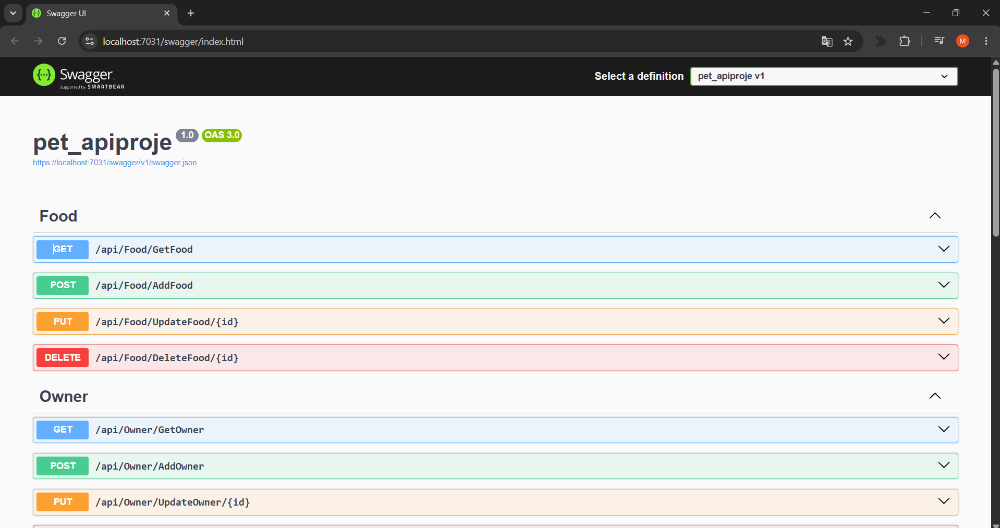

# 🐾 PetAPI — Hayvan Sahiplendirme & Klinik Yönetim API'si

ASP.NET Core Web API ile geliştirilmiş, Swagger UI üzerinden test edilen RESTful bir **Veteriner Klinik & Hayvan Yönetim API Servisi**. Evcil hayvanlar, sahipler, mama ve oyuncak kayıtlarını HTTP uç noktaları aracılığıyla yönetir.

---

## 🛠️ Kullanılan Teknolojiler

- **Framework:** ASP.NET Core Web API (.NET 9)
- **Veri Erişim:** Entity Framework Core (Code-First)
- **Veritabanı:** MS SQL Server (LocalDB)
- **API Dokümantasyonu:** Swagger UI (OpenAPI 3.0 / Swashbuckle)

---

## 📡 API Uç Noktaları (Endpoints)

### 🐶 Pet — Hayvan Yönetimi
| Metot | Endpoint | Açıklama |
|:---:|:---|:---|
| `GET` | `/api/Pet/GetPet` | Tüm hayvan kayıtlarını listeler |
| `POST` | `/api/Pet/AddPet` | Yeni hayvan kaydı ekler |
| `PUT` | `/api/Pet/UpdatePet/{id}` | Var olan hayvan bilgilerini günceller |
| `DELETE` | `/api/Pet/DeletePet/{id}` | Hayvan kaydını siler |

### 👤 Owner — Sahip Yönetimi
| Metot | Endpoint | Açıklama |
|:---:|:---|:---|
| `GET` | `/api/Owner/GetOwner` | Tüm sahip kayıtlarını listeler |
| `POST` | `/api/Owner/AddOwner` | Yeni sahip kaydı ekler |
| `PUT` | `/api/Owner/UpdateOwner/{id}` | Sahip bilgilerini günceller |
| `DELETE` | `/api/Owner/DeleteOwner/{id}` | Sahip kaydını siler |

### 🍖 Food — Mama Yönetimi
| Metot | Endpoint | Açıklama |
|:---:|:---|:---|
| `GET` | `/api/Food/GetFood` | Tüm mama kayıtlarını listeler |
| `POST` | `/api/Food/AddFood` | Yeni mama kaydı ekler |
| `PUT` | `/api/Food/UpdateFood/{id}` | Mama bilgilerini günceller |
| `DELETE` | `/api/Food/DeleteFood/{id}` | Mama kaydını siler |

### 🧸 Toy — Oyuncak Yönetimi
| Metot | Endpoint | Açıklama |
|:---:|:---|:---|
| `GET` | `/api/Toy/GetToy` | Tüm oyuncak kayıtlarını listeler |
| `POST` | `/api/Toy/AddToy` | Yeni oyuncak kaydı ekler |
| `PUT` | `/api/Toy/UpdateToy/{id}` | Oyuncak bilgilerini günceller |
| `DELETE` | `/api/Toy/DeleteToy/{id}` | Oyuncak kaydını siler |

---

## 🗄️ Veri Modelleri

```csharp
// Hayvan
Pet      { Id, Name, Species (Kedi/Köpek/Kuş...), Age }

// Sahip
Owner    { Id, FullName, Phone, City }

// Mama
Food     { Id, FoodName, Brand, Price }

// Oyuncak
Toy      { Id, ToyName, Material, Price }
```

---

## 🌟 Öne Çıkan Özellikler

### 1. Controller-Based RESTful API Tasarımı
Her kaynak için ayrı controller sınıfı (`PetController`, `OwnerController`, `FoodController`, `ToyController`) `[ApiController]` ve `[Route("api/[controller]")]` attribute'ları ile route yönetimi yapılmıştır.

### 2. Swagger UI — Entegre API Dokümantasyonu
`Swashbuckle.AspNetCore` paketi ile proje açıldığında doğrudan `https://localhost:{port}/swagger` adresinden tüm endpoint'ler etkileşimli olarak test edilebilmektedir.

### 3. Async/Await Pattern
Tüm veritabanı işlemleri `async Task<>` yapısıyla asenkron olarak çalışmaktadır; sunucu thread blokajı önlenir.

### 4. EF Core Code-First
Model sınıflarından `ApplicationDbContext` üzerinden veritabanı tabloları oluşturulmuş, `migration` ile şema yönetimi sağlanmıştır.

---

## 🧠 Backend Geliştirici Olarak Neler Öğrendim?

- **RESTful API Standartları:** `GET`, `POST`, `PUT`, `DELETE` HTTP metotlarını doğru kaynak semantiğiyle eşleştirmeyi, route convention'larını ve response kodlarını öğrendim.
- **Swagger / OpenAPI Entegrasyonu:** `AddSwaggerGen()` ve `UseSwaggerUI()` middleware'lerini `Program.cs`'e ekleyerek otomatik API dokümantasyonu oluşturulmasını öğrendim.
- **ApiController & ControllerBase Farkı:** View döndürmeye gerek duyulmayan saf API endpoint'lerinde `ControllerBase` kullanımını ve `[ApiController]` attribute'nun otomatik model validation davranışını öğrendim.
- **Async Veri Erişimi:** EF Core'un `ToListAsync()`, `SaveChangesAsync()` metotlarıyla asenkron veritabanı operasyonlarını uygulamalı olarak deneyimledim.
- **EntityState Yönetimi:** `EntityState.Modified` ve `EntityState.Deleted` kullanarak `DbContext` üzerinden güncelleme ve silme işlemlerinin nasıl yönetildiğini öğrendim.

---

## 📸 Ekran Görüntüsü

### 🔍 Swagger UI — API Uç Noktaları


---

## 🗺️ Mimari Özet

```
pet_apiproje/
├── Controllers/
│   ├── FoodController.cs
│   ├── OwnerController.cs
│   ├── PetController.cs
│   └── ToyController.cs
├── Models/
│   ├── ApplicationDbContext.cs
│   ├── Food.cs
│   ├── Owner.cs
│   ├── Pet.cs
│   └── Toy.cs
└── Program.cs          ← Swagger + EF Core servis kaydı
```
