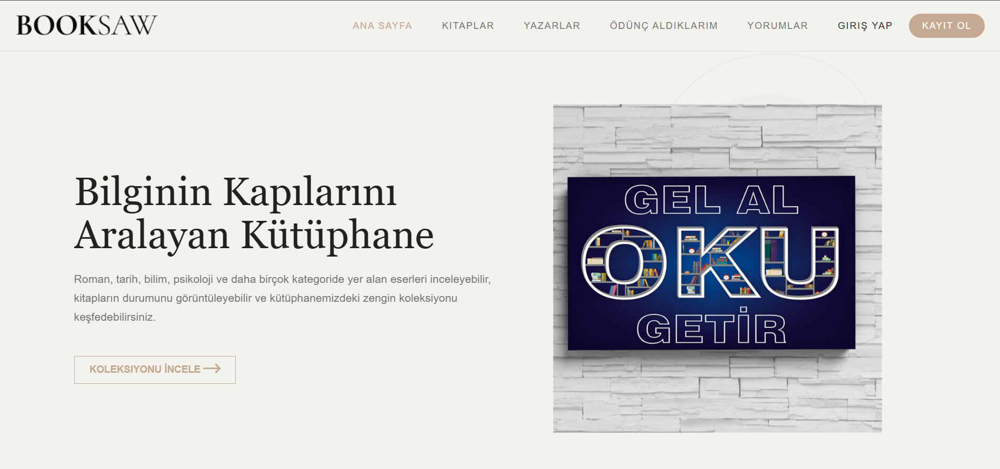
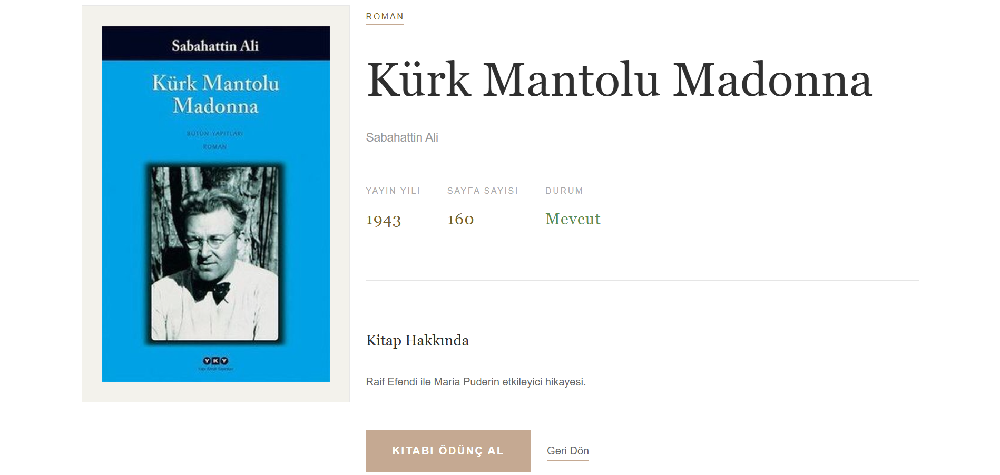
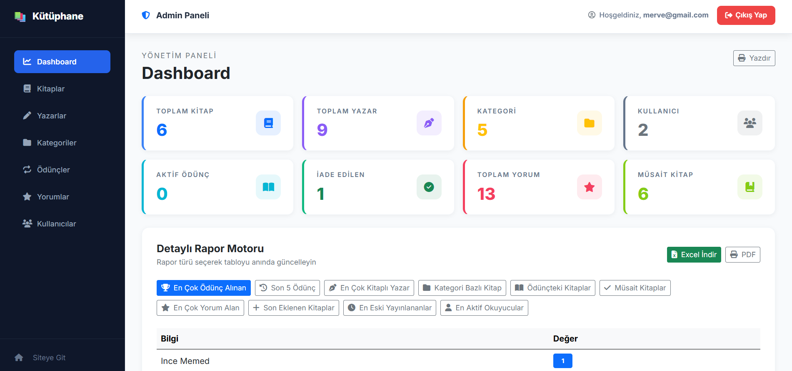
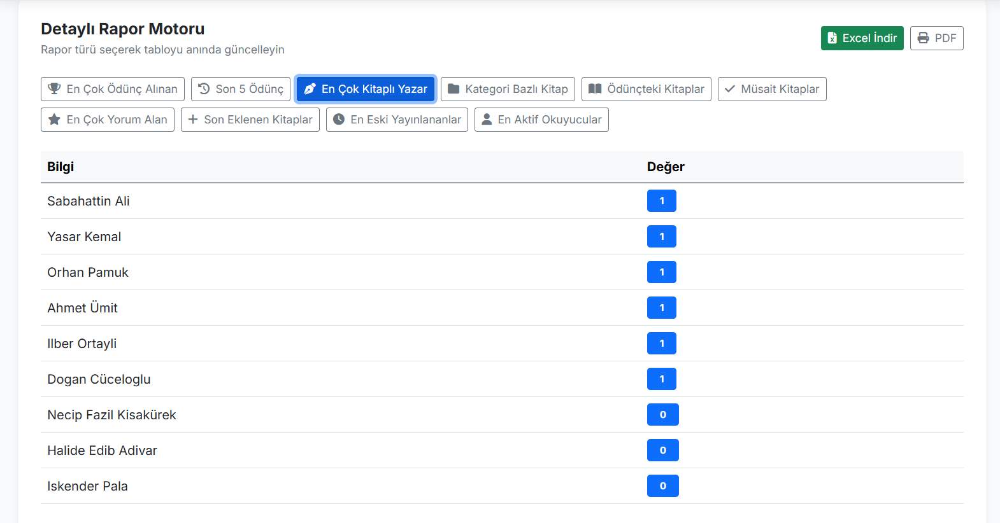

# 📚 Kütüphane Otomasyonu, Yorum ve Ödünç Takip Sistemi (Web API & MVC)

Bu proje, Softito Akademi eğitimi kapsamında ASP.NET Core Web API ve MVC yapıları bir arada kullanılarak geliştirilmiş, **ASP.NET Core Identity** güvenlik entegrasyonuna sahip gelişmiş bir **Kütüphane Yönetim Portalı ve API** uygulamasıdır.

## 🛠️ Kullanılan Teknolojiler

- **Programlama Dili:** C#
- **Framework:** ASP.NET Core Web API & ASP.NET Core MVC (Net 6.0/8.0)
- **Güvenlik & Kimlik Doğrulama:** ASP.NET Core Identity (`ApplicationUser` ile genişletilmiş)
- **ORM Teknolojisi:** Entity Framework Core
- **Veritabanı:** MS SQL Server (`kutuphanedb` veya `LibraryDb` veritabanı)
- **Dokümantasyon:** Swagger UI

## 🗄️ Model / Entity Yapısı

Proje, kütüphane iş süreçlerini ve kullanıcı yetkilerini kapsayan geniş bir veritabanı şemasına sahiptir:

- **ApplicationUser:** ASP.NET Identity yapısını devralarak kütüphaneye üye olan kişilerin ve kütüphane görevlilerinin (admin) profil bilgilerini saklar.
- **Book (Kitap):** Kitap adı, ISBN, sayfa sayısı, yayın yılı, stok durumu ve Kategori (`CategoryId`) / Yazar (`AuthorId`) ilişkileri.
- **Author (Yazar):** Yazarların ad, soyad ve kısa biyografi bilgileri.
- **Category (Kategori):** Roman, Bilim, Tarih vb. kitap türleri.
- **Borrowing (Ödünç Alma):** Hangi üyenin (`UserId`), hangi kitabı (`BookId`) ne zaman aldığını, iade tarihini ve teslim durumunu takip eder.
- **Review (Kitap Yorumları):** Üyelerin kitaplara bıraktığı yorumları, puanları (`Rating`) ve onay durumlarını tutar.

## 🌟 Öne Çıkan Özellikler

- **ASP.NET Core Identity Yetkilendirmesi:** Rol bazlı erişim kontrolü (Öğrenci kitap talep edebilir, Kütüphaneci kitap ekleyebilir/güncelleyebilir).
- **Dashboard ve İstatistikler (`DashboardViewModel`):** Kütüphanedeki toplam kitap sayısı, aktif ödünçteki kitaplar ve en çok ödünç alınan kitapların (`MostBorrowedBookViewModel`) analitik gösterimi.
- **Yorum ve Puanlama Filtresi:** Kitap detay sayfasında onaylanmış kitap yorumlarının listelenmesi.
- **RESTful API Uçları:** Mobil veya harici uygulamaların kütüphane envanterine erişebilmesi için Swagger dokümantasyonlu API desteği.

## 📸 Ekran Görüntüleri

Uygulamaya ait arayüz ekran görüntüleri aşağıda yer almaktadır:

### 🏠 Kullanıcı & Kitap İşlemleri Arayüzü

<table width="100%">
  <tr>
    <td width="50%" align="center">
      <b>1. Ana Sayfa (Kitap Listesi & Karşılama)</b> 
      
    </td>
    <td width="50%" align="center">
      <b>2. Kitap Detay Sayfası</b> 
      
    </td>
  </tr>
  <tr>
    <td width="50%" align="center">
      <b>3. Kitap Ödünç Alma Talebi (Modal)</b> 
      
    </td>
    <td width="50%" align="center">
      <b>4. Ödünç Aldığım Kitaplar (Kullanıcı Paneli)</b> 
      
    </td>
  </tr>
</table>

### 🛡️ Yönetici (Admin) Paneli & API Arayüzü

<table width="100%">
  <tr>
    <td width="50%" align="center">
      <b>5. Yönetici Kontrol Paneli (Dashboard)</b> 
      
    </td>
    <td width="50%" align="center">
      <b>6. Swagger Web API Dokümantasyonu</b> 
      
    </td>
  </tr>
  <tr>
    <td colspan="2" align="center">
      <b>7. Kullanıcı & Yetkilendirme Yönetimi</b> 
      
    </td>
  </tr>
</table>

