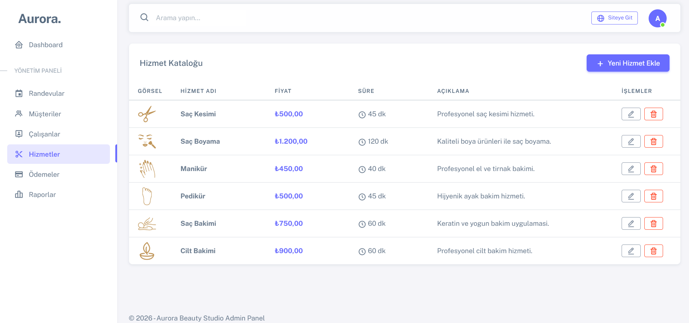
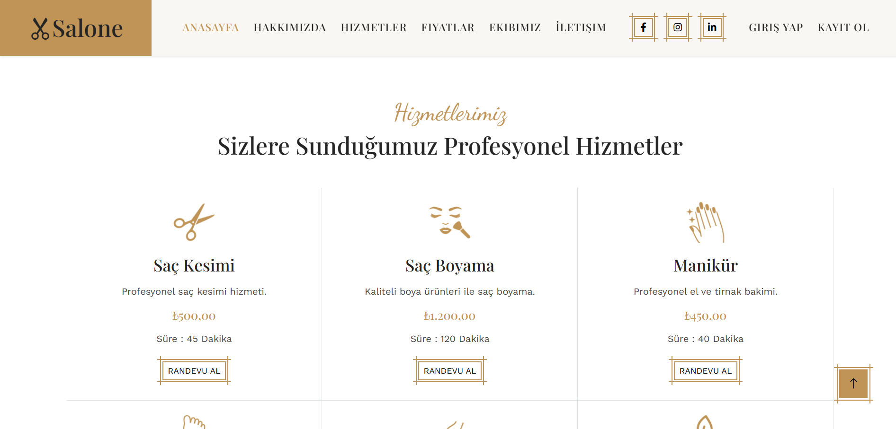

# 💈 Çok Katmanlı Kuaför Randevu ve Yönetim Sistemi (EF Core ORM)

Bu proje, Softito Akademi eğitimi kapsamında **Çok Katmanlı Mimari (N-Tier Architecture)** prensipleri ve Entity Framework Core ORM teknolojisi kullanılarak geliştirilmiş bir **Kuaför Randevu ve İşletme Yönetim Sistemi** ASP.NET Core MVC uygulamasıdır.

## 📐 Katmanlı Mimari Yapısı

Proje, kodun sürdürülebilirliğini ve test edilebilirliğini artırmak amacıyla 3 katmana ayrılmıştır:

1. **`kuafor_ORMproje.Model` (Varlık Katmanı):** Projedeki tüm ilişkisel veritabanı tablolarının (Modellerin) ve ASP.NET Identity sınıflarının tanımlandığı ortak katmandır.
2. **`kuafor_ORMproje.Data` (Veri Erişim Katmanı):** `ApplicationDbContext` sınıfını ve veritabanı işlemlerini gerçekleştiren sınıfları içerir.
3. **`kuafor_ORMproje` (Sunum Katmanı):** Kullanıcıların randevu aldığı, yöneticilerin salonu yönettiği ASP.NET Core MVC web uygulamasıdır.

## 🛠️ Kullanılan Teknolojiler

- **Programlama Dili:** C# (.NET 6.0/8.0)
- **Framework:** ASP.NET Core MVC (Katmanlı Yapıda)
- **Güvenlik & Rol Yönetimi:** ASP.NET Core Identity (`ApplicationUser` özelleştirmesiyle)
- **ORM & Veritabanı:** Entity Framework Core (Code First), MS SQL Server
- **Arayüz:** HTML5, CSS3, JavaScript, Bootstrap

## 🗄️ Model / Entity Yapısı

Katmanlı mimarideki veri modelleri ve ilişkileri:
- **ApplicationUser:** Randevu alan müşterilerin ve salon çalışanlarının/yöneticilerinin kimlik doğrulama verilerini tutar.
- **Appointment (Randevu):** Randevu tarihi, saati, durumu (Onaylandı, Bekliyor, İptal), Randevu Alan Müşteri (`CustomerId`) ve Hizmet Veren Çalışan (`EmployeeId`) ilişkileri.
- **Employee (Çalışan/Kuaför):** Çalışanların ad, uzmanlık alanı (Saç Tasarımı, Makyaj vb.) ve haftalık çalışma saatlerini barındırır.
- **Service (Hizmet):** Kuaförde sunulan servislerin adını, süresini (dakika) ve ücretini saklar.
- **Payment (Ödeme):** Tamamlanan randevulara ait tutar, ödeme türü (Nakit, Kredi Kartı) ve ödeme tarihi kaydı.

## 🌟 Temel Özellikler

- **Dinamik Randevu Rezervasyon Formu:** Müşterilerin müsait kuaför çalışanını ve kuaför hizmetini seçerek uygun saat dilimine randevu oluşturabilmesi.
- **Yetkilendirme & Rol Yönetimi (ASP.NET Identity):** Admin paneli üzerinden salon sahibi veya yöneticisinin randevuları onaylaması/reddetmesi ve yeni çalışanlar eklemesi.
- **Ödeme Takip Entegrasyonu:** Randevuların tamamlanmasının ardından kasa/ödeme girişlerinin yapılması.

## 📸 Ekran Görüntüleri

Uygulamaya ait arayüz ekran görüntüleri aşağıda yer almaktadır:

### 🏠 Kamu (Müşteri) Arayüzü

<table width="100%">
  <tr>
    <td width="50%" align="center">
      <b>1. Salone Kurumsal Karşılama Sayfası</b> 
      
    </td>
    <td width="50%" align="center">
      <b>2. Hizmetlerimiz & Rezervasyon Sayfası</b> 
      
    </td>
  </tr>
</table>

### 🛡️ Yönetici (Admin) Paneli

<table width="100%">
  <tr>
    <td width="100%" align="center">
      <b>3. Aurora Yönetici Paneli - Hizmet Kataloğu Yönetimi (CRUD)</b> 
      
    </td>
  </tr>
</table>

