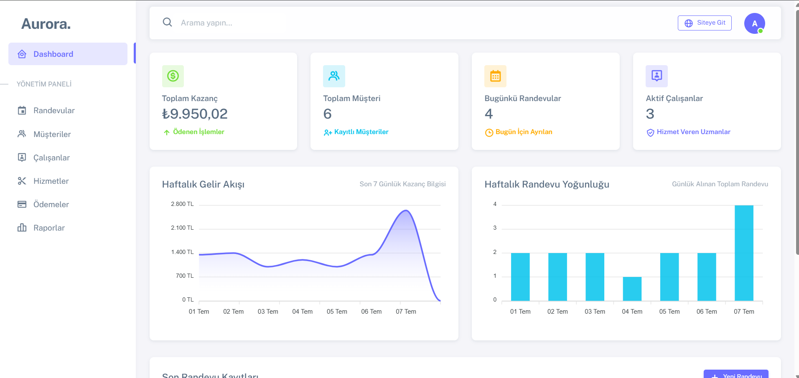
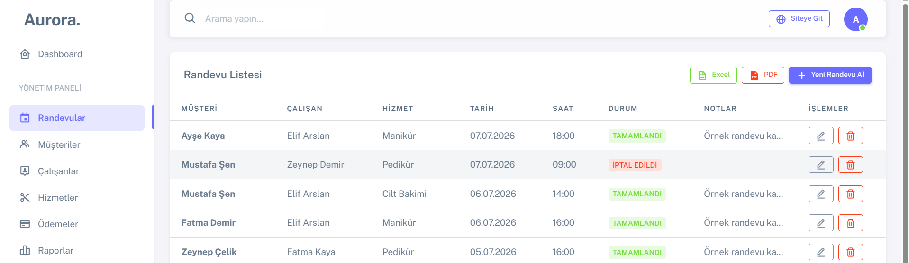
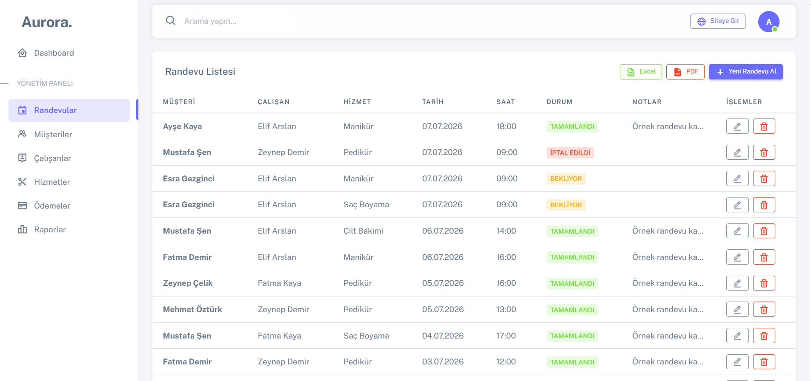
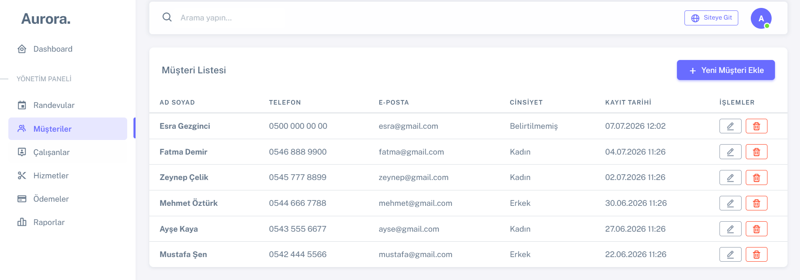
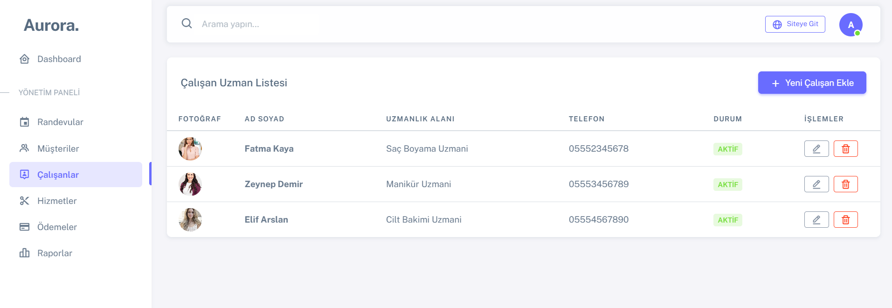
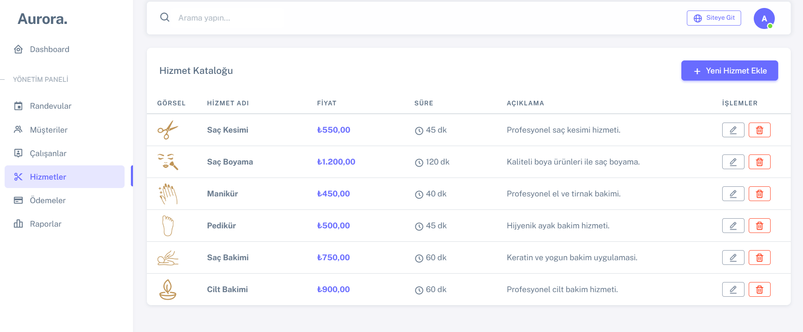
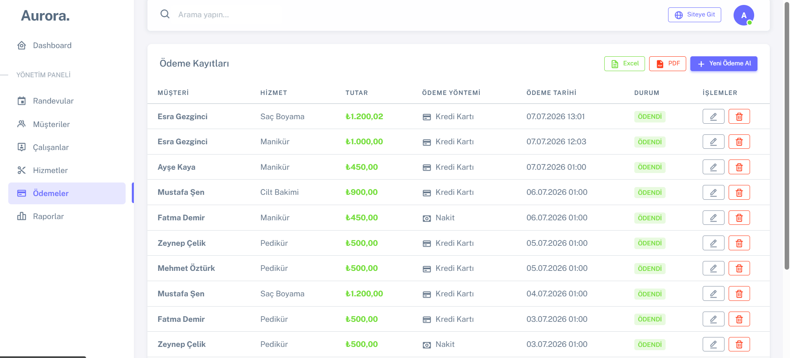
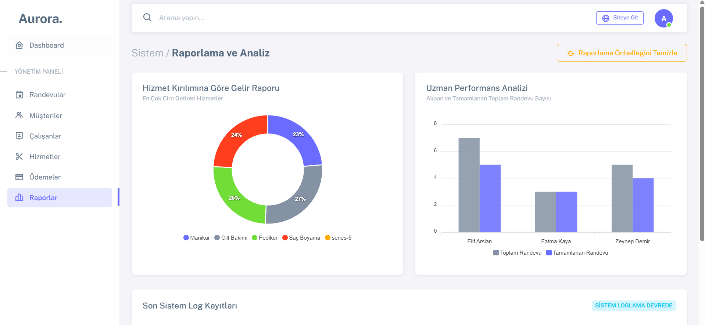
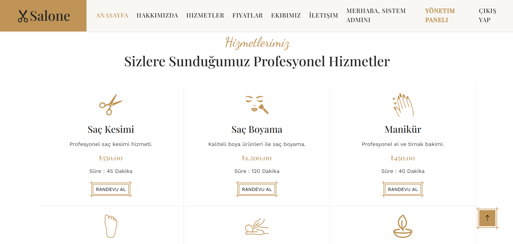
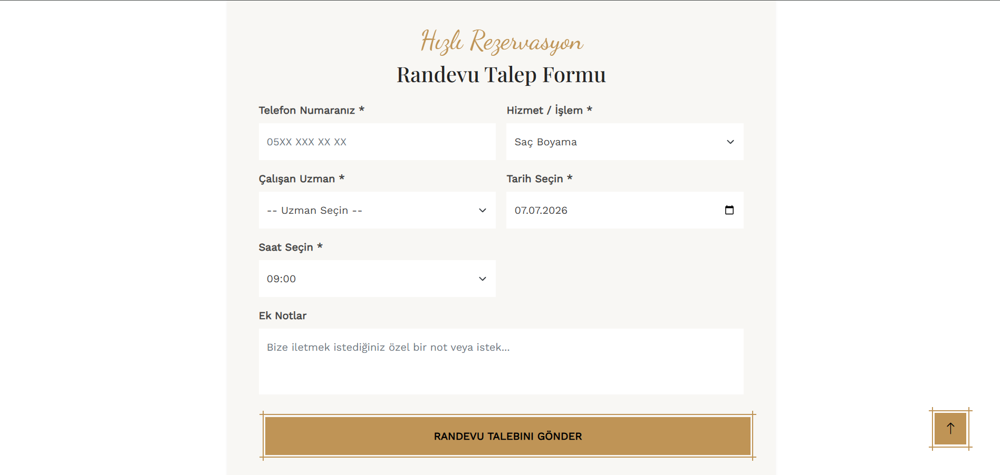

# 🚀 Softito 2026 — Backend Developer Eğitim Projelerim

Bu repo, **İstanbul Ticaret Odası - SoftITo Yazılım Bilişim Akademisi** Backend Developer eğitiminde online ve yüz yüze geliştirdiğim C# ve .NET tabanlı projelerimi içermektedir. ADO.NET'ten başlayarak Entity Framework Core, ASP.NET Core MVC, Razor Pages ve RESTful Web API'ye uzanan geniş bir teknoloji yelpazesini kapsamaktadır.

---

## 📁 Proje Listesi

### 📗 Proje 1 — [adonet_hastaneproje](./01-adonet-hastane-projesi/)
**Teknoloji:** Windows Forms · ADO.NET · SQL Server · Stored Procedure · .NET Framework 4.7.2

ADO.NET veri erişim mimarisi ve SQL Server Saklı Yordamları (Stored Procedures) kullanılarak geliştirilmiş **Hastane Yönetim Sistemi**. Kullanıcı girişi ve kaydı, doktor/hasta/poliklinik/sağlık kayıtlarının tümü parametreli SP'ler üzerinden yönetilir.

**Öne Çıkan Özellikler:**
- Tüm CRUD işlemleri Stored Procedure ile (`HastaEkle`, `HastaGuncelle`, `HastaSil`, `HastaAra` vb.)
- Referans bütünlüğü koruması: Hastaya ait kayıt varsa silme engellenir
- Hasta ve doktor formlarında ComboBox FK seçimi (`DisplayMember`/`ValueMember`)
- 10 farklı SP ile rapor ekranı (`sp_KilosuYuksekHastalar`, `sp_DoktorMaasSirala` vb.)
- Kullanıcı girişi ve kayıt formu (Login & Register)

---

### 📘 Proje 2 — [efdb_arac_kiralama_proje](./02-efdb-arac-kiralama-projesi/)
**Teknoloji:** Windows Forms · Entity Framework 6 · Database First (EDMX) · SQL Server · .NET Framework 4.7.2

Entity Framework 6 Database First yaklaşımıyla geliştirilmiş **Araç Kiralama Takip Sistemi**. Veritabanı modeli EDMX Designer ile görsel olarak tasarlanmış, araç/marka/müşteri ve kiralama işlemleri EF 6 ORM ile yönetilmiştir.

**Öne Çıkan Özellikler:**
- EF 6 Database First — EDMX Designer ile model oluşturma
- Araç, Marka, Müşteri, Kiralama tam CRUD işlemleri
- Alış ve teslim tarihine göre toplam ücret hesaplama
- Müşteri ve araç bazlı kiralama geçmişi listeleme
- Kullanıcı girişi ve kayıt formu

---

### 📙 Proje 3 — [adonetPastaneProje](./03-adonet-pastane-projesi/)
**Teknoloji:** Windows Forms · ADO.NET · SQL Server · .NET Framework 4.7.2

ADO.NET ile doğrudan SQL sorguları kullanılarak geliştirilmiş **Pastane Sipariş ve Stok Yönetim Sistemi**. Master-Detail sipariş yapısı ve dinamik ürün seçim arayüzü öne çıkan özelliklerdir.

**Öne Çıkan Özellikler:**
- Master-Detail sipariş yapısı (`Siparis` + `SiparisDetay`, `SCOPE_IDENTITY()` ile FK yönetimi)
- Dinamik ürün seçim arayüzü: Her ürün için `FlowLayoutPanel` içinde `CheckBox + NumericUpDown` otomatik oluşturuluyor
- `LIKE @p` ile müşteri adına göre sipariş arama
- Sipariş güncelleme: önce detaylar temizlenir, sonra yeniden eklenir (delete-insert pattern)
- Stok, fiyat ve satış ciro raporları (10 farklı SQL raporu)

---

### 📕 Proje 4 — [cafe_codefirstmvcproje](./04-cafe-codefirst-mvc-projesi/)
**Teknoloji:** ASP.NET Core MVC · EF Core 9 Code First · SQL Server · .NET 9

Entity Framework Core Code First yaklaşımıyla geliştirilmiş **Kafe Sipariş Yönetimi ve Admin Raporlama Sistemi**. Hem kullanıcı tarafı (ürün görüntüleme, yorum yapma) hem de admin paneli (ürün/kategori/yorum yönetimi ve istatistik dashboard) içermektedir.

**Öne Çıkan Özellikler:**
- EF Core 9 Code First — Migration ile veritabanı yönetimi
- Yorum ve puan sistemi (`Rating` 1–5 arası, `IsApproved` moderasyon)
- Admin dashboard: LINQ ile gruplandırma, `Average`, `Count`, `GroupBy` kombinasyonları
- `ReportsViewModel` ile strongly-typed raporlama
- Ürün, kategori ve yorum adı üzerinde dinamik `Contains()` arama filtresi
- ASP.NET Core DI (`AddDbContext`) ile temiz mimari

---

### 🏠 Proje 5 — [emlak_dbfirstmvcproje](./05-emlak-dbfirst-mvc-projesi/)
**Teknoloji:** ASP.NET Core MVC · EF Core 9 Database First · SQL Server · .NET 9

EF Core Database First (Scaffold) ile mevcut veritabanından model üretilerek geliştirilmiş **Rentiz Emlak İlan ve Raporlama Portalı**. Kullanıcı tarafında çoklu filtreli ilan arama, admin tarafında AJAX tabanlı dinamik raporlama sunmaktadır.

**Öne Çıkan Özellikler:**
- EF Core 9 Database First — `Scaffold-DbContext` ile model oluşturma
- Çoklu parametre ile ilan filtreleme (şehir, tip, amaç)
- Admin dashboard: KPI metrikleri (toplam ilan, ortalama fiyat, toplam değer)
- 5 farklı AJAX JSON raporu: şehir/tip bazlı dağılım, yüksek fiyatlı ilanlar, büyük ilanlar, danışman bazlı ilanlar
- Şehir, İlan Tipi, Danışman ve İlan tam CRUD yönetimi

---

### 🛒 Proje 6 — [stok_codefirstmvcproje](./06-stok-codefirst-mvc-projesi/)
**Teknoloji:** ASP.NET Core MVC · EF Core 9 Code First · SQL Server · .NET 9 · 3 Katmanlı Mimari

3 katmanlı proje mimarisi (UI / Data / Model) ile geliştirilmiş **Stok Takip ve Sipariş Yönetim Sistemi**. Gerçek stok giriş/çıkış mantığı, kritik stok uyarısı ve async/await pattern ile öne çıkmaktadır.

**Öne Çıkan Özellikler:**
- 3 katmanlı mimari: `stok_codefirstmvcproje.UI` + `.Data` + `.Model`
- Stok giriş: `product.StockQty += stockEntry.Quantity` ile otomatik güncelleme
- Sipariş kontrolü: `if (product.StockQty < order.Quantity)` yetersiz stok engeli
- Kritik stok uyarısı: stok ≤ 15 olan ürünler dashboard'da listeleniyor
- Fluent API: `OnDelete(DeleteBehavior.NoAction)` ile cascade silme engeli
- 3 aşamalı Migration geçmişi (`Init` → `AddOrderTable` → `AddStockEntry`)
- 5 AJAX raporu + async/await pattern
- Sneat 1.0.0 Bootstrap Admin Teması

---

### 🏢 Proje 7 — [OfisTasarim_RazorPagesProje](./07-ofis-tasarim-razor-pages-projesi/)
**Teknoloji:** ASP.NET Core Razor Pages · ADO.NET · SQL Server · .NET 9

ASP.NET Core Razor Pages mimarisi ile geliştirilmiş **Ofis Tasarım Şirketi Kurumsal Web Sitesi ve Yönetim Paneli**. EF Core kullanılmadan saf ADO.NET ile Razor Pages'ın nasıl kullanılabileceğini göstermektedir.

**Öne Çıkan Özellikler:**
- ASP.NET Core Razor Pages — EF Core **kullanılmadan** saf ADO.NET ile
- `SqlConnection` → `SqlCommand` → `SqlDataReader` ile doğrudan veri erişimi
- SQL Injection'a karşı parametreli sorgular (`AddWithValue("@Search", "%" + SearchTerm + "%")`)
- Hizmet, Proje, Kategori tam CRUD + İletişim mesajı yönetimi
- Admin dashboard: kategori bazlı proje sayısı, son 5 mesaj
- 5 AJAX JSON raporu
- Yavin Bootstrap UI Teması

---

### 🎓 Proje 8 — [kurs_javascriptcodefirstproje](./08-kurs-javascript-codefirst-projesi/)
**Teknoloji:** ASP.NET Core MVC · EF Core 9 Code First · SQL Server · jQuery AJAX · .NET 9

Kurs/Kategori/Kayıt (Enrollment) yönetimi içeren **Online Kurs Platformu**. Tüm CRUD işlemleri `JsonResult` döndürerek **jQuery AJAX** ile frontend'e entegre edilmiştir.

**Öne Çıkan Özellikler:**
- Tüm CRUD controller'ları `JsonResult` döndürür — jQuery AJAX ile çalışır
- Son kullanıcı kurs satın alma akışı (`BuyUserCourseController`)
- 8 farklı admin raporu: en çok kayıt olan kurs, en pahalı/ucuz kurslar, kategori bazlı kurs sayısı, 40 saat üzeri kurslar vb.
- EF Core 9 Code First Migration
- `HomeIndexViewModel` ile strongly-typed anasayfa

---

### 🐾 Proje 9 — [pet_apiproje](./09-pet-api-projesi/)
**Teknoloji:** ASP.NET Core Web API · EF Core 9 · SQL Server · Swagger/OpenAPI · .NET 9

RESTful API standartlarında tasarlanmış **Evcil Hayvan Yönetim API'si**. Pet, Owner, Food ve Toy entity'leri üzerinde tam CRUD endpoint'leri sunar.

**Öne Çıkan Özellikler:**
- `[ApiController]` + `[Route("api/[controller]")]` standart RESTful yapısı
- Swagger UI ile tam API dokümantasyonu ve test ortamı
- Pet, Owner, Food, Toy entity'leri için GET/POST/PUT/DELETE endpoint'leri
- `async/await` + `ToListAsync`, `SaveChangesAsync` pattern
- `EntityState.Modified` ve `EntityState.Deleted` ile güncelleme/silme

---

### 📚 Proje 10 — [kutuphane_apiproje](./10-kutuphane-api-projesi/)
**Teknoloji:** ASP.NET Core MVC · EF Core 8 · ASP.NET Core Identity · SQL Server · Swagger · .NET 8

ASP.NET Core Identity entegrasyonlu **Kütüphane Yönetim Sistemi**. Kullanıcı kimlik doğrulama, kitap ödünç alma/iade takibi, yorum sistemi ve kapsamlı admin raporlama içermektedir.

**Öne Çıkan Özellikler:**
- ASP.NET Core Identity: Login, Register, Email doğrulama, şifre değişikliği
- `[Authorize]` korumalı ödünç alma: Otomatik `DueDate = DateTime.Now.AddDays(15)` hesaplama
- Kitap iade: `borrowing.IsReturned = true` + `book.IsAvailable = true` flag yönetimi
- `ClaimTypes.NameIdentifier` ile giriş yapan kullanıcının ID'si alınıyor
- EF Core `Include()` ile eager loading (Kitap → Yazar, Kategori)
- 10 farklı admin raporu: en çok ödünç alınan kitaplar, aktif okuyucular, kategori dağılımı vb.
- Swagger UI entegrasyonu

---

### 🛠️ Proje 11 — Yapım Aşamasında

Bu proje yapım aşamasındadır.

---

### 🎓 Proje 12 — [ogrenciyonetimi](./12-ogrenci-yonetimi-dapper-projesi/)
**Teknoloji:** ASP.NET Core Web API · ASP.NET Core MVC · Dapper · Stored Procedure · SQL Server · Cookie Auth & JWT · iTextSharp · EPPlus · .NET 8

Dapper ve Stored Procedure kullanılarak geliştirilmiş, Web API ve MVC mimarisine sahip **Öğrenci Yönetim Sistemi**. Sistemde CRUD işlemleri, arama, PDF/Excel raporlama ve kullanıcı kimlik doğrulama API aracılığıyla gerçekleştirilmektedir.

**Öne Çıkan Özellikler:**
- **Web API + MVC Mimarisi:** MVC istemcisi veriye erişimi doğrudan değil, güvenli bir şekilde Web API katmanı üzerinden gerçekleştirir.
- **Dapper & Stored Procedure:** Performans odaklı Dapper ORM kullanılarak tüm CRUD ve listeleme işlemleri SQL saklı yordamları (Stored Procedures) ile yapılır.
- **En Az 4 Tablolu DB Şeması:** Veritabanında ilişkisel olarak tasarlanmış `Users`, `Departments`, `Students` ve `Grades` tabloları bulunmaktadır.
- **Kullanıcı Girişi (Login & Register):** API düzeyinde şifre hashleme ve JWT token doğrulaması, MVC tarafında ise Cookie tabanlı kimlik denetimi.
- **Arama & Filtreleme:** Öğrenci adı, soyadı ve bölümlere göre dinamik arama yapabilme.
- **Raporlama:** EPPlus ile Excel çıktısı oluşturma ve iTextSharp kütüphanesi yardımıyla dinamik PDF listesi hazırlama.

---

### ✂️ Proje 13 — [kuafor_ORMproje](./13-kuafor-orm-projesi/)
**Teknoloji:** ASP.NET Core MVC · EF Core 9 · Repository Pattern & Unit of Work · ASP.NET Core Identity · IMemoryCache · ILogger · SQL Server · .NET 9 · 3 Katmanlı Mimari

3 katmanlı mimaride **Repository Pattern** ve **Unit of Work** tasarım kalıpları kullanılarak geliştirilmiş, **rol tabanlı kimlik doğrulama**, **bellek önbellekleme** ve **loglama** içeren **Kuaför Salonu Randevu ve Ödeme Yönetim Sistemi**.

**Öne Çıkan Özellikler:**
- **Repository Pattern & Unit of Work:** Veritabanı işlemleri `IUnitOfWork` ve generic `IRepository` soyutlama katmanları üzerinden gevşek bağlı (loosely coupled) bir mimari ile yönetilir.
- 3 katmanlı mimari: `kuafor_ORMproje` (Sunum) + `.Data` (Veri Erişim) + `.Model` (Varlıklar)
- ASP.NET Core Identity — Rol tabanlı yetkilendirme (`[Authorize(Roles = "Admin")]`)
- Uygulama başlarken otomatik Admin rolü ve yönetici kullanıcı seed
- Fluent API: Customer/Employee/Service → Appointment One-to-Many, Appointment → Payment **One-to-One** (Cascade Delete)
- `IMemoryCache` ile rapor önbellekleme (5 dk sliding + 1 saat absolute expiration)
- `ILogger<ReportController>` ile raporlama erişim logları
- Admin dashboard: bugünkü randevular, toplam gelir, haftalık gelir ve randevu grafik verisi (son 7 gün)
- Sadece ödemesiz randevular listelenerek ödeme oluşturulabilir
- Sneat 1.0.0 Bootstrap Admin Teması

**📸 Ekran Görüntüleri:**
1. **Yönetici Paneli - İstatistik Paneli (Dashboard):** 
2. **Yönetici Paneli - Randevu Listesi:** 
3. **Yönetici Paneli - Randevu Listesi (Güncel):** 
4. **Yönetici Paneli - Müşteri Listesi:** 
5. **Yönetici Paneli - Çalışan Uzman Listesi:** 
6. **Yönetici Paneli - Hizmet Kataloğu:** 
7. **Yönetici Paneli - Ödeme Kayıtları:** 
8. **Yönetici Paneli - Gelişmiş Raporlama & Analiz:** 
9. **Müşteri Paneli - Anasayfa:** 
10. **Müşteri Paneli - Hizmetler Alanı:** 
11. **Müşteri Paneli - Randevu Talep Formu:** 

---

## 🛠️ Kullanılan Teknolojiler Matrisi

| Teknoloji | Kullanıldığı Projeler |
| :--- | :--- |
| **ASP.NET Core MVC** | Proje 4, 5, 6, 8, 10, 12, 13 |
| **ASP.NET Core Razor Pages** | Proje 7 |
| **ASP.NET Core Web API** | Proje 9, 10, 12 |
| **Windows Forms** | Proje 1, 2, 3 |
| **EF Core Code First** | Proje 4, 6, 8, 9, 10, 13 |
| **EF Core Database First** | Proje 5 |
| **Entity Framework 6 (EDMX)** | Proje 2 |
| **Dapper** | Proje 12 |
| **ADO.NET** | Proje 1, 3, 7 |
| **Stored Procedure** | Proje 1, 12 |
| **ASP.NET Core Identity** | Proje 10, 13 |
| **Repository & Unit of Work** | Proje 13 |
| **Swagger / OpenAPI** | Proje 9, 10 |
| **IMemoryCache** | Proje 13 |
| **ILogger** | Proje 13 |
| **jQuery AJAX** | Proje 8 |
| **3 Katmanlı Mimari** | Proje 6, 13 |
| **SQL Server** | Tüm Projeler |

---

## ⚙️ Gereksinimler

- **.NET SDK:** .NET 8.0 veya .NET 9.0 (.NET Framework 4.7.2 — Proje 1, 2, 3 için)
- **Veritabanı:** MS SQL Server / LocalDB
- **IDE:** Visual Studio 2022+ veya Visual Studio Code (C# Dev Kit eklentisi yüklü)

---

## 🚀 Çalıştırma

Her proje bağımsız olarak kendi klasörü altındaki `.sln` veya `.csproj` dosyası üzerinden çalıştırılabilir.

```bash
# Proje dizinine gidin (Örn: Proje 4)
cd "04-cafe-codefirst-mvc-projesi/cafe_codefirstmvcproje"

# Bağımlılıkları geri yükleyin ve projeyi çalıştırın
dotnet run
```
