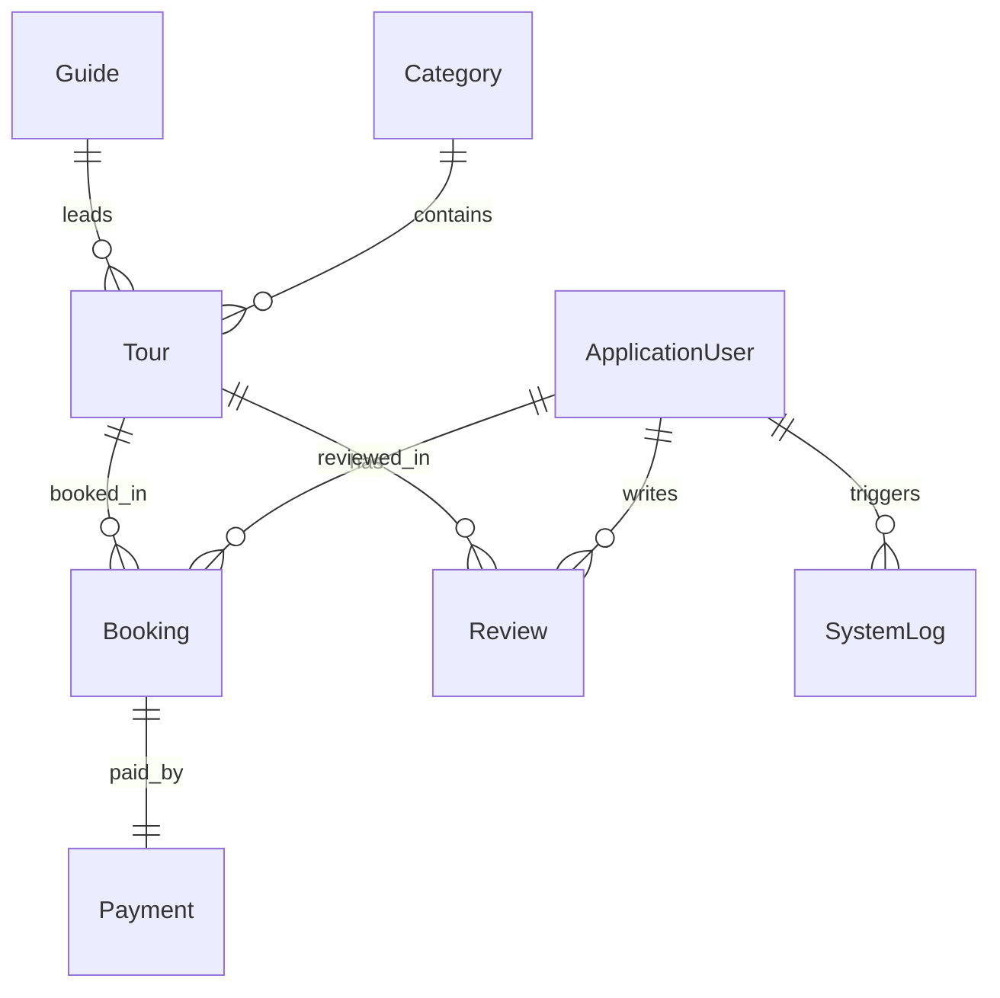

# 🌍 GM Seyahat Acentesi (Softito Academy Bitirme Projesi)

**GM Seyahat Acentesi**, **Softito Academy - Backend Developer** eğitimi bitirme projesi olarak; modern seyahat acentelerinin tur listeleme, arama, rezervasyon, blog yönetimi, üyelik ve sistem moderasyon süreçlerini uçtan uca dijitalleştirmek amacıyla geliştirilmiş, **ASP.NET Core MVC** mimarisine sahip kurumsal düzeyde bir web uygulamasıdır.

> 💡 **Proje Adı Hakkında:** Projede kullanılan "GM" ismi, geliştiriciler **Gamze Türker** ve **Merve Gezginci**'nin baş harflerini temsil etmektedir. Projenin genelindeki marka kimliği (Fatura PDF'leri, raporlar, logolar) bu isim doğrultusunda şekillendirilmiştir.

---

## 📌 İçindekiler
1. [📸 Ekran Görüntüleri](#-ekran-görüntüleri)
2. [👥 Proje Ekibi](#-proje-ekibi)
3. [🛠️ Teknoloji Yığını (Tech Stack)](#%EF%B8%8F-teknoloji-y%C4%B1%C4%9F%C4%B1n%C4%B1-tech-stack)
4. [🏢 Mimari Tasarım ve Tasarım Desenleri (Architecture & Patterns)](#-mimari-tasar%C4%B1m-ve-tasar%C4%B1m-desenleri-architecture--patterns)
5. [🗄️ Veri Tabanı Modelleri ve İlişkileri](#%EF%B8%8F-veri-taban%C4%B1-modelleri-ve-ili%C5%9Fkileri)
6. [🎮 Controller Sınıfları ve İşlevleri](#-controller-s%C4%B1n%C4%B1flar%C4%B1-ve-%C4%B0%C5%9Flevleri)
7. [📁 Proje Dizin Yapısı (Directory Tree)](#-proje-dizin-yap%C4%B1s%C4%B1-directory-tree)
8. [🔌 Veri Tabanı Seeding ve SQL Dosyaları](#-veri-taban%C4%B1-seeding-ve-sql-dosyalar%C4%B1)
9. [🚀 Kurulum ve Yapılandırma Kılavuzu](#-kurulum-ve-yap%C4%B1land%C4%B1rma-k%C4%B1lavuzu)
10. [👥 Git & GitHub Ortak Çalışma Kılavuzu](#-git--github-ortak-%C3%A7al%C4%B1%C5%9Fma-k%C4%B1lavuzu)

---

## 📸 Ekran Görüntüleri (Screenshots)

*Projenizin görsellerini GitHub'da sergilemek için `docs/images` dizinine ilgili ekran görüntülerini ekleyebilirsiniz.*

| Ziyaretçi Ana Sayfası | Detaylı Tur Sayfası & Yorumlar |
| :---: | :---: |
|  |  |

| Fatura PDF Çıktısı (PDFsharp) | Yönetici (Admin) Kontrol Paneli |
| :---: | :---: |
|  |  |

| Önbellek (Cache) İzleme Ekranı | Sistem İşlem Günlükleri (Audit Logs) |
| :---: | :---: |
|  |  |

---

## 👥 Proje Ekibi
Bu proje, **Softito Academy - Backend Developer** eğitimi kapsamında aşağıdaki ekip tarafından ortak bir mezuniyet bitirme projesi çalışması olarak tasarlanmış, geliştirilmiş ve test edilmiştir:
- **Gamze Türker** - [GitHub Profili](https://github.com/gamzeturker)
- **Merve Gezginci** - [GitHub Profili](https://github.com/mervegezginci)

---

## 🛠️ Teknoloji Yığını (Tech Stack)

### Backend (Sunucu Tarafı)
* **.NET 8.0 (C#)**: Modern, platformlar arası çalışan ve yüksek performanslı backend çatısı.
* **Entity Framework Core 8.0**: SQL Server ile nesne-ilişkisel eşleme (ORM) sağlayan veri tabanı yönetim katmanı.
* **Dapper (Micro-ORM)**: Okuma (Read) ağırlıklı ve karmaşık birleştirme (JOIN) içeren SQL sorgularını milisaniyeler içinde çalıştırmak için entegre edilmiş yüksek performanslı mikro ORM.
* **ASP.NET Core Identity**: Kullanıcı ve rol tabanlı (Admin/User) kimlik doğrulama, güvenli parola doğrulama yapılandırmaları ve oturum çerezleri yönetimi.
* **IMemoryCache (RAM Caching)**: Kategoriler, marquee tur başlıkları ve en popüler turlar gibi veri tabanına her saniye istek gitmesi gerekmeyen, az değişen verilerin sunucu RAM'inde tutulması amacıyla kullanılan önbellek kütüphanesi.

### Raporlama ve Yardımcı Servisler
* **PDFsharp**: Satın alınan turlara ait seyahat belgelerini ve faturaları dinamik olarak oluşturmak için kullanılan kütüphane. Türkçe karakter uyumluluğu için özel bir `MyFontResolver` font çözücü sınıfı yazılmıştır.
* **ClosedXML**: Admin panelinden rezervasyon, üye ve finansal işlem tablolarını anlık olarak Excel (.xlsx) formatında dışa aktarmak için kullanılır.
* **LogService**: Platformda yapılan kritik hareketleri (Tur ekleme/silme, rezervasyon onaylama/iptal, cache temizleme) gerçekleştiren kullanıcının IP adresiyle birlikte veri tabanına kaydeden denetim (audit) servisi.

### Frontend (İstemci Tarafı)
* **HTML5 & CSS3 & Javascript**
* **Bootstrap 5**: Duyarlı (Responsive) tasarım altyapısı.
* **jQuery**: Dinamik AJAX talepleri, DOM manipülasyonu ve arayüz etkileşimleri.
* **SweetAlert2**: Klasik browser uyarı kutuları yerine modern, animasyonlu bildirim ve silme onay pencereleri.
* **FontAwesome**: Proje genelindeki ikon tasarımları.

---

## 🏢 Mimari Tasarım ve Tasarım Desenleri (Architecture & Patterns)

### 1. N-Tier (Çok Katmanlı) Mimari
Proje, bağımlılıkları azaltmak ve sürdürülebilirliği artırmak amacıyla üç katman halinde tasarlanmıştır:
- **Presentation Layer (`seyahat_projesi`)**: Arayüz (Views), denetleyiciler (Controllers) ve dış servislere bağlantı sağlayan yapılar.
- **Data Layer (`seyahat_projesi.Data`)**: Veri tabanı bağlamı (`DbContext`), EF Core migrations dosyaları ve veri erişim sınıfları.
- **Model Layer (`seyahat_projesi.Model`)**: Veri tabanı tablolarının C# karşılığı olan entity sınıfları ve arayüze veri taşımak için özelleştirilmiş ViewModels.

### 2. Repository ve Unit of Work Desenleri
Veri erişim kodlarının tekrar etmesini önlemek amacıyla Repository Deseni kullanılmıştır. Sınıflar veri tabanına doğrudan erişmek yerine `Repository` üzerinden işlem gerçekleştirir:
* **`IRepository<T>`**: Genel CRUD (Ekleme, güncelleme, getirme, silme) işlemlerini arayüz olarak tanımlar.
* **`IUnitOfWork`**: Tüm repository sınıflarını tek bir çatı altında toplar ve veri tabanı işlemlerinin tek bir SQL `Transaction` altında topluca kaydedilmesini (`Save()`) sağlar.

### 3. Hibrit ORM Yaklaşımı (EF Core + Dapper)
Bu projede veri yazma (Insert/Update/Delete) ve tablo ilişkileri kurma/güncelleme işlemleri için **EF Core** kullanılırken, performans gerektiren okuma ve arama (Select/Search) sorguları için doğrudan SQL komutları koşturan **Dapper** kullanılmıştır:
* **EF Core**: İlişkileri yönetir, otomatik veritabanı tablolarını üretir.
* **Dapper**: Caching mekanizmalarıyla doğrudan SQL sorgusu atarak kategori listeleri, marquee tur isimleri ve filtreleme sonuçlarını yüksek hızda getirir.

### 4. Önbellek (Caching) Stratejisi
IMemoryCache kullanılarak anlık sorgular önbelleğe alınır.
* **Önbellek Evicting (Temizleme)**: Veriler veri tabanında güncellendiğinde (`SaveTour`, `DeleteTour`, `SaveCategory` vb.) önbellekteki ilgili anahtarlar (`CategoriesList`, `ActiveTours` vb.) `_cache.Remove("Key")` metoduyla silinerek sonraki ilk istekte verilerin güncel haliyle veritabanından çekilip yeniden önbelleğe yazılması sağlanır.

---

## 🗄️ Veri Tabanı Modelleri ve İlişkileri



### 1. `ApplicationUser` (AspNetUsers)
ASP.NET Core Identity'den türetilmiştir. Sisteme kayıtlı kullanıcıları temsil eder.
* `Name` (string): Kullanıcı adı soyadı.
* `Status` (string): Kullanıcı hesabı durumu (`active`, `suspended`).
* `Email`, `PhoneNumber` vb. (Identity alanları).

### 2. `Tour` (Turlar)
Acentenin sunduğu seyahat rotalarını temsil eder.
* `Title` (string): Turun başlığı.
* `Description` (string): Turun detaylı açıklaması.
* `Location` (string): Turun gerçekleşeceği konum.
* `StartDate` / `EndDate` (DateTime): Seyahat başlangıç ve bitiş tarihleri.
* `DurationDays` (int): Seyahat süresi.
* `Price` (double): Kişi başı tur ücreti.
* `Capacity` (int): Kalan kontenjan miktarı.
* `ImageUrl` (string): Tur görselinin URL adresi.
* `IsActive` (bool): Soft delete için aktif/pasif durumu.
* `CategoryId` (int): Bağlı olduğu kategori (İlişki: N-1).
* `GuideId` (int): Tur rehberi (İlişki: N-1).

### 3. `Category` (Kategoriler)
Turların gruplandırıldığı alanlardır (Örn: Kültür Turu, Doğa Turu).
* `Name` (string): Kategori adı.
* `Description` (string): Kategori açıklaması.

### 4. `Guide` (Rehberler)
Turları yöneten seyahat rehberlerini temsil eder.
* `FullName` (string): Rehber adı soyadı.
* `Mail` / `Phone` (string): İletişim bilgileri.
* `Bio` (string): Rehber özgeçmişi.
* `GuideImageUrl` (string): Rehber profil fotoğrafı.

### 5. `Booking` (Rezervasyonlar)
Kullanıcıların tur satın alma taleplerini içerir.
* `BookingDate` (DateTime): Rezervasyonun oluşturulduğu tarih.
* `GuestsCount` (int): Rezervasyona katılacak kişi sayısı.
* `TotalPrice` (double): İndirimler hesaplandıktan sonraki toplam tutar.
* `Status` (string): Rezervasyon durumu (`pending`, `approved`, `cancelled`).
* `PaymentStatus` (string): Ödeme durumu (`unpaid`, `paid`, `refunded`).
* `UserId` (string): Rezervasyonu yapan kullanıcı (İlişki: N-1).
* `TourId` (int): Satın alınan tur (İlişki: N-1).

### 6. `Payment` (Ödemeler)
Rezervasyonlara ait ödeme ve fatura işlemlerini saklar.
* `PaymentDate` (DateTime): Ödeme saati.
* `Amount` (double): Tahsil edilen tutar.
* `PaymentMethod` (string): Ödeme yöntemi (`credit_card`, `bank_transfer`).
* `TransactionId` (string): Banka/Sistem işlem ID'si.
* `Status` (string): Ödeme işlem durumu (`completed`, `refunded`).
* `BookingId` (int): Bağlı rezervasyon (İlişki: 1-1).

### 7. `Review` (Yorumlar)
Kullanıcıların katıldıkları turlar hakkında yaptığı değerlendirmeler.
* `Rating` (int): Puanlama (1-5 arası).
* `Comment` (string): Yorum metni.
* `CreatedAt` (DateTime): Yorum tarihi.
* `UserId` (string) / `TourId` (int): İlişkili kullanıcı ve tur.

### 8. `Coupon` (Kuponlar)
İndirim sağlayan promosyon kodlarıdır.
* `Code` (string): Kupon kodu (Örn: GEZGIN20).
* `DiscountType` (string): İndirim türü (`percentage`, `fixed_amount`).
* `DiscountValue` (double): İndirim miktarı.
* `ExpiryDate` (DateTime): Son kullanma tarihi.
* `IsActive` (bool): Aktiflik durumu.

### 9. `SystemLog` (Sistem Günlükleri)
Yönetici paneli üzerinden yapılan kritik denetim logları.
* `Action` (string): Yapılan işlem türü (`TOUR_CREATE`, `CACHE_CLEAR` vb.).
* `Level` (string): Uyarı seviyesi (`info`, `warn`, `error`).
* `Details` (string): İşlem detayları.
* `CreatedAt` (DateTime): İşlem tarihi.
* `UserId` (string): İşlemi gerçekleştiren admin (İlişki: N-1).

---

## 🎮 Controller Sınıfları ve İşlevleri

### 1. `HomeController`
Ziyaretçilerin karşılandığı ana sayfayı yönetir.
* `Index()`: Dapper ve IMemoryCache ile kategorileri ve popüler 6 aktif turu getirir. Ayrıca arama sorgularını işler.
* `Tours()`: Fiyat, süre ve kategoriye göre gelişmiş filtrelemeli turları listeler.
* `CategoryDetail(id)`: Seçilen kategoriye ait aktif turları listeler.
* `Detail(id)`: Turun tüm detaylarını, rehber bilgisini ve bu tura yapılmış yorumları kullanıcıya gösterir.

### 2. `BookingController`
Kullanıcıların satın alma ve rezervasyon aşamalarını yönetir. `[Authorize]` etiketi ile korunmaktadır.
* `Checkout(tourId)`: Rezervasyon yapılacak turun kontenjan ve mükerrer rezervasyon kontrollerini yapar, rezervasyon formunu yükler.
* `Create(...)`: Rezervasyon kaydını oluşturur, kupon kodunu doğrular, toplam tutarı hesaplar, ödeme simülasyonunu (`Payment`) gerçekleştirir ve tura ait kontenjandan katılımcı sayısını düşer. Tüm bu adımları güvenli bir database transaction altında yürütür.

### 3. `ExportController`
Dışa aktarma ve raporlama işlemlerini barındırır.
* `Invoice(id)`: Kullanıcının satın aldığı rezervasyonun faturasını PDFsharp kullanarak Türkçe karakter uyumlu şık bir PDF belgesi halinde üretir ve indirtir.
* `ExportBookingsToExcel()`: ClosedXML kullanarak sistemdeki tüm rezervasyonları Excel (.xlsx) formatında derler ve indirir.

### 4. `AccountController`
Kullanıcı kayıt, giriş, çıkış ve profil güvenliği işlemlerini yürütür.
* `Register()`: Yeni kullanıcı kaydı.
* `Login()`: Güvenli şifre kontrolü ile üye veya yönetici girişi sağlar.
* `Logout()`: Kullanıcı oturum çerezlerini temizler.

### 5. `AdminController` (Admin Area)
Yönetici panelinin kalbidir. `[Authorize(Roles = "Admin")]` korumalıdır.
* `Index()`: Toplam gelir, rezervasyon, üye ve aktif turların istatistiklerini getirir.
* `Tours() / SaveTour() / DeleteTour()`: Tur rotası CRUD işlemleri.
* `Bookings() / ApproveBooking() / CancelBooking()`: Rezervasyon onaylama veya iptal süreçleri. İptal durumunda ücret iade durumuna alınır ve tur kontenjanı otomatik olarak geri eklenir.
* `Users() / UpdateUserRoleAndStatus()`: Kullanıcı durumunu değiştirme (aktif/pasif) ve rol yönetimi.
* `Logs()`: Audit veritabanı loglarını inceleme, arama ve filtreleme.
* `Cache() / ClearSystemCache()`: Sistem önbelleğini izleme ve temizleme portalı.

---

## 📁 Proje Dizin Yapısı (Directory Tree)

```text
seyahat_projesi/
│
├── seyahat_projesi.sln                           # Visual Studio Çözüm Dosyası
│
├── seyahat_projesi/                              # Sunum Katmanı (Web App)
│   ├── Areas/
│   │   ├── Admin/                                # Yönetici Paneli Alanı
│   │   │   ├── Controllers/AdminController.cs
│   │   │   └── Views/
│   │   └── User/                                 # Kullanıcı Paneli Alanı
│   │       ├── Controllers/DashboardController.cs
│   │       └── Views/
│   ├── Controllers/
│   │   ├── HomeController.cs
│   │   ├── BookingController.cs
│   │   └── ExportController.cs
│   ├── Services/
│   │   ├── LogService.cs                         # Veritabanı Loglama Servisi
│   │   └── MyFontResolver.cs                     # PDFsharp Türkçe Font Ayarı
│   ├── ViewModels/                               # Arayüze Özel Model Yapıları
│   ├── Views/                                    # Kamu Arayüzü Cshtml Dosyaları
│   ├── wwwroot/                                  # CSS, JS, Libs, Favicon
│   ├── appsettings.json                          # Veritabanı ve API Key Ayarları
│   └── Program.cs                                # Sistem Başlangıç ve DI Konfigürasyonu
│
├── seyahat_projesi.Data/                         # Veri Erişim Katmanı
│   ├── ApplicationDbContext.cs                   # EF Core DB Bağlamı
│   ├── DapperRepository.cs                       # Hızlı Dapper Sorgu Sınıfı
│   ├── DbInitializer.cs                          # İlk Kurulum Admin/Rol Seeder'ı
│   ├── DbSeeder.cs                               # 20 Örnek Kayıt Üreten Mekanizma
│   ├── Migrations/                               # EF Core Migration Dosyaları
│   └── Repository/                               # Repository Pattern Sınıfları
│
├── seyahat_projesi.Model/                        # Entity (Model) Katmanı
│   ├── ApplicationUser.cs
│   ├── Tour.cs
│   ├── Category.cs
│   ├── Booking.cs
│   └── ... (Diğer Modeller)
│
├── seed_all_20.sql                               # Manuel Veritabanı Seed Scripti
└── update_tour_images.sql                        # Estetik Görseller Ekleyen SQL Scripti
```

---

## 🔌 Veri Tabanı Seeding ve SQL Dosyaları

Projede iki çeşit test verisi oluşturma yöntemi mevcuttur:

1. **Kod Tabanlı Otomatik Seeding (Tavsiye Edilen)**:
   Proje ilk kez çalıştırıldığında `Program.cs` içindeki başlangıç scope'u sayesinde veri tabanı kurulur, migration'lar uygulanır ve `DbInitializer` ile `DbSeeder` sınıfları devreye girerek her tabloya **20'şer adet gerçekçi test verisi** yükler.
   
2. **Manuel SQL Scriptleri**:
   * `seed_all_20.sql`: SQL Server Management Studio (SSMS) üzerinden veri tabanını sıfırdan doldurmak isterseniz bu dosyayı çalıştırabilirsiniz.
   * `update_tour_images.sql`: Turların görsellerini daha estetik ve modern seyahat fotoğraflarıyla güncellemek için bu scripti veri tabanınızda koşturabilirsiniz.

---

## 🚀 Kurulum ve Yapılandırma Kılavuzu

Projeyi yerel bilgisayarınızda çalıştırmak için aşağıdaki adımları takip ediniz:

### 1. Dosyaları İndirin
Projeyi bilgisayarınıza kopyalayın veya klonlayın:
```bash
git clone <github-repository-url>
```

### 2. Veri Tabanı Bağlantısını Düzenleyin
`seyahat_projesi` projesi içindeki **`appsettings.json`** dosyasını açın ve `DefaultConnection` bağlantı adresini kendi lokal SQL Server adınıza göre düzenleyin:
```json
"ConnectionStrings": {
  "DefaultConnection": "Server=LOKAL_SUNUCU_ADINIZ;Database=SeyahatDb;Trusted_Connection=True;MultipleActiveResultSets=true;TrustServerCertificate=True"
}
```

### 3. Paketleri Restore Edin ve Çalıştırın
Terminali proje klasörünün kök dizininde açarak NuGet paketlerini yükleyin ve projeyi derleyin:
```bash
# Paketleri geri yükleyin
dotnet restore

# Projeyi çalıştırın
dotnet run --project seyahat_projesi
```
Tarayıcınız üzerinden terminalde belirtilen adresleri (Örn: `http://localhost:5000` veya `https://localhost:5001`) açarak projeyi test etmeye başlayabilirsiniz.

### 🔑 Başlangıç Giriş Bilgileri (Default Test Hesapları)
* **Yönetici Hesabı (Admin)**:
  * **E-posta**: `admin@gezgin.com`
  * **Şifre**: `Admin123*`
* **Standart Üye Hesabı (User)**:
  * **E-posta**: `uye@gezgin.com`
  * **Şifre**: `Uye123*`

---

## 👥 Git & GitHub Ortak Çalışma Kılavuzu

Gamze ve Merve olarak projeyi çakışma (merge conflict) yaşamadan, düzenli bir şekilde sürdürebilmeniz için aşağıdaki iş akışını uygulamanız önerilir:

### 1. İş Bölümü ve Branch Kullanımı
Doğrudan `main` dalına kod göndermek yerine, her yeni özellik veya hata düzeltmesi için ayrı bir dal (branch) açın:
```bash
# Yerelinizdeki main dalını güncelleyin
git checkout main
git pull origin main

# Yeni bir branch açın (Örn: Merve profil düzenleme özelliği yapıyor olsun)
git checkout -b feature/profil-duzenleme
```

### 2. Değişiklikleri Kaydetme ve Gönderme
Yaptığınız iş bittiğinde dosyaları ekleyip açıklayıcı bir commit mesajı ile kendi dalınıza pushlayın:
```bash
git add .
git commit -m "feat: Kullanıcı profil düzenleme alanı tamamlandı"
git push origin feature/profil-duzenleme
```

### 3. Pull Request (PR) Oluşturma ve Merge Etme
* GitHub sitesine gidin.
* Yeni açtığınız dal için **Compare & pull request** butonuna tıklayın.
* Arkadaşınız kodları inceledikten ve onayladıktan sonra kodlar `main` dalı ile birleştirilir (Merge).

### 4. Çakışma (Conflict) Çözme İpucu
Eğer ikiniz aynı dosyada aynı satırları değiştirdiyseniz Git çakışma uyarısı verecektir. Bu durumda çakışan dosyayı VS Code veya Visual Studio ile açarak hangi satırların kalacağını belirleyip (Accept Incoming / Accept Current) dosyayı kaydedin. Ardından:
```bash
git add .
git commit -m "fix: Çakışmalar giderildi"
git push
```

---

## 📝 Lisans
Bu proje eğitim ve kişisel gelişim amacıyla **Gamze Türker** ve **Merve Gezginci** tarafından geliştirilmiştir. Ticari amaçla kopyalanamaz veya satılamaz.
