# 🌍 GM Seyahat Acentesi (Softito Academy Bitirme Projesi)

**GM Seyahat Acentesi**, **Softito Academy - Backend Developer** eğitimi bitirme projesi olarak; modern seyahat acentelerinin tur listeleme, arama, rezervasyon, blog yönetimi, üyelik ve sistem moderasyon süreçlerini uçtan uca dijitalleştirmek amacıyla geliştirilmiş, **ASP.NET Core MVC** mimarisine sahip kurumsal düzeyde bir web uygulamasıdır.

> 💡 **Proje Adı Hakkında:** Projede kullanılan "GM" ismi, geliştiriciler **Gamze Türker** ve **Merve Gezginci**'nin baş harflerini temsil etmektedir. Projenin genelindeki marka kimliği (Fatura PDF'leri, Excel tabloları, logolar) bu isim doğrultusunda şekillendirilmiştir.

---

## 📌 İçindekiler
1. [📸 Genişletilmiş Ekran Görüntüleri Galerisi](#-geni%C5%9Fletilmi%C5%9F-ekran-g%C3%B6r%C3%BCnt%C3%BCleri-galerisi)
2. [👥 Proje Ekibi](#-proje-ekibi)
3. [🛠️ Detaylı Teknoloji ve Kütüphane Yığını](#%EF%B8%8F-detayl%C4%B1-teknoloji-ve-k%C3%BCt%C3%BCphane-y%C4%B1%C4%9F%C4%B1n%C4%B1)
4. [🏢 Mimari Tasarım ve Tasarım Desenleri](#-mimari-tasar%C4%B1m-ve-tasar%C4%B1m-desenleri)
5. [🗄️ Veri Tabanı Modelleri ve İlişki Yapıları](#%EF%B8%8F-veri-taban%C4%B1-modelleri-ve-ili%C5%9Fki-yap%C4%B1lar%C4%B1)
6. [🔄 Kritik Sistem Algoritmaları ve İş Akışları](#-kritik-sistem-algoritmalar%C4%B1-ve-%C4%B0%C5%9F-ak%C4%B1%C5%9Flar%C4%B1)
7. [🎮 Controller Ayrıntılı Metot ve Endpoint Analizi](#-controller-ayr%C4%B1nt%C4%B1l%C4%B1-metot-ve-endpoint-analizi)
8. [📁 Proje Dizin Yapısı (Directory Tree)](#-proje-dizin-yap%C4%B1s%C4%B1-directory-tree)
9. [🔌 Veri Tabanı Seeding ve SQL Dosyaları](#-veri-taban%C4%B1-seeding-ve-sql-dosyalar%C4%B1)
10. [🚀 Adım Adım Kurulum ve Yapılandırma Kılavuzu](#-ad%C4%B1m-ad%C4%B1m-kurulum-ve-yap%C4%B1land%C4%B1rma-k%C4%B1lavuzu)
11. [👥 Git & GitHub Ortak Çalışma Kılavuzu](#-git--github-ortak-%C3%A7al%C4%B1%C5%9Fma-k%C4%B1lavuzu)

---

## 📸 Genişletilmiş Ekran Görüntüleri Galerisi

*GitHub sayfanızda görsellerin şık bir şekilde sergilenebilmesi için tarayıcınızdan alacağınız ekran görüntülerini projedeki `docs/images/` dizinine README'de belirtilen dosya isimleriyle kaydedip commit etmeniz yeterlidir.*

### 1. Ziyaretçi ve Kullanıcı Arayüzü (Public UI)

| Ekran Görüntüsü | Dosya Adı | Açıklama |
| :---: | :---: | :--- |
| 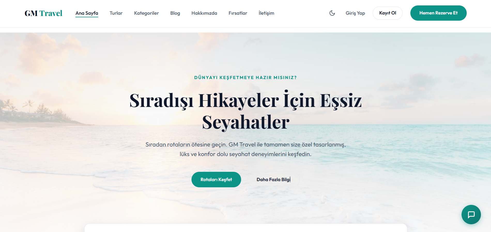 | `home.png` | **Ana Sayfa (Light Mode):** Dynamic Category Slider, Marquee Banner (anlık aktif tur isimleri) ve en popüler turların 10 dakikalık RAM önbelleğinden listelendiği vizyoner arayüz. |
| 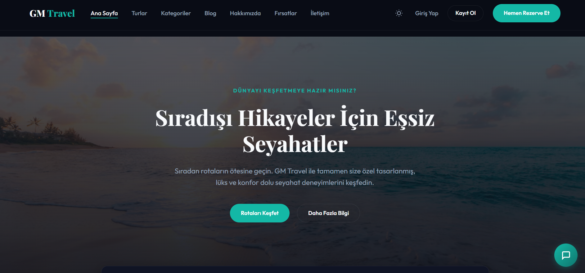 | `home_dark.png` | **Ana Sayfa (Dark Mode):** Web sitesinin göz yormayan, modern ve şık koyu tema arayüz tasarımı. |
| 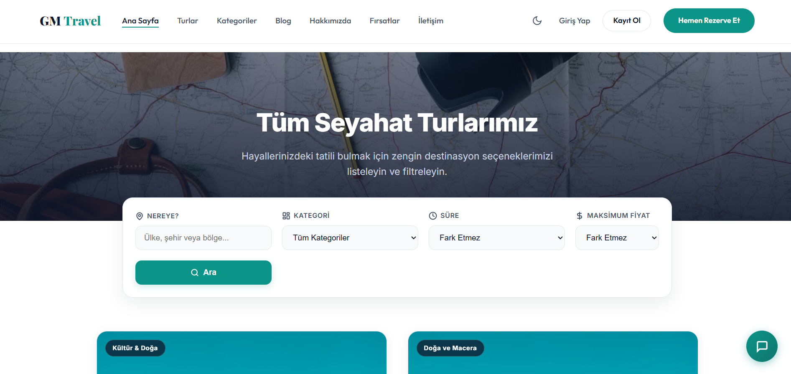 | `tours_list.png` | **Tüm Turlar & Arama:** Lokasyon, tur ismi, kategori ve fiyat aralığına göre filtreleme yapan arama motoru sonuç ekranı. |
| 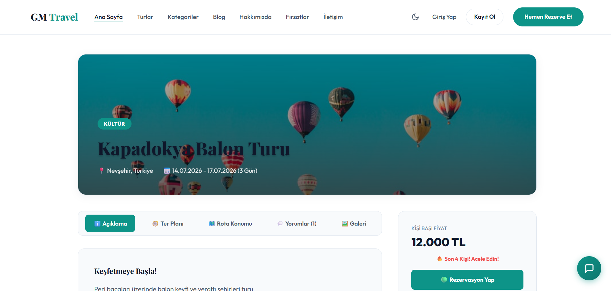 | `tour_detail_header.png` | **Tur Detay Sayfası:** Tur rotası bilgileri, süre, rehber ataması ve kontenjan doluluk durumlarının gösterildiği detay ekranı. |
| 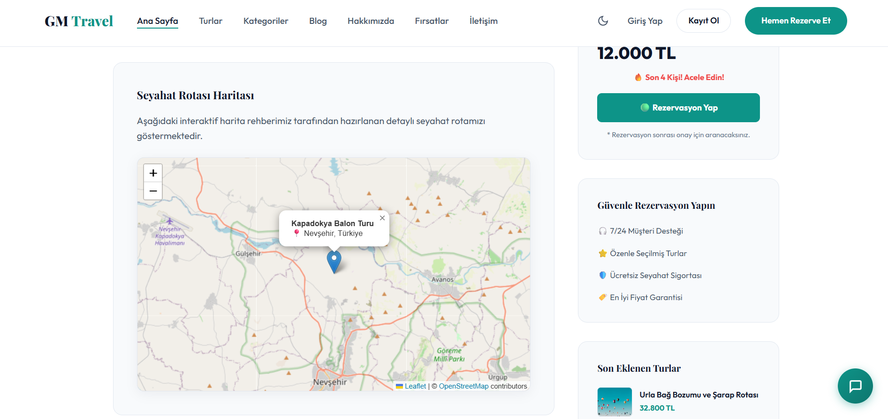 | `tour_detail_map.png` | **Seyahat Rotası Haritası:** Leaflet entegrasyonu ile tura ait rotanın harita üzerinde interaktif olarak işaretlenmesi. |
| 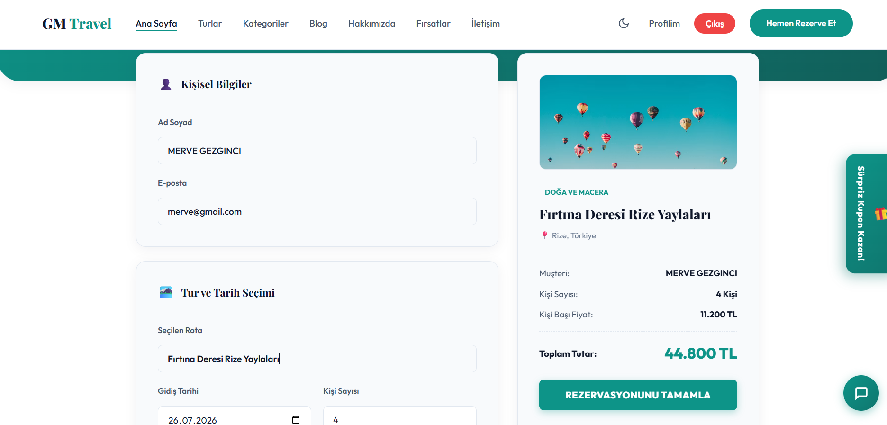 | `checkout.png` | **Rezervasyon / Satın Alma Girişi:** Kişi sayısı seçimi, kupon kodunun AJAX ile doğrulanması ve indirim tutarının anlık hesaplanması. |
| 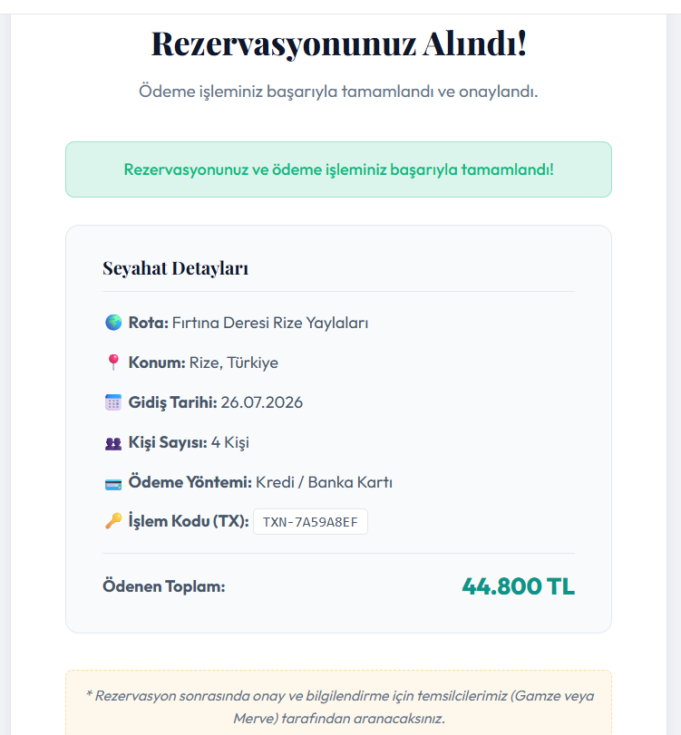 | `checkout_success.png` | **Rezervasyon Başarılı:** Satın alma adımı tamamlandığında üretilen işlem kodu (TX) ve rezervasyon özet çıktısı. |
| 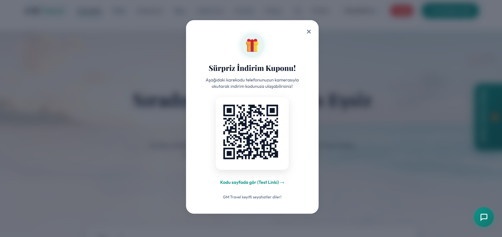 | `coupon_qr_modal.png` | **Sürpriz Kupon QR Kod:** Kullanıcılara mobil cihazlarıyla taratarak sürpriz indirim kazanabilecekleri QR kod modalı. |
| 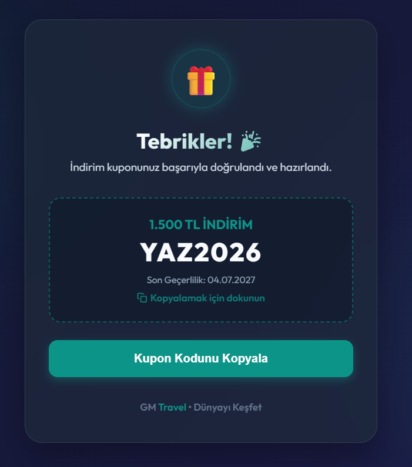 | `coupon_success.png` | **Kupon Doğrulama Ekranı:** QR kod taratıldıktan sonra açılan, aktif kuponun kodunu ve indirim miktarını gösteren ara sayfa. |
| 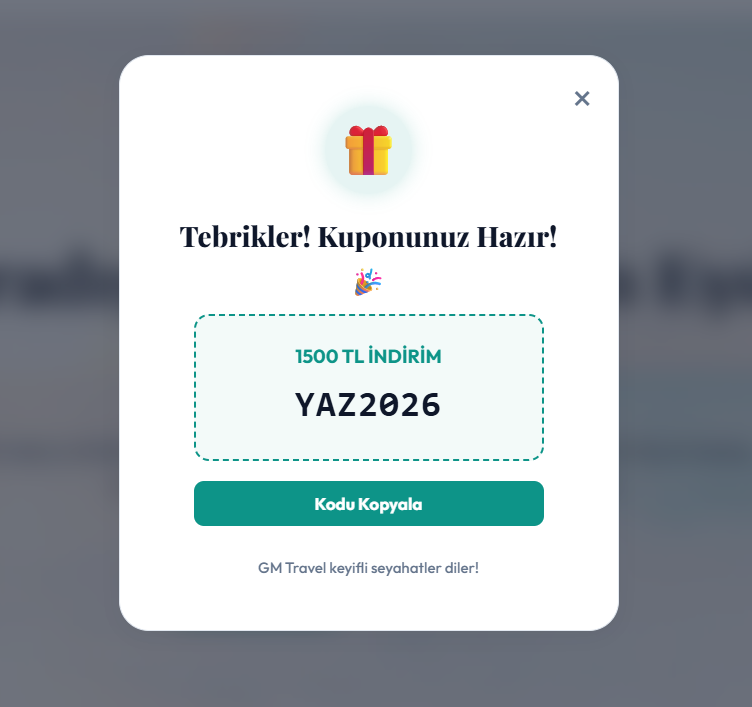 | `coupon_success_modal.png` | **Kupon Hazır Modalı:** Kupon doğrulandıktan sonra sayfa üzerinde beliren kupon kopyalama pencereli hediye modalı. |
| 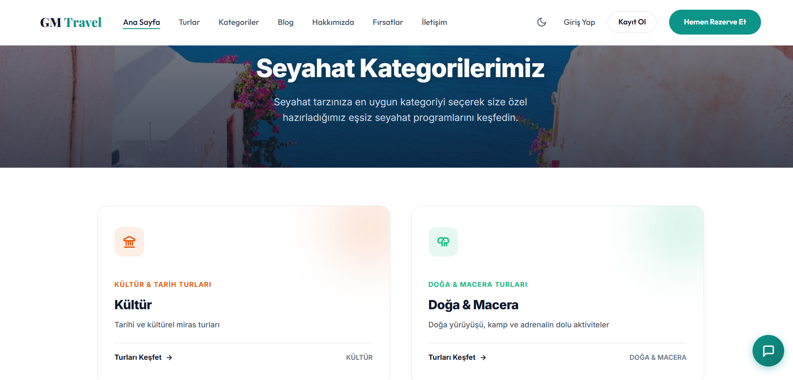 | `categories.png` | **Seyahat Kategorileri:** Turların gruplandırıldığı, Dapper ile yüksek hızda listelenen kategori rehber sayfası. |
| 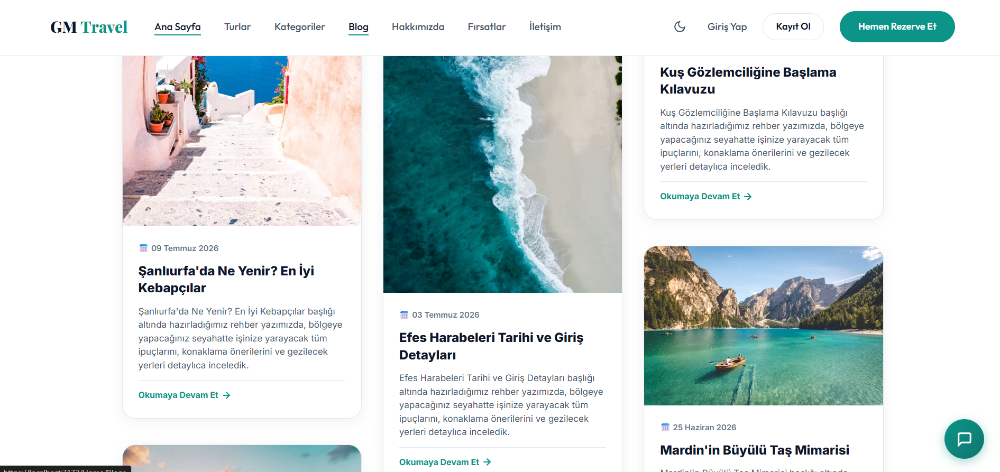 | `blogs.png` | **Seyahat Hikayeleri (Blog):** Gezi rehberleri ve acenteye ait blog yazılarının listelendiği görsel ağırlıklı arayüz. |
| 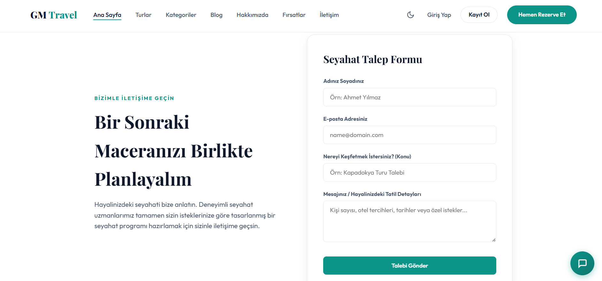 | `contact.png` | **İletişim & Seyahat Talep Formu:** Kullanıcıların mesajlarını ve seyahat taleplerini iletebileceği interaktif form. |
| 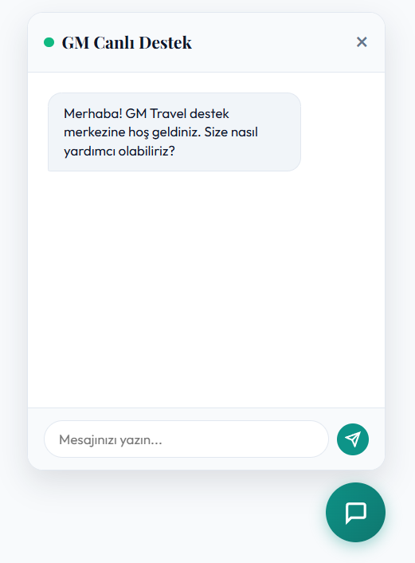 | `chat_widget.png` | **GM Canlı Destek:** Ziyaretçilere hızlı iletişim sağlayan anlık chat widget bileşeni. |
| 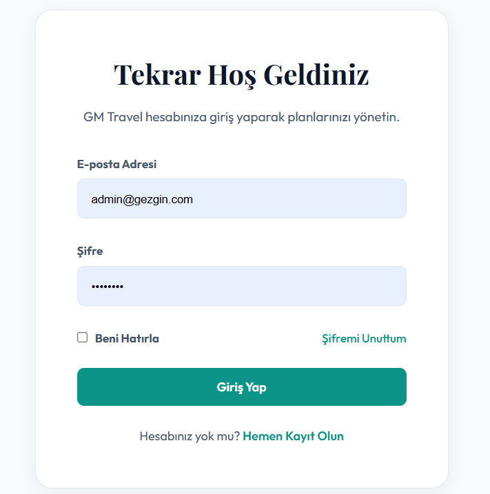 | `login.png` | **Giriş Yap Ekranı:** Şık tasarıma sahip Identity destekli üye ve yönetici giriş paneli. |
| 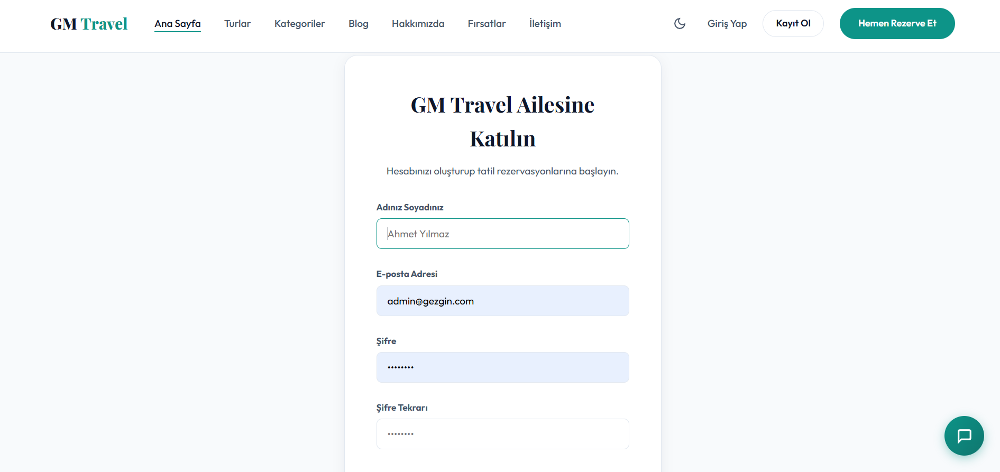 | `register.png` | **Kayıt Ol Ekranı:** Şık tasarıma sahip yeni üye kayıt paneli. |

### 2. Yönetici Kontrol Paneli (Admin Console - `/Admin`)

| Ekran Görüntüsü | Dosya Adı | Açıklama |
| :---: | :---: | :--- |
| 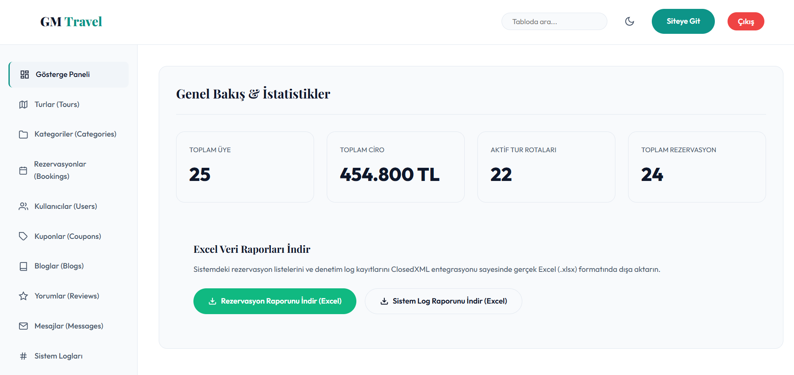 | `admin_dashboard.png` | **Yönetici Dashboard:** Toplam ciro, toplam üye sayısı, aktif rezervasyonlar ve sistem doluluk grafiklerini içeren özet alan. |
| 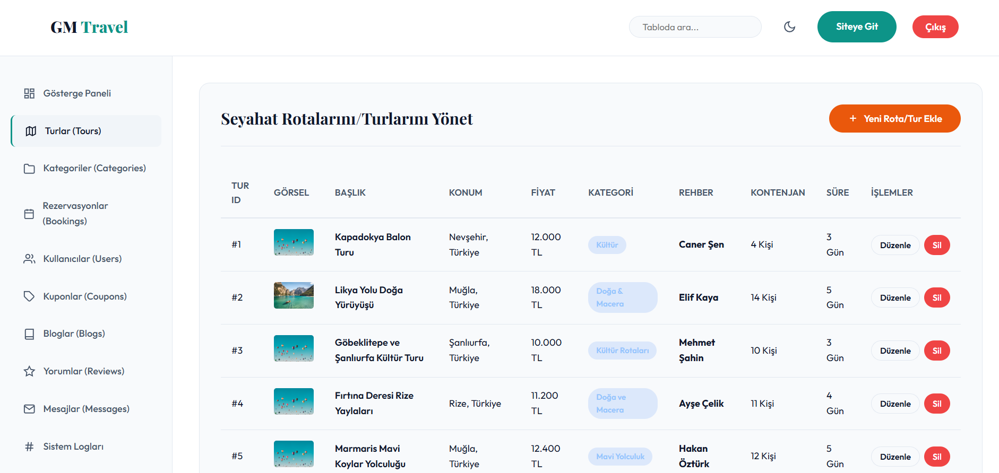 | `admin_tours.png` | **Tur CRUD Paneli:** Yeni tur rotası oluşturma, rehber ve kategori atama, kapasite, fiyat güncelleme ve soft-delete (aktiflik) yönetimi. |
| 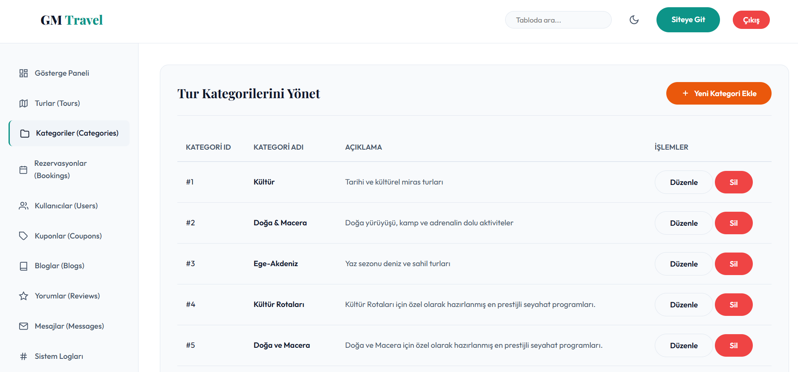 | `admin_categories.png` | **Kategori CRUD Paneli:** Seyahat kategorilerinin oluşturulması, düzenlenmesi ve silinmesi. |
| 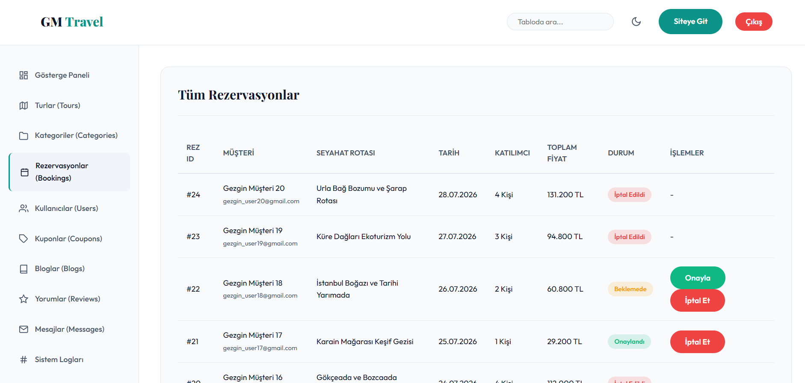 | `admin_bookings.png` | **Rezervasyon Moderasyonu:** Gelen rezervasyon taleplerini inceleme, onaylama veya iptal etme (kontenjan iade tetikleyicisiyle birlikte). |
| 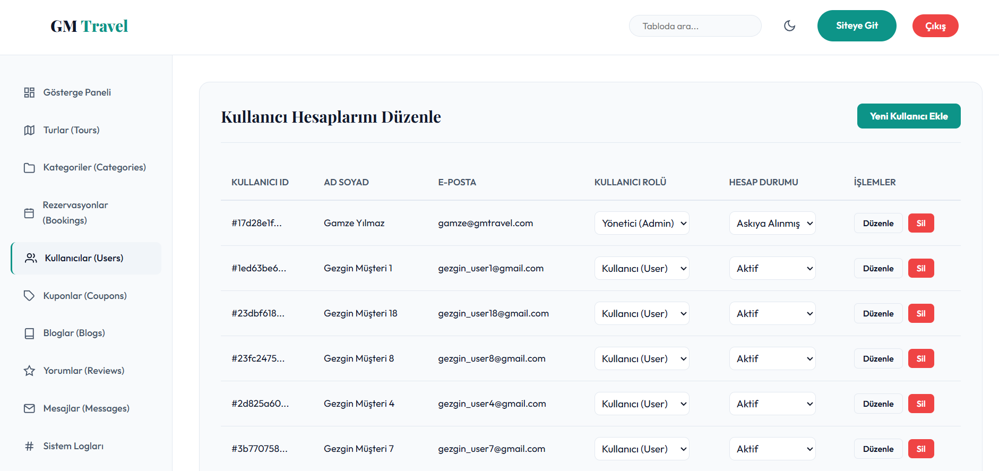 | `admin_users.png` | **Üye Kontrolü:** Rol (Admin/User) atama, şifre sıfırlama ve hesabı askıya alma (aktif/pasif status yönetimi). |
| 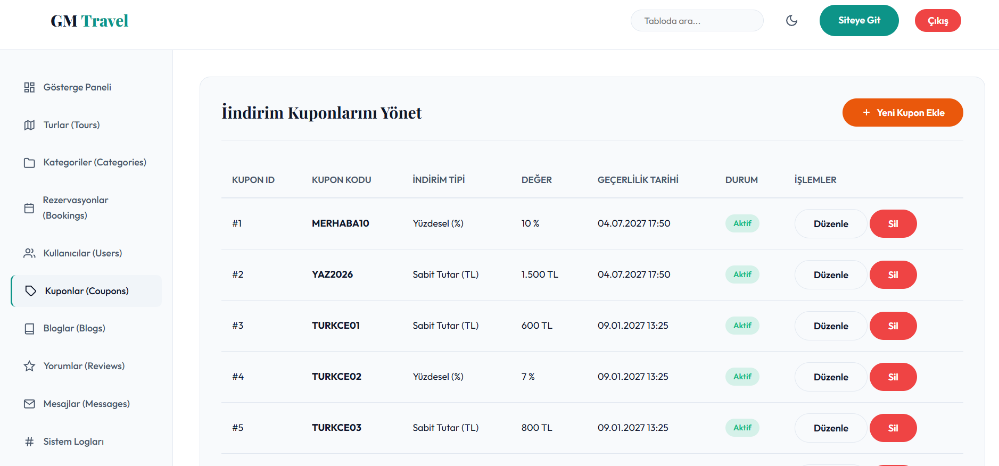 | `admin_coupons.png` | **Promosyon & Kupon Tanımlama:** Yüzdelik veya sabit indirim kodları oluşturma, geçerlilik tarihi belirleme. |
| 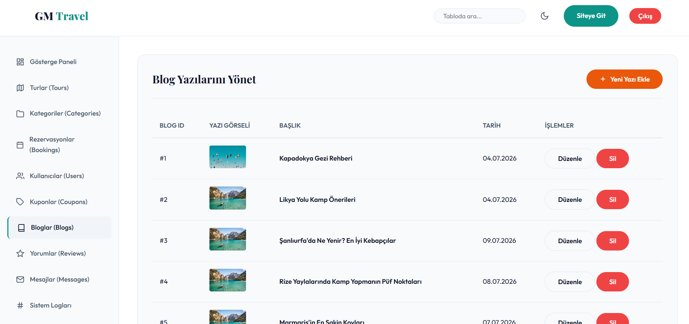 | `admin_blogs.png` | **Blog CRUD Paneli:** Blog yazılarının yönetilmesi, resim yolları ve içerik girişleri. |
| 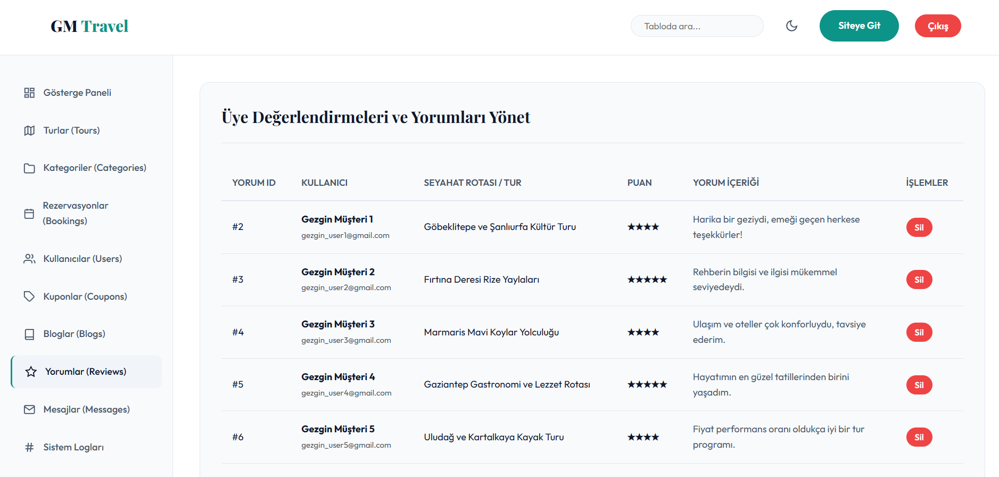 | `admin_reviews.png` | **Üye Değerlendirmeleri:** Turlara yazılan üye yorumlarını inceleme ve moderasyon (uygunsuz içerikleri silme). |
| 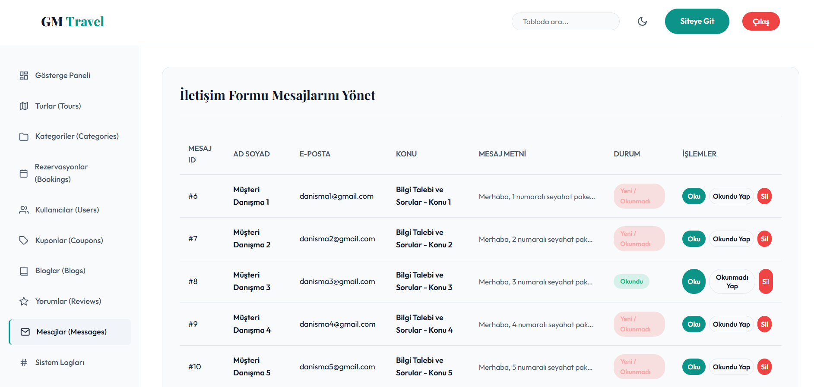 | `admin_messages.png` | **İletişim Mesajları:** İletişim formu üzerinden gelen müşteri taleplerini okundu işaretleme ve silme paneli. |
| 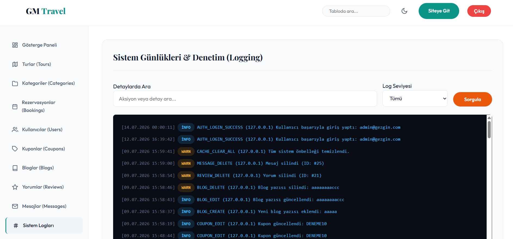 | `admin_logs.png` | **Denetim Günlükleri:** Sistemde kimin, ne zaman, hangi IP ile hangi işlemi yaptığını gösteren filtreli günlük (log) tablosu. |
| 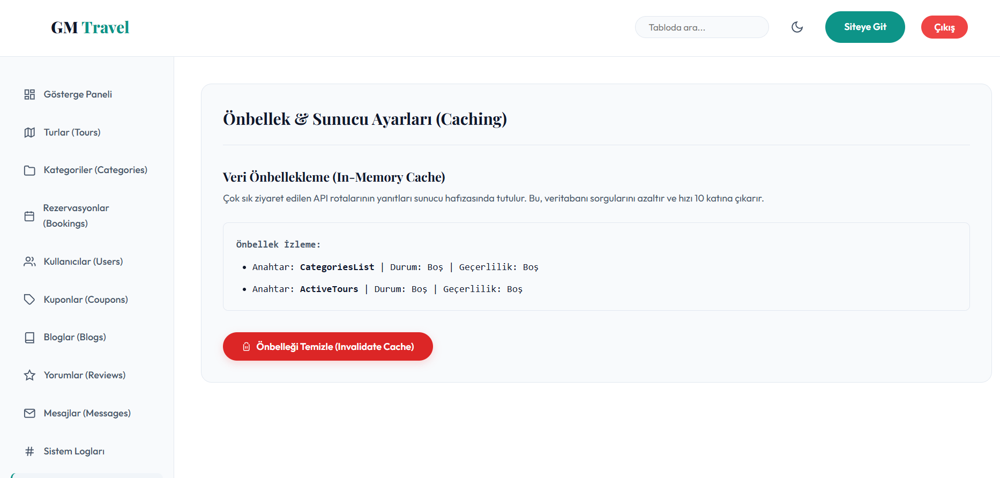 | `admin_cache.png` | **Cache Yönetim Paneli:** Bellekte tutulan kategorilerin ve popüler turların durumu, tek tıkla RAM temizleme. |

---

## 👥 Proje Ekibi
Bu proje, **Softito Academy - Backend Developer** eğitimi kapsamında aşağıdaki ekip tarafından ortak bir mezuniyet bitirme projesi çalışması olarak tasarlanmış, geliştirilmiş ve test edilmiştir:
- **Gamze Türker** - [GitHub Profili](https://github.com/gamzeturker)
- **Merve Gezginci** - [GitHub Profili](https://github.com/mervegezginci)

---

## 🛠️ Detaylı Teknoloji ve Kütüphane Yığını

### Backend Katmanı
* **.NET 8.0 (C#) & ASP.NET Core MVC**: Modern, güvenli, Dependency Injection (Bağımlılık Enjeksiyonu) barındıran güçlü web mimarisi.
* **Entity Framework Core 8.0 (ORM)**: Code-First yaklaşımıyla SQL veritabanı şemalarının C# sınıflarından türetilmesi, veri tabanı ilişkilerinin yönetilmesi ve migrations süreçleri.
* **Dapper Micro-ORM**: EF Core'un ek yük (overhead) oluşturduğu karmaşık JOIN sorgularında, direkt SQL komutlarıyla arama motoru filtrelemeleri ve cache veri çekme süreçlerini yöneten performans optimizasyonu.
* **ASP.NET Core Identity**: Rol tabanlı yetki kontrolü (`[Authorize(Roles = "Admin")]`), kullanıcı oturum süreleri ve çerez tabanlı oturum güvenliği (Cookie Authentication).

### Önbellekleme & Raporlama & Yardımcı Servisler
* **IMemoryCache**: Sık okunan ve nadir güncellenen verilerin RAM üzerinde önbelleğe alınmasıyla sayfa açılış sürelerinin ortalama 10 kat düşürülmesi.
* **PDFsharp (Custom Font Resolver)**: Müşterilere indirtilen rezervasyon faturalarının dinamik PDF oluşturma süreci. Türkçe karakter (`ğ, ş, ı, ç, ö, ü`) hatası alınmaması adına özel olarak tasarlanmış `MyFontResolver` sınıfı ile Arial TrueType font kütüphanesi sisteme entegre edilmiştir.
* **ClosedXML**: SQL Server veritabanındaki rezervasyon tablolarını C# nesnelerinden doğrudan MS Excel standardına dönüştürerek indirtir.
* **Audit System Log Service**: Veri tabanında `SystemLogs` tablosu oluşturularak, adminlerin gerçekleştirdiği kritik işlemler (CRUD, Cache sıfırlama, bilet iptalleri) IP adresiyle birlikte kayıt altına alınır.

### Frontend Katmanı
* **Bootstrap 5.3 & CSS3**: Mobil cihazlarla %100 uyumlu (Responsive) tasarım dili.
* **SweetAlert2**: Silme, güncelleme ve hata bildirimlerinde AJAX süreçlerini yöneten modern animasyonlu arayüz modalları.
* **FontAwesome v6**: Arayüzdeki vektörel ve estetik ikon desteği.

---

## 🏢 Mimari Tasarım ve Tasarım Desenleri

### 1. Repository Pattern ve Unit of Work
Projede doğrudan `DbContext` çağrıları yerine veri tabanı katmanını soyutlayan (abstraction) tasarım desenleri uygulanmıştır:
* **Repository**: Her bir tablo için ortak veri erişim metotlarını (`Add`, `Remove`, `Get`, `GetAll`) tek noktada toplar.
* **Unit of Work**: Tüm veri yazma işlemlerini tek bir veritabanı oturumuna bağlar. `_unitOfWork.Save()` metodu tetiklenene kadar hiçbir değişiklik SQL Server'a yansıtılmaz. Hata durumunda işlemler otomatik geri alınır (Rollback).

### 2. Katmanlı Yapı (Layered Architecture)
* **`seyahat_projesi.Model` (Varlık Katmanı)**: Veri tabanı şemasını oluşturan sınıfları içerir. Sunum katmanı ile veri tabanı katmanı arasında veri taşımak için DTO veya ViewModels barındırır.
* **`seyahat_projesi.Data` (Veri Erişim Katmanı)**: DB bağlantısı, Repositories, Unit of Work ve test verisi seeder dosyalarını kapsar.
* **`seyahat_projesi` (Sunum ve Mantık Katmanı)**: Controller sınıfları, HTML/Razor arayüzleri, CSS/JS dosyaları ve servis entegrasyonları buradadır.

---

## 🗄️ Veri Tabanı Modelleri ve İlişki Yapıları

Projedeki veri tabanı tabloları ilişkisel veri tabanı kurallarına (1NF, 2NF, 3NF) uygun olarak tasarlanmıştır:

* **Kategori (`Category`) ve Tur (`Tour`)**: 1-N İlişki. Bir kategori altında birden fazla seyahat rotası bulunabilir.
* **Rehber (`Guide`) ve Tur (`Tour`)**: 1-N İlişki. Bir rehber birden fazla tura liderlik edebilir.
* **Kullanıcı (`ApplicationUser`) ve Rezervasyon (`Booking`)**: 1-N İlişki. Bir üye birden fazla tur rezervasyonu yapabilir.
* **Rezervasyon (`Booking`) ve Ödeme (`Payment`)**: 1-1 İlişki. Her rezervasyonun tek bir ödeme makbuzu veya işlem kaydı bulunur.
* **Tur (`Tour`) ve Yorum (`Review`)**: 1-N İlişki. Bir tur hakkında birden fazla üye değerlendirme yazabilir.
* **Kullanıcı (`ApplicationUser`) ve Sistem Günlükleri (`SystemLog`)**: 1-N İlişki. Adminlerin yaptığı her işlem denetim loglarına kaydedilir.

---

## 🔄 Kritik Sistem Algoritmaları ve İş Akışları

### 1. Rezervasyon İptali ve Kapasite İade Akışı
Bir rezervasyon iptal edildiğinde veri tutarlılığını sağlamak için aşağıdaki adımlar bir **Transaction** zinciriyle yürütülür:

```mermaid
graph TD
    A[Admin/Kullanıcı İptal İsteği] --> B[Transaction Başlat]
    B --> C{Rezervasyon Durumu Kontrolü}
    C -- Zaten İptal Edilmiş --> D[İşlemi Sonlandır / Hata Dön]
    C -- Aktif Rezervasyon --> E[Rezervasyon Durumunu 'cancelled' Yap]
    E --> F[Ödeme Durumunu 'refunded' Yap]
    F --> G[Tur Kapasitesini Katılımcı Sayısı Kadar Artır]
    G --> H[Audit Log Tablosuna 'BOOKING_CANCEL' İşlemini Kaydet]
    H --> I[Transaction'ı Commit Et (Kaydet)]
    I --> J[Onay Mesajı ve Güncel Kontenjanı Yansıt]
```

### 2. Önbellek (Cache) Geçersiz Kılma (Eviction) Mekanizması
Performansı üst seviyede tutmak için turlar ve kategoriler RAM'de saklanır. Ancak veri güncellendiğinde veya silindiğinde kullanıcıların eski verileri görmemesi için önbellek sıfırlama algoritması devreye girer:

| Tetikleyici İşlem | Çalıştırılan Metot | Etkilenen Cache Key Değerleri |
| :--- | :--- | :--- |
| Yeni Tur Ekleme / Düzenleme | `AdminController.SaveTour()` | `ActiveTours`, `PopularActiveTours`, `MarqueeToursList` |
| Tur Silme (Pasife Alma) | `AdminController.DeleteTour()` | `ActiveTours`, `PopularActiveTours`, `MarqueeToursList` |
| Kategori Ekleme / Düzenleme | `AdminController.SaveCategory()` | `CategoriesList` |
| Kategori Silme | `AdminController.DeleteCategory()` | `CategoriesList` |
| Admin Paneli Manuel Sıfırlama | `AdminController.ClearSystemCache()` | *Tüm Bellek Anahtarları Silinir* |

---

## 🎮 Controller Ayrıntılı Metot ve Endpoint Analizi

### 1. `HomeController` (Kamuya Açık Alan)
* **`[HttpGet] Index(search, categoryId, minDuration)`**:
  * Önbellekten kategorileri ve marquee tur başlıklarını Dapper ile çeker.
  * Eğer filtreleme parametreleri dolu gelirse Dapper ile hazırlanan dinamik sorgu veritabanına atılarak arama sonuçları listelenir. Arama yoksa popüler 6 tur önbellekten yüklenir.
* **`[HttpGet] Details(id)`**:
  * Tura ait detaylı bilgileri rehberiyle birlikte çeker. Bu tura ait onaylanmış puanları ve yorumları listeler.

### 2. `BookingController` (Rezervasyon Akışı - `[Authorize]`)
* **`[HttpGet] Checkout(tourId)`**:
  * Tura ait güncel kapasite kontrolünü yapar.
  * Kullanıcının daha önce aynı tura aktif rezervasyonu olup olmadığını sorgular (Mükerrer rezervasyon engeli).
* **`[HttpPost] Create(tourId, guestsCount, paymentMethod, couponCode)`**:
  * Gelen kupon kodunu veritabanında tarih ve aktiflik yönünden sorgular. Geçerliyse indirimi uygular.
  * Kredi kartı/EFT ödeme simülasyonunu tamamlar, rezervasyonu onaylar ve kontenjandan düşer.

### 3. `ExportController` (Raporlama - `[Authorize]`)
* **`[HttpGet] Invoice(id)`**:
  * Rezervasyon, ödeme, tur ve kullanıcı bilgilerini JOIN ederek çeker.
  * PDFsharp kütüphanesi ile A4 boyutunda bir grafik arayüz çizer. Müşteri bilgileri, fatura no, ödeme yöntemi ve fiyat detaylarını tablo halinde PDF formatında render eder.
* **`[HttpGet] ExportBookingsToExcel()`**:
  * `ClosedXML` kullanarak veritabanındaki rezervasyonları çeker. `Booking ID`, `Müşteri`, `Tur Adı`, `Tarih`, `Kişi Sayısı` ve `Toplam Ödeme` kolonlarını içeren şık biçimlendirilmiş bir Excel dosyası üretir.

---

## 📁 Proje Dizin Yapısı (Directory Tree)

```text
seyahat_projesi/
│
├── seyahat_projesi.sln                           # Visual Studio Çözüm Dosyası
│
├── seyahat_projesi/                              # Sunum Katmanı (Web App)
│   ├── Areas/
│   │   ├── Admin/                                # Yönetici Paneli Alanı
│   │   │   ├── Controllers/AdminController.cs    # Yönetimsel CRUD, Log, Cache Denetleyicisi
│   │   │   └── Views/                            # Yönetici cshtml şablonları
│   │   └── User/                                 # Kullanıcı Paneli Alanı
│   │       ├── Controllers/DashboardController.cs# Kullanıcı rezervasyon & profil denetleyicisi
│   │       └── Views/                            # Kullanıcı cshtml şablonları
│   ├── Controllers/
│   │   ├── HomeController.cs                     # Ana sayfa, Tur Arama, Detay & Filtreler
│   │   ├── BookingController.cs                  # Satın Alma, Kupon Kontrol, Ödeme Simülasyonu
│   │   └── ExportController.cs                   # PDF Fatura ve Excel Rapor Çıktıları
│   ├── Services/
│   │   ├── LogService.cs                         # Audit log kayıt motoru
│   │   └── MyFontResolver.cs                     # PDFsharp Türkçe font entegrasyonu
│   ├── ViewModels/                               # Modelle görünüm arası DTO/VM yapıları
│   ├── Views/                                    # Kamu Arayüzü cshtml dosyaları
│   ├── wwwroot/                                  # CSS, JS, Libs, Favicon
│   ├── appsettings.json                          # Veritabanı ve API Key ayarları (Cleaned)
│   └── Program.cs                                # Sistem Başlangıç ve Servis Konfigürasyonu
│
├── seyahat_projesi.Data/                         # Veri Erişim Katmanı
│   ├── ApplicationDbContext.cs                   # EF Core DB Context tanımı
│   ├── DapperRepository.cs                       # Hızlı SQL ve Cache okuma sınıfları
│   ├── DbInitializer.cs                          # İlk Kurulum Admin/Rol Verileri
│   ├── DbSeeder.cs                               # Tablo başına 20 örnek veri üreten seeder
│   ├── Migrations/                               # EF Core Migration Dosyaları
│   └── Repository/                               # Repository ve Unit Of Work sınıfları
│
├── seyahat_projesi.Model/                        # Entity (Model) Katmanı
│   ├── ApplicationUser.cs                        # Identity Özelleştirilmiş Kullanıcı Sınıfı
│   ├── Tour.cs                                   # Turlar Tablosu
│   ├── Category.cs                               # Kategoriler Tablosu
│   ├── Booking.cs                                # Rezervasyonlar Tablosu
│   └── ... (Diğer Modeller)
│
├── seed_all_20.sql                               # Veritabanı SSMS Manuel Seed Scripti
└── update_tour_images.sql                        # Estetik Görseller Ekleyen SQL Scripti
```

---

## 🔌 Veri Tabanı Seeding ve SQL Dosyaları

Projede yerel geliştirme ortamını kolaylaştırmak amacıyla iki farklı veri tohumlama (seeding) yöntemi bulunur:

1. **Kod Tabanlı Otomatik Yapılandırma**:
   `Program.cs` dosyası ayağa kalktığında veritabanı sunucusunda `SeyahatDb` adında bir veri tabanı yoksa oluşturur, migrations adımlarını tamamlar ve `DbSeeder.Seed20Async` metodu üzerinden tüm tablolara **20'şer adet birbirleriyle ilişkili örnek kayıt** yükler.
   
2. **Manuel SQL Scriptleri**:
   * `seed_all_20.sql`: SQL Server Management Studio (SSMS) kullanarak veritabanına el ile 20'şer kayıt eklemek için.
   * `update_tour_images.sql`: Turların görsellerini daha estetik ve kaliteli seyahat fotoğraflarıyla güncellemek için yazılmış SQL scripti.

---

## 🚀 Adım Adım Kurulum ve Yapılandırma Kılavuzu

Projeyi kendi bilgisayarınızda kurmak ve çalıştırmak için aşağıdaki adımları izleyin:

### 1. Depoyu İndirin
Projeyi bilgisayarınıza indirin veya terminal aracılığıyla klonlayın:
```bash
git clone <github-repository-url>
```

### 2. appsettings.json Dosyasını Yapılandırın
`seyahat_projesi` dizinindeki `appsettings.json` dosyasını açıp veritabanı bağlantı adresinizi lokal SQL Server isminize göre güncelleyin:
```json
"ConnectionStrings": {
  "DefaultConnection": "Server=LOKAL_SQL_SERVER_ADINIZ;Database=SeyahatDb;Trusted_Connection=True;MultipleActiveResultSets=true;TrustServerCertificate=True"
}
```

### 3. Paketleri Restore Edin ve Projeyi Çalıştırın
Kök klasörde bir terminal açarak aşağıdaki komutları girin:
```bash
# NuGet paketlerini geri yükleyin
dotnet restore

# Projeyi derleyin ve ayağa kaldırın
dotnet run --project seyahat_projesi
```
Proje başladıktan sonra tarayıcınızdan `http://localhost:5000` veya `https://localhost:5001` adresine giderek sistemi test edebilirsiniz. İlk açılışta veritabanı otomatik olarak oluşturulacak ve seed verileri yüklenecektir.

### 🔑 Başlangıç Test Hesapları (Giriş Bilgileri)
* **Yönetici Girişi (Admin)**:
  * **E-posta**: `admin@gezgin.com`
  * **Şifre**: `Admin123*`
* **Standart Üye Girişi (User)**:
  * **E-posta**: `uye@gezgin.com`
  * **Şifre**: `Uye123*`

---

## 👥 Git & GitHub Ortak Çalışma Kılavuzu

Gamze ve Merve olarak projeyi çakışma (merge conflict) yaşamadan, düzenli bir şekilde sürdürebilmeniz için aşağıdaki iş akışını uygulamanız önerilir:

### 1. Proje Sahibi Daveti
Repoyu oluşturan kişi (örneğin Merve), GitHub repo sayfasından **Settings > Collaborators > Add people** kısmına giderek diğer arkadaşının (örneğin Gamze) kullanıcı adını eklemeli ve davet göndermelidir. Davet kabul edildikten sonra ortak geliştirme süreci başlar.

### 2. Branch (Dal) Yönetimi
Ana dal olan `main` dalına doğrudan kod göndermek yerine, yapacağınız geliştirmeler için yerelde yeni bir dal oluşturun:
```bash
# Yereldeki main dalınızı en güncel hale getirin
git checkout main
git pull origin main

# Yapacağınız geliştirme için yeni dal açın (Örn: Admin kupon ekranı tasarımı)
git checkout -b feature/admin-kuponlar
```

### 3. Değişiklikleri Gönderme (Push)
Geliştirmenizi tamamladıktan sonra değişikliklerinizi kendi dalınıza pushlayın:
```bash
git add .
git commit -m "feat: Admin kupon arayüzü ve doğrulama metotları yazıldı"
git push origin feature/admin-kuponlar
```

### 4. Pull Request (PR) ve Kod İncelemesi
GitHub sitesine giderek oluşturduğunuz dal için bir **Pull Request** açın. Diğer arkadaşınız kodları inceleyip onay verdikten sonra (Approve), PR'ı `main` dalı ile birleştirin (Merge). Kendi bilgisayarınızda tekrar `main` dalına dönüp güncel kodları çekin (`git pull origin main`).

---

## 📝 Lisans
Bu proje eğitim ve kişisel gelişim amacıyla **Gamze Türker** ve **Merve Gezginci** tarafından geliştirilmiştir. Ticari amaçla çoğaltılamaz ve dağıtılamaz.
