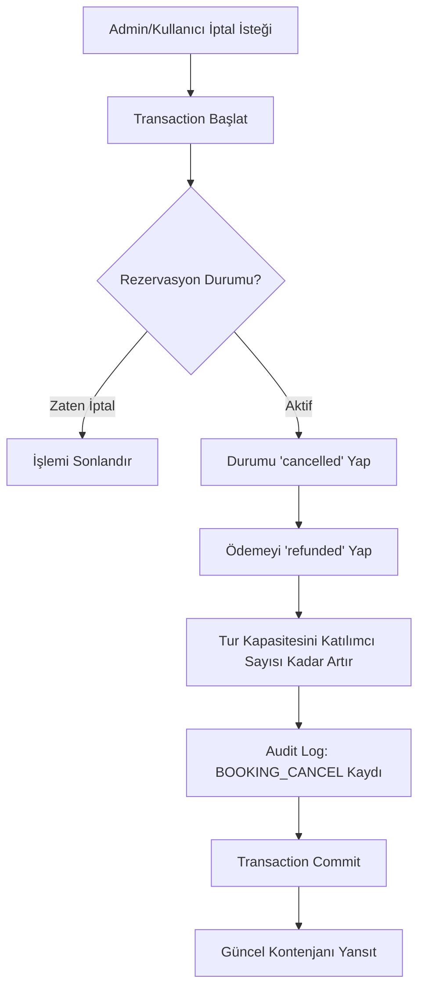

<div align="center">

# 🌍 GM Seyahat Acentesi

### Softito Academy — Backend Developer Eğitimi Bitirme Projesi

<br/>

[](https://dotnet.microsoft.com/)
[](https://docs.microsoft.com/aspnet/core/mvc)
[](https://www.microsoft.com/sql-server)
[](https://docs.microsoft.com/ef/)
[](https://getbootstrap.com/)

<br/>

> 💡 **"GM"** — **G**amze ve **M**erve'nin baş harflerinden oluşmaktadır. Projenin tüm marka kimliği (logolar, faturalar, Excel raporları) bu isim etrafında şekillendirilmiştir.

</div>

---

## 👥 Geliştirici Ekip

<div align="center">

| 👩‍💻 Geliştirici | 🔗 GitHub Profili | 🎓 Rol |
| :---: | :---: | :---: |
| **Gamze Türker** | [](https://github.com/GamzeTurker) | Backend Developer |
| **Merve Gezginci** | [](https://github.com/mervegezginci) | Backend Developer |

**Softito Academy · Backend Developer Eğitimi · Mezuniyet Bitirme Projesi**

</div>

---

## 📌 İçindekiler

1. [📸 Ekran Görüntüleri](#-ekran-görüntüleri)
2. [🛠️ Teknoloji Yığını](#️-teknoloji-yığını)
3. [🏢 Mimari ve Tasarım Desenleri](#-mimari-ve-tasarım-desenleri)
4. [🗄️ Veri Tabanı İlişki Yapıları](#️-veri-tabanı-ilişki-yapıları)
5. [🔄 Kritik Sistem Algoritmaları](#-kritik-sistem-algoritmaları)
6. [🎮 Controller ve Endpoint Analizi](#-controller-ve-endpoint-analizi)
7. [📁 Proje Dizin Yapısı](#-proje-dizin-yapısı)
8. [🚀 Kurulum ve Yapılandırma](#-kurulum-ve-yapılandırma)
9. [👥 Git & GitHub Ortak Çalışma Kılavuzu](#-git--github-ortak-çalışma-kılavuzu)

---

## 📸 Ekran Görüntüleri

### 🌐 Ziyaretçi & Kullanıcı Arayüzü

<table>
  <tr>
    <td align="center" width="50%">
      
      <br/><b>🏠 Ana Sayfa (Light Mode)</b>
      <br/><sub>Dynamic Category Slider, Marquee Banner ve RAM önbelleğinden beslenen popüler turlar</sub>
    </td>
    <td align="center" width="50%">
      
      <br/><b>🌙 Ana Sayfa (Dark Mode)</b>
      <br/><sub>Göz yormayan koyu tema arayüz tasarımı</sub>
    </td>
  </tr>
  <tr>
    <td align="center" width="50%">
      
      <br/><b>🔍 Tüm Turlar & Arama</b>
      <br/><sub>Lokasyon, isim, kategori ve fiyat aralığına göre Dapper tabanlı filtreleme</sub>
    </td>
    <td align="center" width="50%">
      
      <br/><b>🗺️ Tur Detay Sayfası</b>
      <br/><sub>Tur rotası, rehber, kapasite durumu ve üye değerlendirmeleri</sub>
    </td>
  </tr>
  <tr>
    <td align="center" width="50%">
      
      <br/><b>📍 Seyahat Rotası Haritası</b>
      <br/><sub>Leaflet entegrasyonu ile rotanın harita üzerinde interaktif gösterimi</sub>
    </td>
    <td align="center" width="50%">
      
      <br/><b>🗂️ Seyahat Kategorileri</b>
      <br/><sub>Turların gruplandırıldığı, Dapper ile hızlı listelenen kategori rehber sayfası</sub>
    </td>
  </tr>
  <tr>
    <td align="center" width="50%">
      
      <br/><b>🛒 Rezervasyon Formu</b>
      <br/><sub>Kişi sayısı seçimi, kupon kodu AJAX doğrulaması ve anlık indirim hesabı</sub>
    </td>
    <td align="center" width="50%">
      
      <br/><b>✅ Rezervasyon Başarılı</b>
      <br/><sub>İşlem kodu (TX), ödeme yöntemi ve rezervasyon özet çıktısı</sub>
    </td>
  </tr>
  <tr>
    <td align="center" width="50%">
      
      <br/><b>🎁 Sürpriz Kupon (QR Kod)</b>
      <br/><sub>Mobil cihazla taratılarak indirim kodu kazanılan sürpriz kupon modalı</sub>
    </td>
    <td align="center" width="50%">
      
      <br/><b>🎉 Kupon Doğrulama Ekranı</b>
      <br/><sub>Aktif kupon kodu, indirim miktarı ve son geçerlilik tarihi gösterimi</sub>
    </td>
  </tr>
  <tr>
    <td align="center" width="50%">
      
      <br/><b>🎀 Kupon Hazır Modalı</b>
      <br/><sub>Kupon doğrulandıktan sonra beliren kopyalama özellikli hediye penceresi</sub>
    </td>
    <td align="center" width="50%">
      
      <br/><b>📰 Seyahat Hikayeleri (Blog)</b>
      <br/><sub>Gezi rehberleri ve acenteye ait yazıların listelendiği görsel ağırlıklı arayüz</sub>
    </td>
  </tr>
  <tr>
    <td align="center" width="50%">
      
      <br/><b>📩 İletişim & Talep Formu</b>
      <br/><sub>Kullanıcıların mesaj ve seyahat taleplerini iletebileceği form ekranı</sub>
    </td>
    <td align="center" width="50%">
      
      <br/><b>💬 GM Canlı Destek</b>
      <br/><sub>Ziyaretçilere hızlı iletişim sağlayan anlık chat widget bileşeni</sub>
    </td>
  </tr>
  <tr>
    <td align="center" width="50%">
      
      <br/><b>🔐 Giriş Yap</b>
      <br/><sub>Identity destekli, şık tasarımlı üye ve yönetici giriş paneli</sub>
    </td>
    <td align="center" width="50%">
      
      <br/><b>📝 Kayıt Ol</b>
      <br/><sub>Şık tasarımlı yeni üye kayıt paneli</sub>
    </td>
  </tr>
</table>

---

### 🛡️ Yönetici Kontrol Paneli (Admin Console)

<table>
  <tr>
    <td align="center" width="50%">
      
      <br/><b>📊 Yönetici Dashboard</b>
      <br/><sub>Toplam ciro, üye sayısı, aktif rezervasyonlar ve aktif tur rotalarını gösteren genel bakış</sub>
    </td>
    <td align="center" width="50%">
      
      <br/><b>🗺️ Tur CRUD Paneli</b>
      <br/><sub>Yeni tur rotası ekleme, rehber atama, kapasite ve fiyat yönetimi</sub>
    </td>
  </tr>
  <tr>
    <td align="center" width="50%">
      
      <br/><b>🗂️ Kategori CRUD Paneli</b>
      <br/><sub>Seyahat kategorilerinin oluşturulması, düzenlenmesi ve silinmesi</sub>
    </td>
    <td align="center" width="50%">
      
      <br/><b>📋 Rezervasyon Moderasyonu</b>
      <br/><sub>Gelen rezervasyonları onaylama veya iptal etme (kontenjan otomatik iade)</sub>
    </td>
  </tr>
  <tr>
    <td align="center" width="50%">
      
      <br/><b>👤 Üye Yönetimi</b>
      <br/><sub>Rol atama (Admin/User), şifre sıfırlama, hesap askıya alma</sub>
    </td>
    <td align="center" width="50%">
      
      <br/><b>🎟️ Kupon & Promosyon Yönetimi</b>
      <br/><sub>Yüzdelik veya sabit indirim kodu oluşturma, geçerlilik tarihi belirleme</sub>
    </td>
  </tr>
  <tr>
    <td align="center" width="50%">
      
      <br/><b>📰 Blog CRUD Paneli</b>
      <br/><sub>Blog yazılarının yönetilmesi, görsel yolları ve içerik düzenleme</sub>
    </td>
    <td align="center" width="50%">
      
      <br/><b>⭐ Üye Değerlendirmeleri</b>
      <br/><sub>Turlara yazılan yorumları inceleme ve uygunsuz içerikleri kaldırma</sub>
    </td>
  </tr>
  <tr>
    <td align="center" width="50%">
      
      <br/><b>✉️ İletişim Mesajları</b>
      <br/><sub>İletişim formu mesajlarını okundu işaretleme ve yönetme paneli</sub>
    </td>
    <td align="center" width="50%">
      
      <br/><b>📜 Denetim Günlükleri (Audit Log)</b>
      <br/><sub>Kim, ne zaman, hangi IP'den, hangi işlemi yaptığını gösteren sistem logu</sub>
    </td>
  </tr>
  <tr>
    <td align="center" width="50%">
      
      <br/><b>⚡ Cache Yönetim Paneli</b>
      <br/><sub>Bellekte tutulan kategoriler ve popüler turların durumu, tek tıkla RAM temizleme</sub>
    </td>
    <td align="center" width="50%">
    </td>
  </tr>
</table>

---

## 🛠️ Teknoloji Yığını

### Backend
| Teknoloji | Açıklama |
| :--- | :--- |
| **.NET 8.0 & ASP.NET Core MVC** | Modern, Dependency Injection destekli güçlü web mimarisi |
| **Entity Framework Core 8.0** | Code-First şema yönetimi, migrations ve CRUD işlemleri |
| **Dapper Micro-ORM** | Karmaşık JOIN sorgularında ve cache veri çekme süreçlerinde yüksek hız optimizasyonu |
| **ASP.NET Core Identity** | Rol tabanlı yetki kontrolü, cookie authentication ve oturum yönetimi |

### Servisler & Raporlama
| Teknoloji | Açıklama |
| :--- | :--- |
| **IMemoryCache** | Sık okunan verilerin RAM'de saklanmasıyla sayfa açılışını ~10 kat hızlandırma |
| **PDFsharp + MyFontResolver** | Türkçe karakter destekli (`ğ, ş, ı, ç, ö, ü`) dinamik A4 PDF fatura üretimi |
| **ClosedXML** | Rezervasyon ve log verilerini gerçek `.xlsx` Excel formatında dışa aktarma |
| **Audit Log Service** | Admin işlemlerini (CRUD, cache sıfırlama, iptal) IP adresiyle kayıt altına alma |

### Frontend
| Teknoloji | Açıklama |
| :--- | :--- |
| **Bootstrap 5.3 & CSS3** | %100 mobil uyumlu (Responsive) tasarım dili |
| **SweetAlert2** | Modern animasyonlu uyarı ve onay modalları |
| **FontAwesome v6** | Vektörel ikon seti |
| **Leaflet.js** | Tur rotalarının harita üzerinde interaktif gösterimi |

---

## 🏢 Mimari ve Tasarım Desenleri

### Repository Pattern & Unit of Work
Doğrudan `DbContext` çağrıları yerine veri tabanı katmanını soyutlayan tasarım desenleri uygulanmıştır:

- **Repository**: Her tablo için ortak veri erişim metotlarını (`Add`, `Remove`, `Get`, `GetAll`) tek noktada toplar.
- **Unit of Work**: `_unitOfWork.Save()` çağrılana kadar hiçbir değişiklik SQL Server'a yansıtılmaz. Hata durumunda otomatik geri alma (Rollback) gerçekleşir.

### Katmanlı Mimari (N-Tier Architecture)

```
┌─────────────────────────────────────────┐
│         seyahat_projesi (Web)           │  ← Controllers, Views, Services
├─────────────────────────────────────────┤
│         seyahat_projesi.Data            │  ← DbContext, Repositories, Seeders
├─────────────────────────────────────────┤
│         seyahat_projesi.Model           │  ← Entities, ViewModels, DTOs
└─────────────────────────────────────────┘
```

---

## 🗄️ Veri Tabanı İlişki Yapıları

| İlişki | Tablo | Kural |
| :--- | :--- | :--- |
| **1 → N** | Kategori → Tur | Bir kategori birden fazla tura sahip olabilir |
| **1 → N** | Rehber → Tur | Bir rehber birden fazla tura liderlik edebilir |
| **1 → N** | Kullanıcı → Rezervasyon | Bir üye birden fazla rezervasyon yapabilir |
| **1 → 1** | Rezervasyon → Ödeme | Her rezervasyonun tek bir ödeme kaydı bulunur |
| **1 → N** | Tur → Yorum | Bir tur hakkında birden fazla yorum yazılabilir |
| **1 → N** | Kullanıcı → Sistem Logu | Admin işlemleri denetim günlüklerine kaydedilir |

---

## 🔄 Kritik Sistem Algoritmaları

### Rezervasyon İptali ve Kapasite İade Akışı



### Önbellek (Cache) Geçersiz Kılma Matrisi

| Tetikleyici İşlem | Etkilenen Cache Anahtarları |
| :--- | :--- |
| Tur Ekleme / Güncelleme | `ActiveTours`, `PopularActiveTours`, `MarqueeToursList` |
| Tur Silme (Pasife Alma) | `ActiveTours`, `PopularActiveTours`, `MarqueeToursList` |
| Kategori Ekleme / Güncelleme | `CategoriesList` |
| Kategori Silme | `CategoriesList` |
| Admin Manuel Cache Temizleme | *Tüm bellek anahtarları silinir* |

---

## 🎮 Controller ve Endpoint Analizi

### `HomeController` — Kamuya Açık Alan
- **`GET Index(search, categoryId, minDuration)`** — Kategorileri ve marquee tur başlıklarını Dapper ile önbellekten çeker. Filtre parametresi varsa Dapper dinamik sorgu ile arama sonuçlarını listeler.
- **`GET Details(id)`** — Tur detaylarını, rehber bilgilerini ve onaylanmış yorumları çeker.

### `BookingController` — `[Authorize]`
- **`GET Checkout(tourId)`** — Kapasite kontrolü ve mükerrer rezervasyon engeli.
- **`POST Create(tourId, guestsCount, paymentMethod, couponCode)`** — Kupon AJAX doğrulaması, indirim uygulaması, ödeme simülasyonu ve kontenjan düşme işlemleri.

### `ExportController` — `[Authorize]`
- **`GET Invoice(id)`** — PDFsharp ile Türkçe karakter destekli A4 rezervasyon faturası üretimi.
- **`GET ExportBookingsToExcel()`** — ClosedXML ile `.xlsx` formatında rezervasyon raporu dışa aktarma.

---

## 📁 Proje Dizin Yapısı

```text
seyahat_projesi/
│
├── seyahat_projesi.sln                           # Visual Studio Çözüm Dosyası
│
├── seyahat_projesi/                              # Sunum Katmanı (Web App)
│   ├── Areas/
│   │   ├── Admin/Controllers/AdminController.cs  # CRUD, Log, Cache Denetleyicisi
│   │   └── User/Controllers/DashboardController.cs
│   ├── Controllers/
│   │   ├── HomeController.cs                     # Ana sayfa, Arama, Filtreler
│   │   ├── BookingController.cs                  # Satın Alma, Kupon, Ödeme
│   │   └── ExportController.cs                   # PDF Fatura & Excel Raporu
│   ├── Services/
│   │   ├── LogService.cs                         # Audit log motoru
│   │   └── MyFontResolver.cs                     # PDFsharp Türkçe font entegrasyonu
│   ├── ViewModels/                               # DTO / ViewModel yapıları
│   ├── Views/                                    # Razor cshtml dosyaları
│   ├── wwwroot/                                  # CSS, JS, Görseller
│   ├── appsettings.json                          # Bağlantı ve API ayarları
│   └── Program.cs                                # Servis & Middleware konfigürasyonu
│
├── seyahat_projesi.Data/                         # Veri Erişim Katmanı
│   ├── ApplicationDbContext.cs
│   ├── DapperRepository.cs
│   ├── DbInitializer.cs
│   ├── DbSeeder.cs                               # 20'şer kayıt üreten seeder
│   ├── Migrations/
│   └── Repository/                               # Repository & Unit of Work
│
├── seyahat_projesi.Model/                        # Entity (Model) Katmanı
│   ├── ApplicationUser.cs
│   ├── Tour.cs, Category.cs, Booking.cs ...
│
├── seed_all_20.sql                               # SSMS Manuel Seed Scripti
└── update_tour_images.sql                        # Görsel Güncelleme SQL Scripti
```

---

## 🚀 Kurulum ve Yapılandırma

### 1. Repoyu Klonlayın
```bash
git clone https://github.com/mervegezginci/softito-backend-developer-egitim-projeleri.git
cd softito-backend-developer-egitim-projeleri/bitirme-projesi
```

### 2. `appsettings.json` Yapılandırın
```json
"ConnectionStrings": {
  "DefaultConnection": "Server=LOKAL_SQL_SERVER_ADINIZ;Database=SeyahatDb;Trusted_Connection=True;TrustServerCertificate=True"
}
```

### 3. Çalıştırın
```bash
dotnet restore
dotnet run --project seyahat_projesi
```
Proje ayağa kalktığında veritabanı otomatik oluşturulur ve seed verileri yüklenir.  
Tarayıcıdan `https://localhost:5001` adresine gidin.

### 🔑 Test Hesapları

| Rol | E-posta | Şifre |
| :--- | :--- | :--- |
| **Admin** | `admin@gezgin.com` | `Admin123*` |
| **Kullanıcı** | `uye@gezgin.com` | `Uye123*` |

---

## 👥 Git & GitHub Ortak Çalışma Kılavuzu

### Branch (Dal) Yönetimi
```bash
# Main dalını güncelle
git checkout main && git pull origin main

# Yeni özellik dalı aç
git checkout -b feature/admin-kupon-ekrani
```

### Değişiklikleri Gönder
```bash
git add .
git commit -m "feat: Admin kupon arayüzü tamamlandı"
git push origin feature/admin-kupon-ekrani
```

### Pull Request Akışı
GitHub üzerinden Pull Request açın → Diğer geliştirici kodu inceler (Code Review) → Onaylama sonrası `main` dalına birleştirilir.

---

## 📝 Lisans

Bu proje eğitim ve kişisel gelişim amacıyla **Gamze Türker** ve **Merve Gezginci** tarafından geliştirilmiştir.  
Ticari amaçla çoğaltılamaz ve dağıtılamaz.

---

<div align="center">

**GM Seyahat Acentesi** · Softito Academy Bitirme Projesi · 2026

[](https://github.com/GamzeTurker)
[](https://github.com/mervegezginci)

</div>
